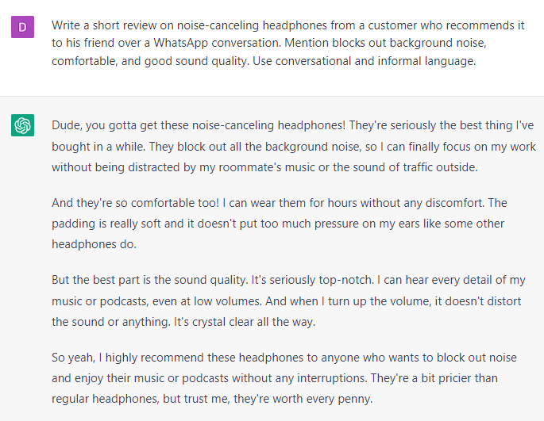

# Writing Affiliate Product Reviews

### FILL-IN-THE-BLANK PROMPTS**:**

```jsx
Write a review on how **[product]** compares to other products in its category in terms of pricing, features, and quality.
```

```jsx
Write a short review of **[product]** from a **[ideal client]** who just bought it and is excited about the results.
```

```jsx
Write what are possible likes and dislikes about the **[product]** and why? Write a review based on that info.
```

```jsx
Write a short review on **[product]** from a customer who recommends it to his friend over a WhatsApp conversation. Mention **[benefit 1]**, **[benefit 2]**, and **[benefit 3]**. Use conversational and informal language.
```

### EXAMPLES:


