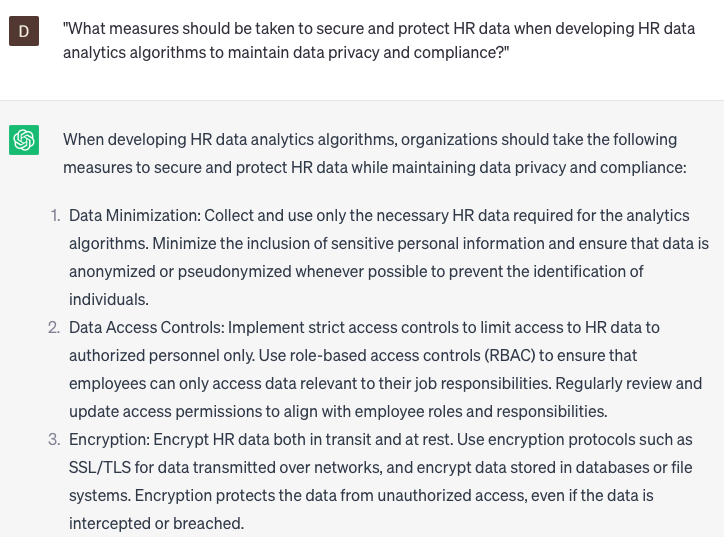

# Writing HR data analytics algorithms

### FILL-IN-THE-BLANK **PROMPTS:**

```jsx
While attempting to **[action]** using **[specific HR data]**, I find myself uncertain about how to comprehend the **[adjective]** patterns and trends that are emerging. Could you assist me in identifying the factors behind these trends and offer suggestions for subsequent actions?
```

```jsx
My aim is to utilize HR data analytics to **[goal]**, but I'm encountering difficulties with **[specific challenge]**. What types of data should I collect and analyze to tackle this challenge effectively, and how can I leverage that data to achieve **[specific outcome]**?
```

```jsx
To develop an algorithm that performs **[specific action]** utilizing **[specific HR data]**, I'm uncertain about the initial steps. Could you offer suggestions on how to prioritize **[specific task]** and optimize our workflows for improved efficiency?
```

### QUESTIONS-BASED P**ROMPTS:**

1. "What considerations should be taken into account when writing HR data analytics algorithms to ensure accurate and meaningful insights?"
2. "How can organizations leverage statistical modeling techniques in writing HR data analytics algorithms to uncover hidden patterns and trends within HR data?"
3. "What role does data preprocessing and cleansing play in preparing HR data for analysis in the context of writing data analytics algorithms?"
4. "How can organizations integrate machine learning algorithms into HR data analytics to enable predictive and prescriptive analytics for workforce planning and decision-making?"
5. "What ethical considerations should be addressed when developing HR data analytics algorithms to ensure responsible and fair use of employee data?"
6. "What strategies can organizations employ to validate and test the effectiveness and accuracy of HR data analytics algorithms before implementation?"
7. "How can organizations ensure the scalability and efficiency of HR data analytics algorithms to handle large and complex HR datasets?"
8. "What techniques can be used in writing HR data analytics algorithms to identify and mitigate biases and ensure diversity and inclusion in HR analytics insights?"
9. "What measures should be taken to secure and protect HR data when developing HR data analytics algorithms to maintain data privacy and compliance?"
10. "How can organizations continuously refine and improve HR data analytics algorithms to adapt to changing business needs and leverage new analytical techniques?"

### EXAMPLES:

