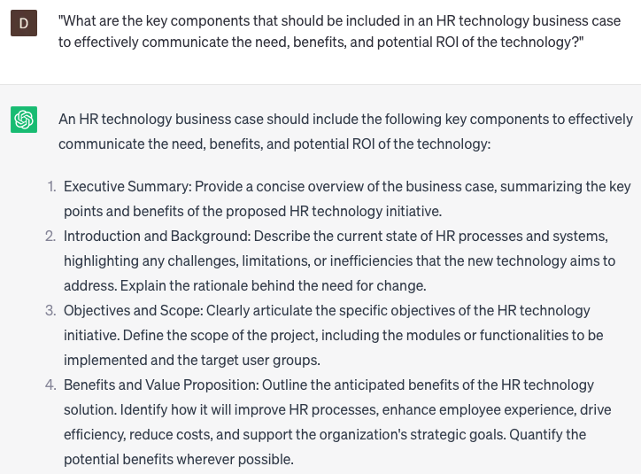

# Writing HR technology business cases

### FILL-IN-THE-BLANK **PROMPTS:**

```jsx
Could you share a template for a business case that can be used to outline the implementation of **[specific HR technology]** within our **[organization/department/division]**, taking into account considerations such as **[budget, ROI, employee feedback]**?
```

```jsx
How can I construct a persuasive case for adopting **[specific HR technology]**, considering factors such as **[market trends, employee demographics, competitive landscape]**, and their impact on the business?
```

```jsx
Could you provide examples of successful HR technology business cases that have been implemented in **[small/large/multi-national]** companies? Additionally, how can we adapt and apply the principles from these examples to our **[organization/department/division]**?
```

### QUESTIONS-BASED P**ROMPTS:**

1. "What are the key components that should be included in an HR technology business case to effectively communicate the need, benefits, and potential ROI of the technology?"
2. "How can organizations align their HR technology business cases with strategic goals and objectives to ensure the technology supports overall organizational success?"
3. "What role does thorough research and analysis play in writing a compelling HR technology business case supported by industry trends and best practices?"
4. "How can organizations assess and articulate the potential risks, challenges, and mitigation strategies associated with implementing the HR technology in their business case?"
5. "How can organizations demonstrate the potential impact of the HR technology on improving HR processes, enhancing employee experience, and driving overall operational efficiency within the business case?"
6. "What strategies can organizations employ to clearly outline the expected costs, implementation timeline, and resource requirements in the HR technology business case?"
7. "How can organizations effectively present the business case to key stakeholders, such as senior leadership and finance teams, to secure support and funding for the HR technology initiative?"
8. "What role does a comprehensive cost-benefit analysis and ROI projection play in strengthening the HR technology business case?"
9. "How can organizations incorporate feedback and input from end-users and HR professionals when developing the HR technology business case to ensure its relevance and alignment with user needs?"
10. "What measures should organizations take to continuously evaluate and update the HR technology business case as new information, technologies, or business requirements arise?"

### EXAMPLES:

