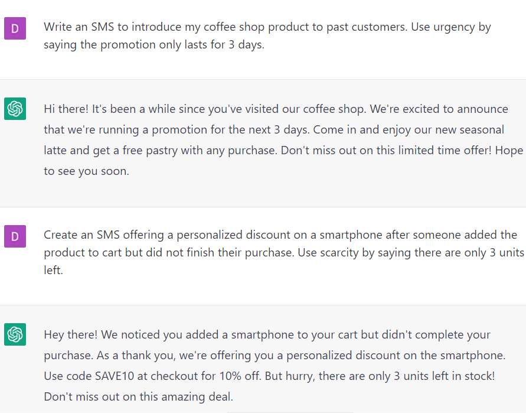

# Writing SMS campaigns for promotions and sales

### FILL-IN-THE-BLANK **PROMPTS:**

```jsx
Write an SMS to introduce **[offer]** to past customers. Use urgency by saying the promotion only lasts for 3 days.
```

```jsx
Create an SMS to invite customers to a special **[event/sale]**, mentioning the date, time, and location and mentioning that the main benefit is **[main benefit].**
```

```jsx
Create an SMS offering a personalized discount on **[product]** after someone added the product to cart but did not finish their purchase. Use scarcity by saying there are only 3 units left. 
```

```jsx
Write an SMS reminding a customer about a meeting that starts in 1 hour. Mention that the benefit of attending is **[main benefit].**
```

### EXAMPLES:

