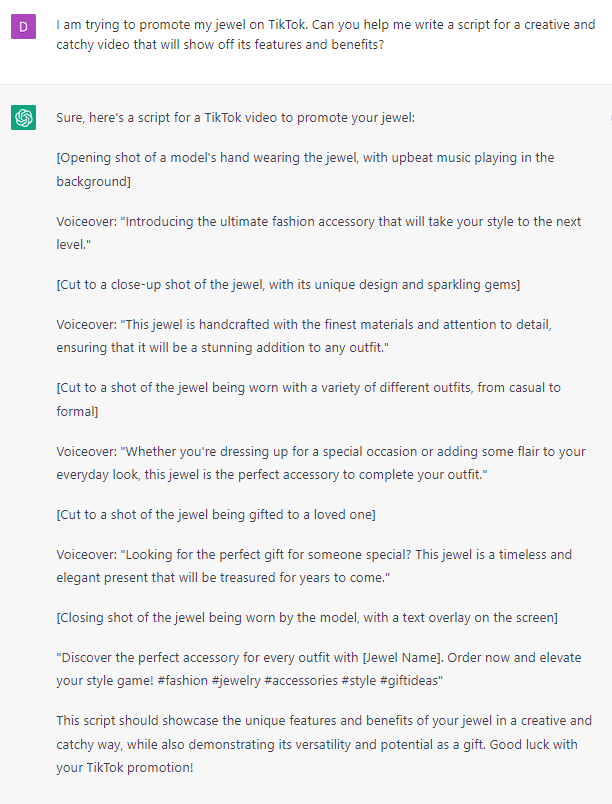

# Writing TikTok Ad Scripts

### FILL-IN-THE-BLANK **PROMPTS:**

```jsx
Please write a TikTok ad promoting **[product]** for **[audience].**
```

```jsx
I am trying to promote my **[product]** on TikTok. Can you help me write a script for a creative and catchy video that will show off its features and benefits?
```

```jsx
I want to create a viral TikTok video that uses humor to promote **[product] for [audience]**. Can you help me write a script that is funny and relatable?
```

```jsx
Create a script for a TikTok ad using the PAS formula. It should promote **[offer]** for **[niche].**
```

```jsx
Create a script for a TikTok ad using the AIDA formula. It should promote **[offer]** for **[niche].**
```

### EXAMPLES:


