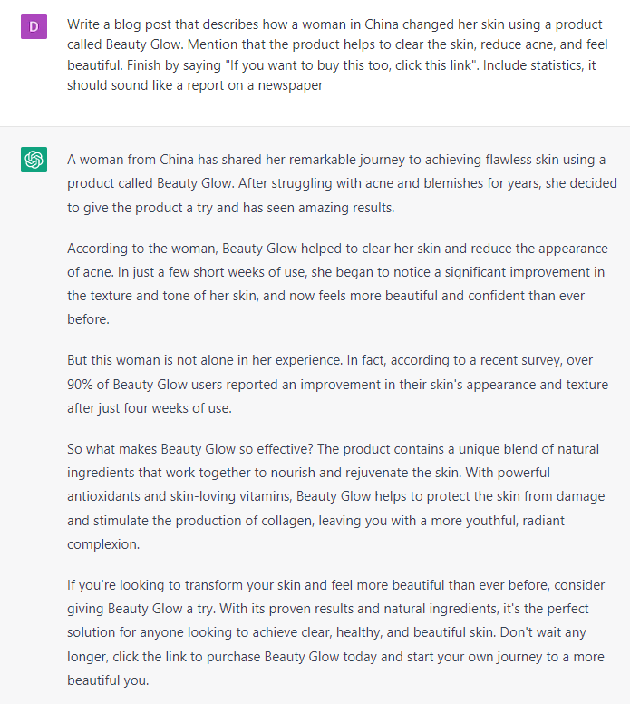

# Writing an Advertorial

### FILL-IN-THE-BLANK **PROMPTS:**

```jsx
*Write* a blog post that describes **[topic]**. Mention that the product helps **[benefit 1]**, **[benefit 2]**, **[benefit 3]**. Finish by saying **[call to action]**. Include statistics, it should sound like a report on a newspaper.
```

```jsx
Brainstorm 10 possible headlines for this article. Make them **[insert magazine or author]** style: **[copy and paste text of the advertorial].**
```

### OPEN-ENDED **PROMPTS:**

1. “Can you write an advertorial for my new [product], which is designed to help [audience achieve] achieve [result]?”
2. “I need an advertorial for my [offer] service that provides [solution] to [niche]. Can you write copy that appeals to [pain point] and highlights the benefits of using my service?”
3. “I'm launching a new [type of product] that helps [audience]. Can you write an advertorial that speaks to [pain point] and emphasizes the unique features of the product?”
4. “Can you write an advertorial for my [offer] course that teaches [topic]? The target audience is [audience] who are interested in [desire].”
5. “I need an advertorial for my [type of business] that provides [product] to [audience]. Can you write copy that appeals to [pain points] and highlights the advantages of using my service?”
6. “I'm launching a new [product] that helps [audience]. Can you write an advertorial that speaks to [desire] and highlights the benefits of using my product?”
7. “I'm launching a new [fill in the blank] service that provides [fill in the blank] to [fill in the blank]. Can you write an advertorial that speaks to [fill in the blank] and emphasizes the unique features of my product?”

### EXAMPLES:



###