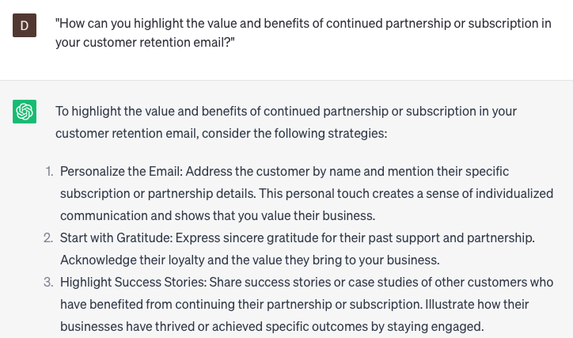

# Writing customer retention emails

### FILL-IN-THE-BLANK **PROMPTS:**

```jsx
I would like assistance in composing a customer retention email that addresses the **[specific concern/issue]** that some of our customers have encountered. Can you help me create a message that reassures our customers and presents a solution to the issue?
```

```jsx
Can you assist me in composing a customer retention email to re-engage [**specific customer]** who has not made a purchase within the last **[specific timeframe]?** I am seeking to create a compelling message that will motivate them to make a purchase.
```

```jsx
Could you assist me in drafting a customer retention email that notifies our customers about **[specific update/change]** to our **[product/service]** while reassuring them that the change will not compromise the quality of our service?
```

### QUESTIONS-BASED P**ROMPTS:**

1. "How can you craft a customer retention email that expresses gratitude and appreciation for the customer's loyalty?"
2. "What strategies can be used to personalize customer retention emails based on the customer's past interactions and preferences?"
3. "How can you highlight the value and benefits of continued partnership or subscription in your customer retention email?"
4. "What role does storytelling and testimonials play in creating persuasive customer retention emails?"
5. "How can you address and overcome potential customer concerns or objections in your customer retention email?"
6. "What tactics can be used to offer exclusive discounts, rewards, or incentives in customer retention emails to encourage continued engagement?"
7. "How can you leverage customer data and behavior to send timely and relevant customer retention emails, such as renewal reminders or upgrade offers?"
8. "What are some effective ways to encourage customer feedback and testimonials in customer retention emails?"
9. "How can you personalize the call-to-action (CTA) in your customer retention email to drive desired actions, such as renewing a subscription or upgrading a service?"
10. "What strategies can be employed to segment and tailor customer retention emails for different customer segments or personas?"

### EXAMPLES:

