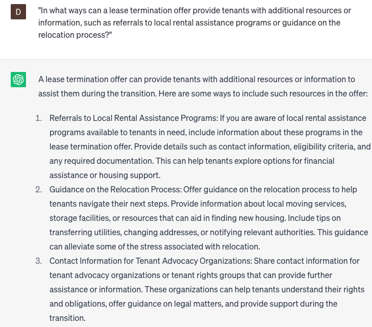

# Writing lease termination offers

### FILL-IN-THE-BLANK **PROMPTS:**

```jsx
Due to **[reason]**, I will be terminating my lease, as I am **[reason_details]**. To ensure that my offer covers all essential aspects, such as **[clause_1], [clause_2], and [clause_3]**, I need your assistance in drafting a lease termination offer that adheres to all legal and regulatory requirements. It should provide clear information on deadlines, termination fees, and the consequences of breaking the lease agreement.
```

```jsx
Given my **[reason]** for early termination of my lease, I need to make sure the termination letter is professional, amicable, and safeguards my rights as a tenant. Can you assist in drafting a lease termination letter that includes [**termination_date], [conditions_of_termination]**, and **[consequences_of_breaking]**, using professional communication techniques?
```

```jsx
I am currently considering terminating my lease for **[reason]**, and I require guidance on the necessary legal requirements and language to include in the offer. Could you assist me in drafting a lease termination offer that incorporates the essential **[legal requirements]**, as well as **[clause_1], [clause_2]**, and **[clause_3]**?
```

### QUESTIONS-BASED P**ROMPTS:**

1. "Why is it important for landlords to create well-crafted lease termination offers when seeking to end a tenancy? How does it ensure clear communication and compliance with legal requirements?"
2. "In what ways can a lease termination offer outline the terms and conditions under which the landlord is willing to terminate the lease, including any notice periods, obligations, or potential financial arrangements?"
3. "How does a lease termination offer provide tenants with an official proposal to voluntarily terminate their lease, allowing them to consider their options and make an informed decision?"
4. "Why is it crucial for a lease termination offer to clearly state the reasons for termination, ensuring transparency and providing a basis for mutual understanding between landlords and tenants?"
5. "What role does a lease termination offer play in facilitating negotiation and discussion between landlords and tenants, allowing both parties to explore potential solutions or alternatives?"
6. "How can a lease termination offer address any financial considerations, such as prorated rent, security deposit refunds, or reimbursement for early termination fees, if applicable?"
7. "What measures can be included in a lease termination offer to provide tenants with sufficient time to respond, ensuring fairness and allowing them to make arrangements for alternative housing if necessary?"
8. "Why is it important for a lease termination offer to comply with local laws and regulations, ensuring that the offer is valid and enforceable under the applicable jurisdiction?"
9. "In what ways can a lease termination offer provide tenants with additional resources or information, such as referrals to local rental assistance programs or guidance on the relocation process?"
10. "What steps can landlords take to ensure that the lease termination offer is delivered in a professional and timely manner, allowing sufficient time for tenants to consider the offer and respond accordingly?"

### EXAMPLES:

