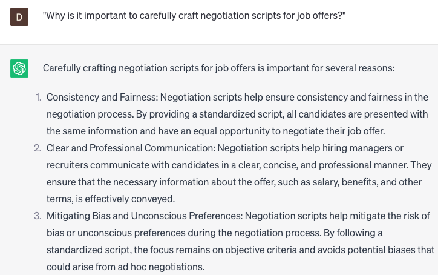

# Writing negotiation scripts for job offers

### FILL-IN-THE-BLANK **PROMPTS:**

```jsx
As a **[job title]** currently in the process of discussing a job offer with **[company]**, my aim is to secure a salary within the desired range of **[desired salary range]**. However, I'm unsure about the best approach to negotiate without putting the offer at risk. Could you assist me in formulating a strategy to negotiate **[salary/benefits/other perks]** in a manner that aligns with my objectives?
```

```jsx
After receiving a job offer from **[company]** which encompasses **[compensation/benefits/perks]**, I wish to **[increase negotiation factor/decrease negotiation factor/change negotiation factor]**. Could you assist me in negotiating for **[higher/lower] [compensation/benefits/perks]** while maintaining a positive rapport with the employer?
```

```jsx
Upon receiving a job offer from **[company]**, which encompasses **[sign-on bonus/relocation package/other perks]**, I desire to **[increase negotiation factor/decrease negotiation factor/change negotiation factor]**. How can I effectively negotiate for **[more/less] [sign-on bonus/relocation package/other perks]** without appearing excessively demanding or unrealistic?
```

### QUESTIONS-BASED P**ROMPTS:**

1. "Why is it important to carefully craft negotiation scripts for job offers?"
2. "What key elements should be included in a negotiation script to effectively address both the employer's and candidate's interests?"
3. "How can negotiation scripts help maintain professionalism and create a positive negotiation experience?"
4. "Why is it valuable to research and understand market salary ranges and industry standards before drafting a negotiation script?"
5. "What strategies can be employed to anticipate and address potential objections or concerns from the candidate in the negotiation script?"
6. "How can negotiation scripts be tailored to highlight the unique benefits and opportunities offered by the organization?"
7. "What techniques can be used to strike a balance between flexibility and firmness in the negotiation script?"
8. "Why is it important to consider non-salary aspects, such as benefits, professional development opportunities, or remote work options, in the negotiation script?"
9. "What measures should be taken to maintain open and constructive communication throughout the negotiation process?"
10. "How can negotiation scripts be continuously evaluated and improved based on feedback and outcomes from previous negotiations?"

### EXAMPLES:

