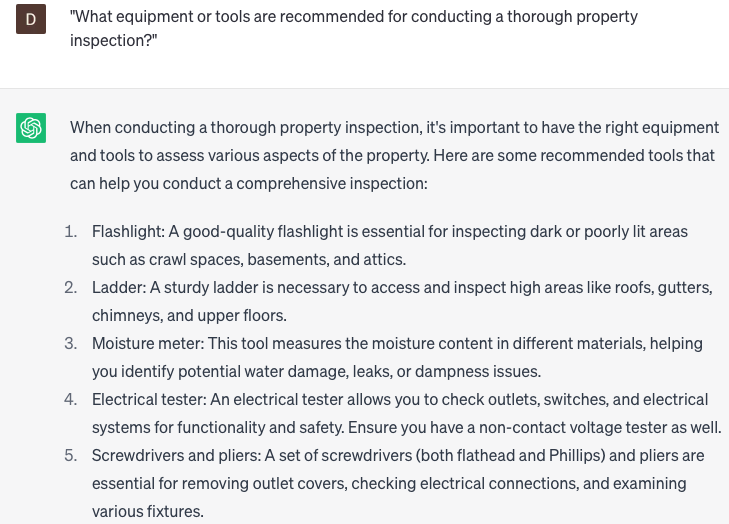

# Writing property inspection checklists

### FILL-IN-THE-BLANK **PROMPTS:**

```jsx
What essential **[items/components]** should be part of a **[property inspection/maintenance]** checklist for **[residential/commercial]** **[properties/real estate]** in **[rural/urban/suburban]** areas? Provide a detailed description and highlight any **[potential/known]** issues to be aware of.
```

```jsx
What **[safety/health]** hazards should be assessed during **[property inspection/maintenance]** in **[cold/hot] [climate/weather]** conditions? Please provide a list of recommended **[equipment/tools]** for conducting the **[inspection/maintenance]**.
```

```jsx
What steps can I take to ensure my **[property inspection/maintenance]** checklist is comprehensive, covering all essential **[items/components]** and **[areas/sections]** of the **[property/real estate]**? Provide valuable **[tips/suggestions/recommendations]** to create an organized and thorough structure for the checklist.
```

### QUESTIONS-BASED P**ROMPTS:**

1. "What essential components should be included in a property inspection checklist for residential properties?"
2. "How can I ensure that my property inspection checklist covers all necessary areas of the property?"
3. "What specific items or components should be inspected in the interior areas of the property?"
4. "Are there any unique areas or features in the exterior of the property that require special attention during the inspection?"
5. "What potential safety hazards should be checked for during a property inspection?"
6. "What are some common issues or problems that property owners should look out for during the inspection?"
7. "What equipment or tools are recommended for conducting a thorough property inspection?"
8. "Are there any specific regulations or standards that should be followed when conducting a property inspection?"
9. "How can I organize and structure my property inspection checklist for maximum efficiency?"
10. "Are there any specialized techniques or methods that can enhance the effectiveness of a property inspection checklist?"

### EXAMPLES:

