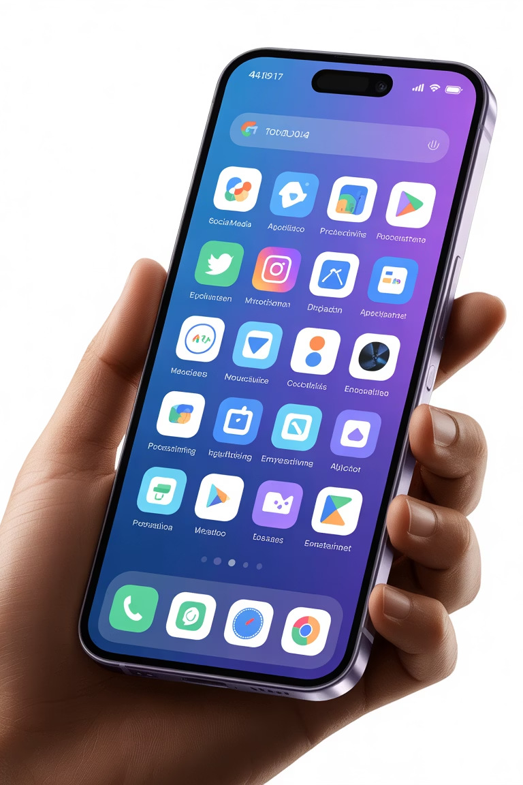
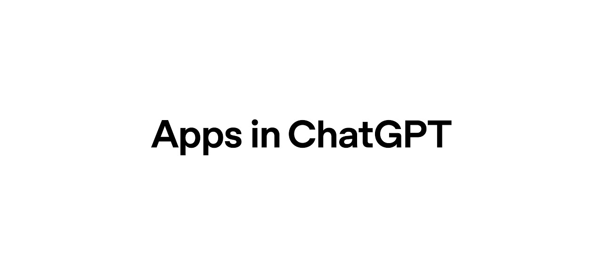
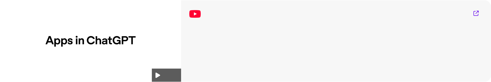

# AI Mastery Suite (ChatGPT5 Updates)

**5, Sora 2, and Agents You**

**Can Build Yourself**

Breaking Down the Biggest Announcements &

What They Mean for Developers

**OpenAI Just Changed**

**Everything: Apps in ChatGPT**

**Four Major Themes**

**Apps in ChatGPT** **AgentKit Platform**

Mini-apps from Spotify, Canva, Booking integrated directly No-code agent builder for workflow automation

**Codex Updates** **Sora 2 API**

Enhanced AI coding assistant with Slack & GitHub Video generation now accessible to developers integration

**Apps Within ChatGPT**

**Sam Altman's Bold Vision: "Most Tech Stacks Are Now**

**Deprecated"**

**What's New?** **Key Partners**

Access sites directly inside

**Spotify**

- Music & playlistsChatGPT

**Canva**

- Design tools

Functional integration with

**Expedia**

- Travel booking

partners

**Zillow**

- Real estate search

Create Spotify playlists, book

**Coursera**

- Interactive learning

travel, design with Canva

No app-switching required

**Apps in ChatGPT**

**Discoverability Problem**

Apps competing against Canva, Expedia, and Zillow face uphill battles

"If you build one of these apps, how will you make it show up when competing against OpenAI's major partners?"

**The Discovery Challenge**

**Small Developer Concerns**

How do you compete when OpenAI partners dominate generic

searches?

**Standout App Examples**

**Canva Integration** **Coursera Experience**

Transform outlines into polished decks directly within ChatGPT Watch courses inside ChatGPT while chatting with video

interface content in real-time

**Rolling out:** Preview starts today, full app store launches later this year

**AgentKit**

**The No-Code Future Is Here**

01 02 03

**Visual Agent Builder** **Connector Registry** **ChatKit Included**

Canvas-based interface for creating AI Integrate OpenAI and third-party Build production-ready chat applications

agents without writing code services seamlessly out of the box

Similar to N8N and Google Opal, but fully integrated with OpenAI's ecosystem

**AgentKit Deep Dive**

**Powerful Features**

File search capabilities

Custom MCP integrations

Conditional routing architecture

Full recursive agent support

Custom widget definitions

Built-in guardrails

**Perfect For:**

Organizations wanting AI agents without dedicated AI

engineering teams

Agent Builder enables conditionally rendered UI

elements and sophisticated widget customization

**Codex: AI-Powered Development**

**GitHub Actions** **Security Scanning** **Auto Documentation**

Automatic code quality review on Identify vulnerabilities before Generate docs as you code

every PR deployment

**10x** **40T**

**Usage Growth** **Tokens Served**

Daily usage increase since early August In first three weeks of availability

**Sora 2 & API Updates**

**Sora 2 Pricing**

**50¢**

Per second of high-quality video

**$1.8K**

Cost for 1-hour production

**Game changer:** Developers now have affordable tools for voice, image, and video generation

**Key Takeaways**

**Integration Era** **No-Code Agents** **Developer Tools**

Apps living inside ChatGPT signal AgentKit democratizes AI Enhanced APIs make multimedia AI

shift in how we build software automation for all teams accessible and affordable

**The Future of Development**

OpenAI DevDay 2025 delivered transformative tools that will reshape how we build, deploy, and scale AI applications. From no-

code agent builders to API-accessible video generation, developers have more power than ever.