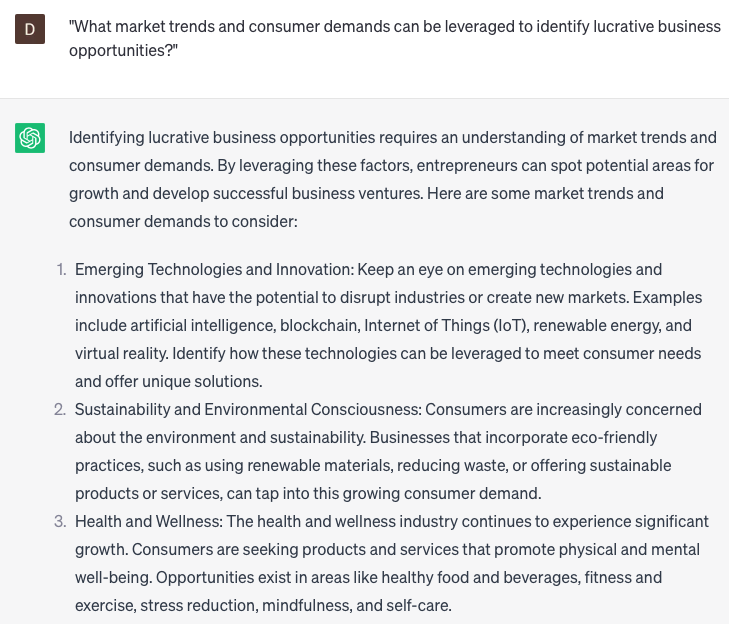

# Analyze business opportunities

### FILL-IN-THE-BLANK **PROMPTS:**

```jsx
What are the most promising **[product/service]** opportunities for **[company name]** in the **[industry]** sector? Could you please share insights on the target audience, competition, and revenue potential?
```

```jsx
As an expert in analyzing business opportunities, could you evaluate the potential of **[industry/sector]** for **[target market]** and identify emerging trends, untapped niches, and areas of growth? Additionally, please provide insights on the competitive landscape, market entry strategies, and potential risks to consider in pursuing these opportunities.
```

```jsx
What are some creative **[marketing strategy/sales approach]** ideas that **[company name]** can utilize to effectively connect with its target audience in the **[industry]** sector? Could you share insights on the target audience, competition, and potential return on investment (ROI)?
```

### QUESTIONS-BASED P**ROMPTS:**

1. "What market trends and consumer demands can be leveraged to identify lucrative business opportunities?"
2. "How can you evaluate the potential profitability and sustainability of a new business idea?"
3. "What competitive advantage can you offer in a specific industry, and how can it translate into a viable business opportunity?"
4. "What key factors should you consider when assessing the feasibility and scalability of a business opportunity?"
5. "How can you identify untapped niche markets and capitalize on them?"
6. "What emerging technologies or innovations present promising business opportunities in today's market?"
7. "How can you analyze and leverage data to identify unmet needs and create valuable business solutions?"
8. "What partnerships or collaborations can be explored to unlock new business opportunities and expand your reach?"
9. "What potential risks and challenges should be evaluated when assessing a business opportunity, and how can they be mitigated?"
10. "How can you stay agile and adapt to changing market dynamics to seize new business opportunities as they arise?"

### EXAMPLES:

