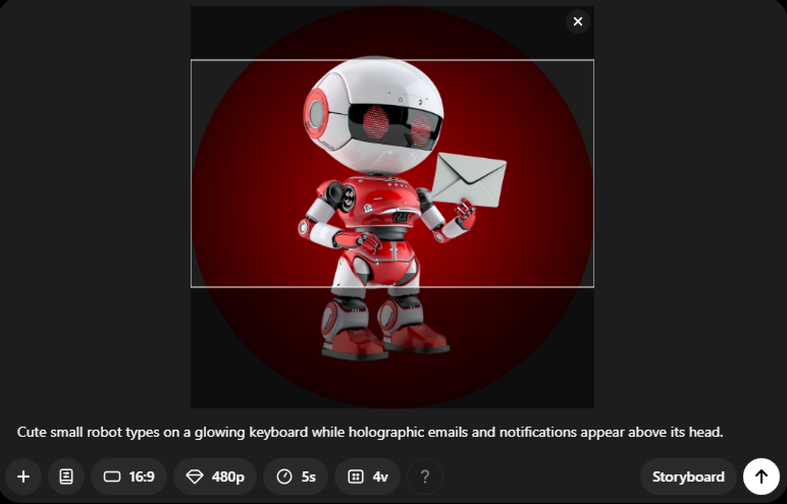

# BONUS: How to Create Videos Using Reference Images

To create a video from a reference image, just click the **'+'** and choose **'Upload image or video'** or **'Choose from library,'.**

Then, add your prompt.

Now you have your video ready to use for ads or social media posts!

[20250127_2037_Charming Robot Mail Delivery_simple_compose_01jjmgvc3bepetymjjq8pcj2t4.mp4](20250127_2037_Charming_Robot_Mail_Delivery_simple_compose_01jjmgvc3bepetymjjq8pcj2t4.mp4)