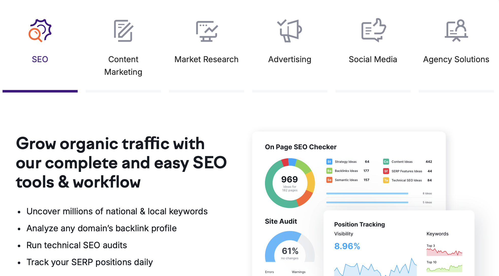

# BONUS: Perfect AI Partner

If you're a **Strategy Consultant**, tools like **BuzzSumo** and **SEMrush** can help you gather insights and refine strategies for your clients. 

[**BuzzSumo**](https://buzzsumo.com) is excellent for researching content trends and finding out what’s resonating with audiences in your client’s industry. 

[**SEMrush**](https://www.semrush.com) helps you dive deeper into SEO and competitor analysis, allowing you to fine-tune your strategies for better online visibility and growth.

