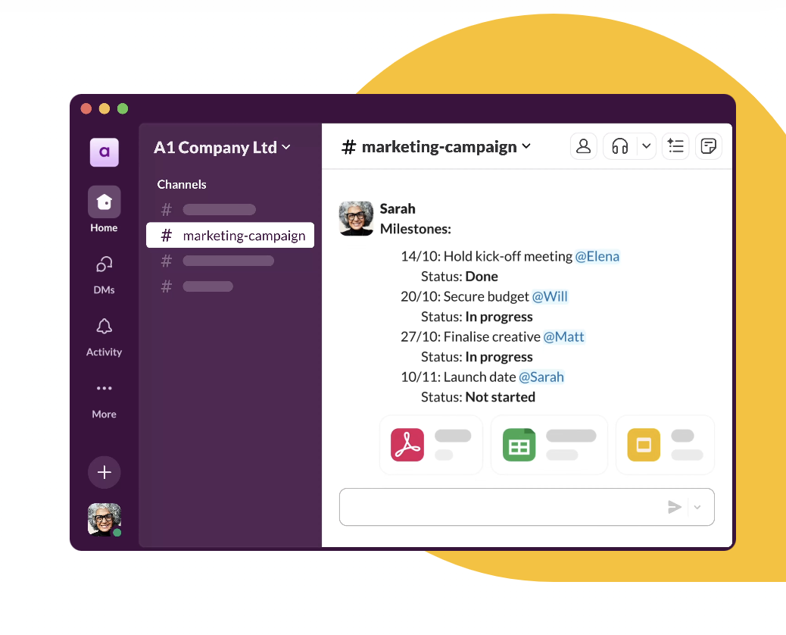

# BONUS: Perfect AI Partner

If you’re focused on **operations management**, tools like **Trello**, **Asana**, and **Slack** can help streamline your workflow and ensure smooth communication across teams. 

[**Trello**](https://trello.com) helps you organize tasks and projects visually, making it easier to track deadlines, assign responsibilities, and monitor progress. 

[**Asana**](https://asana.com) takes it further by allowing you to create detailed project timelines, track milestones, and automate task assignments. 

For real-time communication, [**Slack**](https://slack.com/intl/en-gb/) keeps your team connected, helping you collaborate on projects instantly and avoid unnecessary email back-and-forth.

