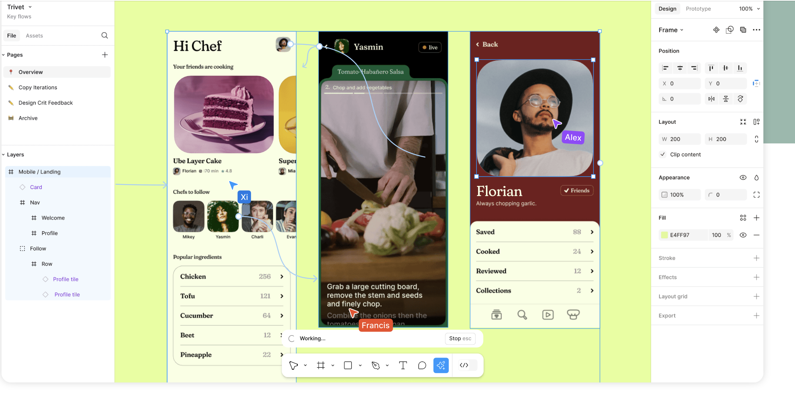

# BONUS: Perfect AI Partner

If you’re focused on **innovation and product development**, tools like **Trello**, **Miro**, and **Figma** can help you organize ideas and bring your concepts to life. 

[**Trello**](https://trello.com) is great for managing the entire product development process, from brainstorming to final delivery. You can easily organize tasks, track progress, and keep everyone aligned on deadlines. 

[**Miro**](https://miro.com) helps you visualize your ideas and collaborate in real time with your team, whether you’re mapping out user journeys or brainstorming new features. 

And [**Figma**](https://www.figma.com) is perfect for creating and prototyping product designs, allowing your team to collaborate on visuals.

