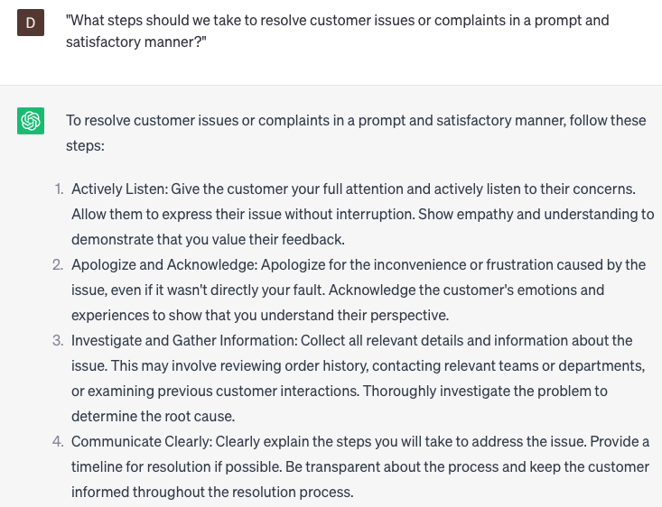

# Building customer relationships

### FILL-IN-THE-BLANK **PROMPTS:**

```jsx
What are some impactful approaches to personalize my interactions with **[customers/clients]**, taking into account their past **[purchases/interactions]** and **[feedback/reviews]**? How can I utilize this information to customize my **[products/services]** according to their specific **[preferences/needs]**?
```

```jsx
What are prevalent errors that **[businesses/companies]** tend to make in regards to **[customer service/interactions]**, and how can I steer clear of them? Furthermore, how can I proficiently handle **[difficult/dissatisfied] [customers/clients]** in a **[professional/efficient]** manner?
```

```jsx
What are innovative methods to demonstrate to **[customers/clients]** that we truly **[value/appreciate]** their **[loyalty/business]**? How can we **[go the extra mile/exceed expectations]** in order to **[surpass their expectations/create an unforgettable experience]**?
```

### QUESTIONS-BASED P**ROMPTS:**

1. "How can we build strong and lasting customer relationships to foster loyalty and advocacy?"
2. "What strategies can we employ to personalize our interactions and communications with customers to create a sense of connection?"
3. "Are there any specific methods or initiatives we should implement to actively listen and understand our customers' needs and preferences?"
4. "How can we go the extra mile to exceed customer expectations and demonstrate our commitment to their satisfaction?"
5. "What measures should we take to consistently deliver exceptional customer service and support throughout the customer journey?"
6. "How can we proactively communicate with customers to keep them informed about updates, new offerings, or relevant information?"
7. "What steps should we take to resolve customer issues or complaints in a prompt and satisfactory manner?"
8. "How can we leverage customer feedback and insights to continuously improve our products, services, and overall customer experience?"
9. "Are there any customer loyalty programs or rewards initiatives we should consider implementing to strengthen customer relationships?"
10. "What strategies can we employ to build trust and transparency with our customers, ensuring open and honest communication?"

### EXAMPLES:

