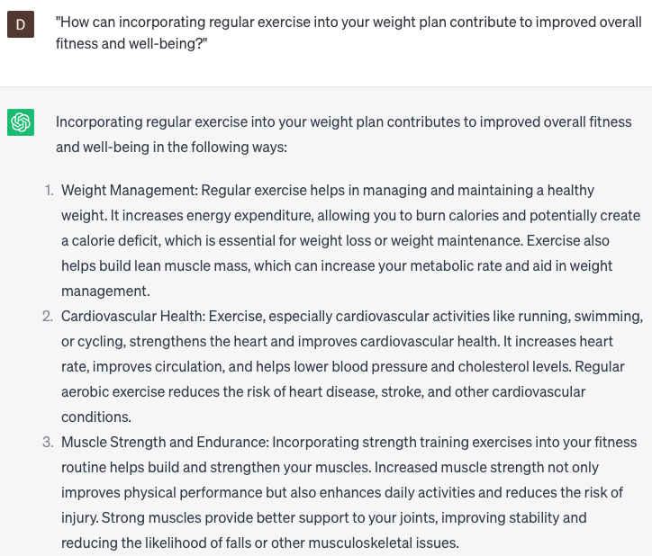

# Calculate BMI and weight plan

### FILL-IN-THE-BLANK **PROMPTS:**

```jsx
Could you assist me in calculating my BMI and devising a weight plan based on my **[height]** and **[weight]**?
```

```jsx
Could you recommend a customized weight plan tailored for vegetarians, incorporating **[x]** servings of plant-based protein per day?
```

```jsx
Could you offer guidance on maintaining a healthy weight and minimizing the risk of **[type of]** diseases? I'm seeking tips and suggestions to support these objectives.
```

### QUESTIONS-BASED P**ROMPTS:**

1. "How can calculating your Body Mass Index (BMI) help you assess your overall health and determine an appropriate weight plan?"
2. "What role does understanding your BMI play in setting realistic weight loss or weight gain goals?"
3. "In what ways can tracking your BMI over time help you monitor progress and make adjustments to your weight plan?"
4. "What are the benefits of consulting with a healthcare professional or nutritionist to develop a personalized weight plan based on your BMI?"
5. "How does knowing your BMI range help you understand the potential health risks associated with being underweight, overweight, or obese?"
6. "What strategies can individuals employ to achieve and maintain a healthy weight within their BMI range?"
7. "How can incorporating regular exercise into your weight plan contribute to improved overall fitness and well-being?"
8. "What impact can adopting a balanced and nutritious diet have on achieving and sustaining a healthy weight?"
9. "What are the benefits of seeking social support or joining weight management programs when implementing a weight plan based on BMI?"
10. "How does focusing on overall health and well-being, rather than solely on weight, contribute to a sustainable and positive approach to achieving your goals?"

### EXAMPLES:

