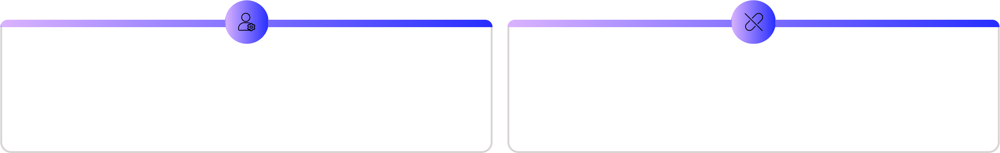

# ChatGPT-Atlas-Connectors-and-Apps

**with ChatGPT Atlas, Connectors**

**and Apps**

Redefining how business professionals browse, collaborate and get work done.

**Supercharge your productivity**

**What is ChatGPT Atlas?**

A web browser built from the ground up around the ChatGPT assistant.

Available initially for macOS; Windows, iOS and Android coming soon.

Integrates ChatGPT features directly: summary, analysis, task-automation, inline

help.

**Core Features**

**1** **2**

**Ask ChatGPT everywhere** **Inline writing help**

In any tab/page you9re on, ask questions like <What9s this page Highlight text in a document/email form field, click the assistant,

about?= or <Summarise the core points= and get suggestions (e.g., <Make this sound more professional=).

**3** **4**

**Browser memories** **Agent mode (preview)**

Optional feature that remembers context from the sites you visit The assistant can take actions on your behalf (open tabs, click

and uses it to make conversations smarter. through sites, help complete tasks) under your control

**Demo 1: Let's explore Atlas**

platforms for users significantly increases.

**Advanced Enterprise Workflows**

Opens new avenues for automation and streamlined processes, particularly

impactful for teams focused on knowledge work.

**Key Security Considerations**

Highlights critical aspects related to IT management, data security, and governance, which will be discussed in an upcoming section.

**Strategic Implications**

**Integrated Workspace**

Moves the AI assistant from a standalone application directly into the browser,

becoming an integral part of your digital workspace.

**Increased User Retention**

As browsing history and context accumulate within Atlas, the cost of switching

**Privacy, Control & Governance**

**Browser Memories Incognito Mode**

Optional and user-controlled. You can view, archive, or delete them Ensures chats, browsing, and memory are not saved or linked to

anytime. your account.

**Agent Mode Constraints Enterprise Policies**

Cannot run code, install extensions, or access your file Critical for defining memory usage, agent mode, and data access

system/apps. rules.

**Practical Ways to Use It**

**On-boarding & knowledge transfer**

Use browsing memory to capture key context from earlier sessions and re-activate for later work

**Automating routine workflows**

e.g., <Find all job postings I browsed last week, summarise trends= or <Scan our competitor sites, open relevant tabs, pull data into brief=.

**Market research sprint**

Ask Atlas to review a set of web pages, summarise key competitor moves, suggest implications.

**Content creation support**

Writing email drafts, proposals or blog posts 3 highlight rough text and ask for professional refinement

**Demo 2: Let's explore some practical use cases**

---

---

---

---

**Define governance: decide whether to enable**

**memories, whether agent mode is allowed, set**

**training/data sharing priorities.**

**Explore for tips and updates**

**Getting Started**

**Download Atlas for macOS from**

**Import bookmarks, passwords, history from another**

**browser (i.e. Chrome, Safari) to maintain continuity.**

**Plans:**

Available in

**Plus, Pro, Business, Enterprise, and Edu.**

Pull in **your data, documents, and templates** to create stronger first drafts.

Find answers fast from **internal files or shared drives.**

Summarize **project threads, emails, or meeting notes** in seconds.

Combine sources for **cross-tool insights** (e.g. Notion + Drive + Sheets).

Generate **reports or competitor briefs** using internal + external data.

**What is ChatGPT Connectors?**

Link ChatGPT to your own data and tools (e.g. Google Drive, Outlook, Notion).

**What They Do:**

**Demo 3: ChatGPT Connectors in Action**

**What is ChatGPT Apps?**

Add new interactive capabilities inside the chat (e.g. book hotels, create designs, play

music).

New generation of

**interactive mini-apps**

you can chat with.

Apps appear naturally in conversation 4 suggested when called by name.

Blend chat + interface: maps, playlists, designs, courses 4 all inside ChatGPT.

Available now:

**Booking, Canva, Coursera, Expedia, Figma, Spotify, Zillow.**

Apps can access context (<Make this outline into slides with Canva=) and respond

instantly.

**Business takeaway:**

Apps turn ChatGPT into a unified workspace where employees can act, not just ask.

**Demo 4: ChatGPT Apps in Action**

**When to Use What**

**Scenario** **Use Apps** **Use Connectors**

Need to perform a task (book, design, play, learn)

Need ChatGPT to access internal company data or files

Want to automate multi-step workflows across SaaS tools (via App SDK or (for data context)

future automations)

Want to summarize, report, or analyze your own docs

**Data Privacy & Controls**

**Limited Data Visibility** **No Model Training** **User-Driven Control**

ChatGPT can only access the data you Data shared via connectors on Business, Users connect apps with their own

personally have permissions to view within Enterprise, and Education plans is strictly credentials and must explicitly review and

the connected application. not used for model training. approve access permissions.

**Centralized Admin Oversight**

Organization administrators have full control to enable/disable

**Instant Disconnection**

You can disconnect apps at any time, immediately terminating

connectors and conduct comprehensive permission audits. ChatGPT's data access.

**Thank you! Questions?**