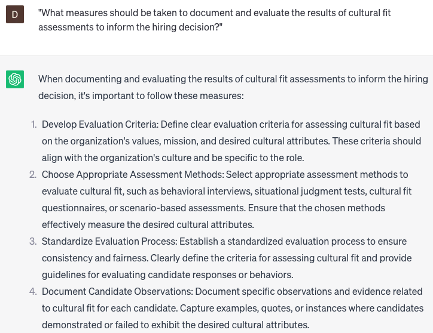

# Conducting cultural fit assessments

### FILL-IN-THE-BLANK **PROMPTS:**

```jsx
Could you aid me in generating **[a minimum of 10]** behavioral-based questions that assess a candidate's cultural fit for a **[specific job role]**? The job is situated within a global organization comprising diverse employees. It is preferable for the ideal candidate to have experience in **[at least 3 areas]**, and we are specifically seeking cultural values that encompass **[at least 3 core values].**
```

```jsx
When evaluating a candidate's cultural compatibility for a **[specific job role]** in **[a specific country or region]**, which common cultural elements should be taken into account? **[The company strongly emphasizes work-life balance and collaboration]**. The preferred candidate should possess prior experience collaborating with **[specific types of stakeholders]**, and the cultural values we prioritize encompass **[at least 3 core values]**.
```

```jsx
How can one effectively perform a cultural fit evaluation during a remote interview for a **[specific job role]**? **[The company operates in a fast-paced work environment and values strong communication skills].** The preferred candidate should possess expertise in **[specific types of remote work]**, and the cultural values we prioritize encompass **[at least 3 core values]**.
```

### QUESTIONS-BASED P**ROMPTS:**

1. Why is conducting cultural fit assessments important in the hiring process?"
2. "What are the key elements that contribute to a strong organizational culture?"
3. "How can cultural fit assessments help determine if a candidate aligns with the values and norms of the organization?"
4. "What strategies can be used to assess a candidate's alignment with the organization's mission and vision?"
5. "Why is it important to evaluate a candidate's communication and collaboration skills as part of the cultural fit assessment?"
6. "How can behavioral interview questions be used to assess a candidate's fit within the existing team dynamics and company culture?"
7. "What role does diversity and inclusion play in cultural fit assessments, and how can organizations ensure a fair and inclusive evaluation?"
8. "Why is it valuable to involve multiple stakeholders, including team members and leaders, in the cultural fit assessment process?"
9. "How can organizations balance the need for cultural fit with the importance of embracing diverse perspectives and backgrounds?"
10. "What measures should be taken to document and evaluate the results of cultural fit assessments to inform the hiring decision?"

### EXAMPLES:

