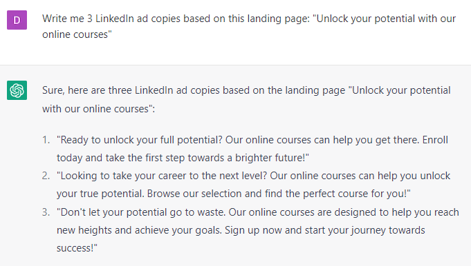
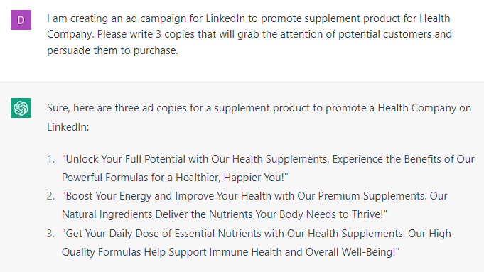

# Creating Ads For LinkedIn

### FILL-IN-THE-BLANK **PROMPTS:**

```jsx
Write me 3 LinkedIn ad copies based on this landing page:
**[Copy and paste the landing page text].**
```

```jsx
Can you provide examples of effective ad copy to promote **[product]** to **[audience]**? Make sure they are **[persuasive/playful/emotional]** and mention these benefits:
**[Benefit 1]
[Benefit 2]
[Benefit 3]**
Finish with a call to action saying **[CTA]**. Add 3 emojis to it.
```

```jsx
I am creating an ad campaign for LinkedIn to promote **[product]** for **[niche]**. Please write 3 copies that will grab the attention of potential customers and persuade them to purchase.
```

### EXAMPLES**:**



