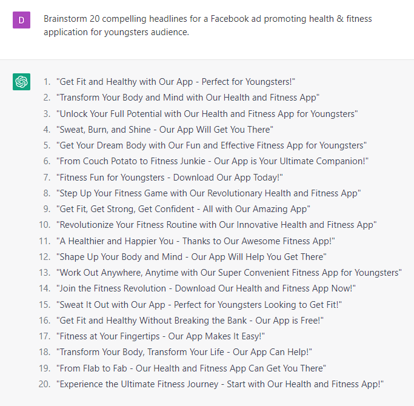

# Creating Effective Facebook Ad Copy

### FILL-IN-THE-BLANK PROMPTS**:**

```jsx
Write me 3 Facebook ad copies based on this landing page:
**[Copy and paste the landing page text].**
```

```jsx
Can you provide examples of effective ad copy to promote **[product]** for **[audience]**? Make sure they are **[persuasive/playful/emotional]** and mention these benefits:
**[Benefit 1]
[Benefit 2]
[Benefit 3]**
Finish with a call to action saying **[CTA]**. Add 3 emojis to it.
```

```jsx
Brainstorm 20 compelling headlines for a Facebook ad promoting **[product]** for **[audience].**
```

```jsx
I am creating an ad campaign for **[product/service]** and need help writing copy that will grab the attention of potential customers. Can you help me come up with headlines and body copy that will persuade them to make a purchase?
```

```jsx
What are 20 possible audiences on Facebook who could be interested in **[product]**?
```

### EXAMPLES:



