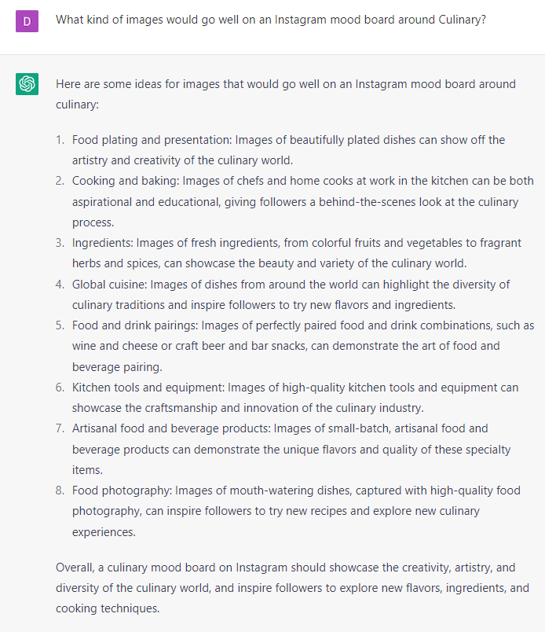

# Creating Visually Stunning Mood Boards for Instagram or Pinterest

### OPEN-ENDED QUESTIONS:

1. “What kind of images would go well on a [Pinterest or Instagram] mood board around [topic]?”
2. “I am an interior designer. How would you design a [topic] mood board for [platform]?”
3. “What are trendy mood board images for [topic] on [platform]”
4. “Act like a graphic designer. How would you create a [platform] mood board for [topic]?”
5. “What can I tell DALL-E in order to create a [platform] mood board about [topic]?”
6. “Can you suggest ideas for a [fill in the theme] mood board on Instagram or Pinterest?”
7. “I need some inspiration for my Instagram or Pinterest mood board related to [fill in the topic]. Can you help?”
8. “Can you generate some creative ideas for an Instagram or Pinterest mood board that reflects the [fill in the adjective] vibe I'm going for?”
9. “I'm looking for some fresh ideas for my Instagram or Pinterest mood board based on [fill in the subject matter]. What do you suggest?”
10. “Can you brainstorm ideas for an Instagram or Pinterest mood board that showcases [fill in the product or service] in an artistic and visually appealing way?”
11. “I need some ideas for an Instagram or Pinterest mood board that reflects the [fill in the emotion] feeling I want to convey. Can you help me with that?”
12. “Can you suggest themes and visual elements for an Instagram or Pinterest mood board that align with my brand identity and values?”
13. “I'm looking for ideas for an Instagram or Pinterest mood board that captures the essence of [fill in the theme] in a creative and interesting way. What do you recommend?”
14. “Can you help me brainstorm ideas for an Instagram or Pinterest mood board that appeals to [fill in the target audience] and showcases my brand in a unique way?”
15. “I need some inspiration for my Instagram or Pinterest mood board related to [fill in the topic]. Can you suggest some visual elements and color schemes that would work well?”

### EXAMPLES:

