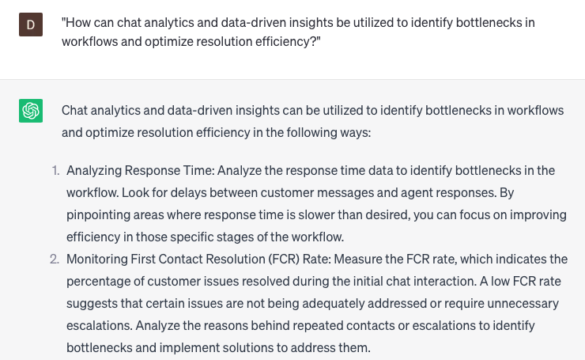

# Creating chat workflows for faster resolution

### FILL-IN-THE-BLANK **PROMPTS:**

```jsx
I require assistance regarding **[specific issue]** concerning my **[product/service]**. Would you perform the necessary **[action required]** to address and resolve this matter?
```

```jsx
I'm considering the acquisition of **[product/service]**. Could you please furnish me with further details regarding **[specific feature]** and its potential advantages or benefits for me?
```

```jsx
Regarding my **[product/service]** subscription, I have a specific concern related to **[specific issue]**. Could you please assist me by connecting me with an appropriate **[department/team member]** who can provide guidance on this matter?
```

### QUESTIONS-BASED P**ROMPTS:**

1. "What are the key elements to consider when designing chat workflows that prioritize speed and efficiency in issue resolution?"
2. "How can you streamline chat workflows to minimize customer wait times and expedite issue resolution?"
3. "In what ways can automation be leveraged to create efficient chat workflows that reduce the need for manual intervention?"
4. "What strategies can be implemented to prioritize and categorize incoming chat requests for faster resolution?"
5. "How can you integrate knowledge bases and resources into chat workflows to empower agents with quick access to relevant information?"
6. "What role does proactive chat engagement play in guiding customers through predefined workflows and expediting issue resolution?"
7. "How can you incorporate feedback loops and continuous improvement mechanisms into chat workflows to optimize resolution times?"
8. "What measures can be taken to ensure seamless handoffs and collaboration between chat agents during complex issue resolution?"
9. "How can chat analytics and data-driven insights be utilized to identify bottlenecks in workflows and optimize resolution efficiency?"
10. "What are some best practices for regularly reviewing and updating chat workflows to adapt to changing customer needs and improve resolution speed?"

### EXAMPLES:

