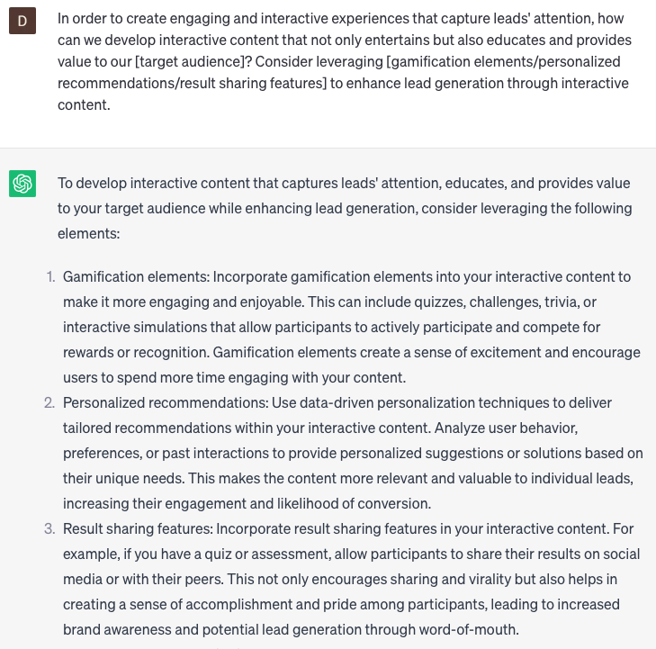

# Creating interactive content for lead generation

### FILL-IN-THE-BLANK **PROMPTS:**

```jsx
Hey ChatGPT, I need assistance in developing an interactive quiz aimed at generating leads for our **[specific product/service]**. Can you offer ideas for quiz questions and suggestions on designing an engaging and effective quiz?
```

```jsx
In order to create engaging and interactive experiences that capture leads' attention, how can we develop interactive content that not only entertains but also educates and provides value to our **[target audience]**? Consider leveraging **[gamification elements/personalized recommendations/result sharing features]** to enhance lead generation through interactive content.
```

```jsx
In the age of information overload, our content needs to be immersive and interactive to effectively engage and convert leads. How can we incorporate **[interactive videos/360-degree product tours/virtual reality experiences]** to create memorable and shareable content that drives lead generation? Consider analyzing **[user behavior/feedback]** to iterate and improve the interactive content over time.
```

### QUESTIONS-BASED P**ROMPTS:**

1. "How can you create interactive quizzes or assessments that not only engage your audience but also provide valuable insights for lead generation?"
2. "What strategies can you employ to develop interactive calculators or estimators that allow prospects to estimate savings or returns, driving lead generation?"
3. "How do you design interactive eBooks or whitepapers with interactive elements such as clickable infographics or interactive charts to enhance engagement and capture leads?"
4. "What techniques can you use to create interactive webinars or live Q&A sessions that encourage audience participation and generate leads in real-time?"
5. "How can you leverage interactive contests or giveaways to incentivize audience engagement and collect valuable lead information?"
6. "What methods can you employ to develop interactive product demonstrations or virtual tours that allow prospects to explore your offerings and generate leads?"
7. "How do you incorporate interactive polls or surveys within your content to gather feedback and capture lead data?"
8. "What strategies can you use to create interactive videos or interactive presentations that enable viewers to interact and engage with the content, leading to lead generation?"
9. "How can you leverage interactive quizzes or games that are relevant to your industry or niche to capture leads while providing an entertaining experience?"
10. "What techniques can you employ to create interactive landing pages or microsites that offer engaging experiences and prompt visitors to provide their contact information for lead generation?"

### EXAMPLES:

