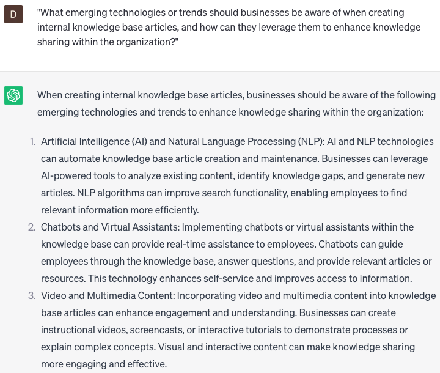

# Creating internal knowledge base articles

### FILL-IN-THE-BLANK **PROMPTS:**

```jsx
We require an article for our internal knowledge base that addresses **[specific topic]** from a specific **[perspective/angle]**. The article should encompass **[key points/facts/figures]** and include relevant **[examples/case studies]**. Would you be able to generate an article that fulfills these specifications?
```

```jsx
We are in search of a captivating article for our internal knowledge base regarding **[subject]**. This article should feature **[anecdotes/personal experiences/historical context]**, **[statistics/data/research findings]**, and **[quotes/expert opinions/citations]** from **[relevant industry leaders/scholars/experts]**. Would you be able to create an article that effectively incorporates all of these elements?
```

```jsx
Our team requires a thoroughly researched internal knowledge base article on **[topic]** that offers a comparative analysis of **[two or more concepts/theories/approaches]** relevant to the topic. The article should encompass an examination of **[potential benefits/risks/limitations/impacts]** associated with each approach, accompanied by **[case studies/examples]** that illustrate their effectiveness. Could you generate an article that fulfills these specified requirements?
```

### QUESTIONS-BASED P**ROMPTS:**

1. "How can businesses create comprehensive internal knowledge base articles that effectively capture and document organizational knowledge?"
2. "What are some best practices for organizing and categorizing internal knowledge base articles to ensure easy navigation and accessibility for employees?"
3. "How can businesses encourage employees to contribute to the creation of internal knowledge base articles and foster a culture of knowledge sharing?"
4. "What strategies can businesses employ to ensure that internal knowledge base articles are kept up-to-date and reflect the latest information and practices?"
5. "What role does multimedia content, such as videos or screenshots, play in enhancing the clarity and usefulness of internal knowledge base articles?"
6. "How can businesses create internal knowledge base articles that are written in a clear and concise manner, promoting effective understanding and application?"
7. "What methods can businesses use to measure the effectiveness and usage of internal knowledge base articles among employees?"
8. "What considerations should businesses keep in mind when implementing a search function within their internal knowledge base, enabling employees to find information quickly and efficiently?"
9. "How can businesses leverage internal knowledge base articles to streamline onboarding processes for new employees and facilitate their integration into the organization?"
10. "What emerging technologies or trends should businesses be aware of when creating internal knowledge base articles, and how can they leverage them to enhance knowledge sharing within the organization?"

### EXAMPLES:

