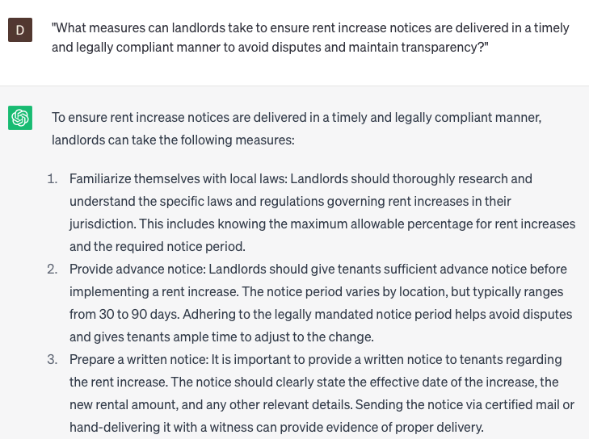

# Creating rent increase notices

### FILL-IN-THE-BLANK **PROMPTS:**

```jsx
Could you assist me in composing a rent increase notice for my **[tenant's name]** regarding my **[apartment/house]**? I need to notify them that the rent will be raised from **[current rent amount]** to **[new rent amount]**, effective from **[effective date]**. Include details about any additional services or amenities that will be offered along with the rent increase.
```

```jsx
When considering an upcoming rent increase for **[tenant's name]**, how can you craft a transparent, well-detailed letter, clearly stating the new rent amount, effective date, and a breakdown of the increased costs and expenses, while also highlighting any policy changes since the last rent increase?
```

```jsx
What are the steps involved in creating a rent increase notice for my **[tenant's name]** that effectively justifies the rent increase, citing reasons like increased property values or necessary repairs and maintenance? Additionally, I would like to infuse a personal touch by expressing gratitude for their tenancy and outlining any upcoming plans for property improvements or upgrades.
```

### QUESTIONS-BASED P**ROMPTS:**

1. "Why is it crucial to provide rent increase notices in a timely manner to tenants? How does it benefit both parties involved?"
2. "How can a well-crafted rent increase notice help landlords communicate the reasons behind the adjustment and maintain transparency?"
3. "What are the potential legal implications for landlords who fail to provide proper rent increase notices to tenants?"
4. "In what ways can rent increase notices facilitate open dialogue between landlords and tenants, fostering a positive landlord-tenant relationship?"
5. "How does a rent increase notice allow tenants to plan their finances accordingly and avoid any unexpected financial burdens?"
6. "What role does a rent increase notice play in ensuring compliance with local rental laws and regulations?"
7. "How can a rent increase notice be used as a documentation tool, providing evidence of proper communication and agreement between the landlord and tenant?"
8. "Why is it important for landlords to provide clear and concise explanations of the factors that contribute to the rent increase in the notice?"
9. "How does a well-drafted rent increase notice demonstrate professionalism and respect towards tenants, contributing to a positive landlord-tenant relationship?"
10. "What measures can landlords take to ensure rent increase notices are delivered in a timely and legally compliant manner to avoid disputes and maintain transparency?"

### EXAMPLES:

