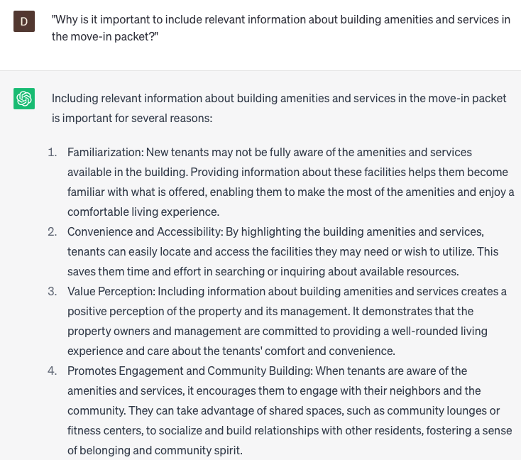

# Creating tenant move-in packets

### FILL-IN-THE-BLANK **PROMPTS:**

```jsx
Generate a professionally tailored lease agreement for **[tenant name]**, incorporating a monthly rental amount of **[amount]**, a security deposit of **[amount]**, a move-in date set for **[date]**, and a lease term spanning **[term]**. The expected outcome is a comprehensive and legally sound lease agreement that satisfies the specified terms and conditions.
```

```jsx
Could you please assist me in creating a template for a pet addendum to be included in a move-in packet, covering essential details such as the **[pet type], [pet breed], [pet name],** and **[pet deposit amount]**? The objective is to obtain a standardized and comprehensive pet addendum that can be seamlessly incorporated into the move-in packet.
```

```jsx
What essential information should be incorporated into a welcome letter for new tenants? Additionally, could you provide sample language encompassing **[building amenitties]**, **[local attractions]**, **[utility information]**, and **[emergency contacts]** to enhance the welcoming experience? The desired outcome is a well-crafted welcome letter that effectively informs and acquaints the new tenants with relevant details about the property and its surroundings.
```

### QUESTIONS-BASED P**ROMPTS:**

1. "What documents and information are crucial to include in a comprehensive tenant move-in packet?"
2. "How can a well-organized move-in packet facilitate a smooth transition for new tenants?"
3. "What essential forms should be provided to tenants in their move-in packet, such as the lease agreement, move-in checklist, and contact information?"
4. "What important guidelines and instructions should be included in the move-in packet to help tenants navigate the property effectively?"
5. "Why is it important to include relevant information about building amenities and services in the move-in packet?"
6. "How can providing utility information, such as contact details and instructions, assist tenants in setting up essential services promptly?"
7. "What role do local attractions and community resources play in enhancing the tenant's move-in experience, and how can they be highlighted in the move-in packet?"
8. "Why should emergency contacts and procedures be prominently featured in the move-in packet, and how can they contribute to tenant safety and peace of mind?"
9. "What additional resources or materials can be included in the move-in packet to help tenants become familiar with the neighborhood or city?"
10. "How can the language and design of the move-in packet be optimized to ensure clarity, readability, and a positive first impression for new tenants?"

### EXAMPLES:

