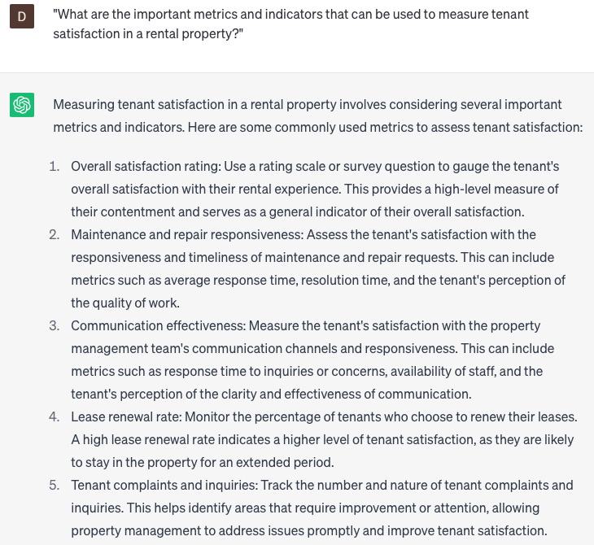

# Creating tenant satisfaction reports

### FILL-IN-THE-BLANK **PROMPTS:**

```jsx
Suggest actionable steps to address common tenant issues in **[insert location]**. Improve tenant satisfaction by implementing recommendations on **[insert actionable recommendation]**, within **[insert timeframe]**, and assigning responsibility to **[insert team/department]**.
```

```jsx
Share best practices for analyzing survey results and summarizing overall tenant satisfaction levels. Help identify trends and patterns based on **[insert questionnaire distibution method]**, **[insert survey response rate]**, and **[insert survey segmentation criteria].**
```

```jsx
Provide recommendations to enhance communication and responsiveness to tenant concerns and complaints. Use insights from **[insert data source or specific aspect to analyze]** to implement actionable strategies for improved tenant satisfaction. Consider preferred communication channels from **[insert tenant preference survey results]** and **[insert response time benchmarks]**.
```

### QUESTIONS-BASED P**ROMPTS:**

1. "What are the key components that should be included in a tenant satisfaction report to accurately assess tenant experiences?"
2. "How can regular tenant surveys contribute to the creation of comprehensive tenant satisfaction reports?"
3. "What are the important metrics and indicators that can be used to measure tenant satisfaction in a rental property?"
4. "How can qualitative feedback from tenants be effectively incorporated into tenant satisfaction reports?"
5. "What methods can be employed to ensure anonymity and encourage honest responses in tenant surveys for accurate satisfaction reporting?"
6. "How can tenant satisfaction reports help identify areas of improvement and prioritize actions to enhance overall tenant experience?"
7. "What role does benchmarking against industry standards and best practices play in creating meaningful tenant satisfaction reports?"
8. "What strategies can be implemented to effectively communicate and share tenant satisfaction reports with property owners and stakeholders?"
9. "How can tenant satisfaction reports be utilized to drive positive changes and initiatives in property management practices?"
10. "What are some effective ways to track trends and monitor changes in tenant satisfaction over time through tenant satisfaction reports?"

### EXAMPLES:

