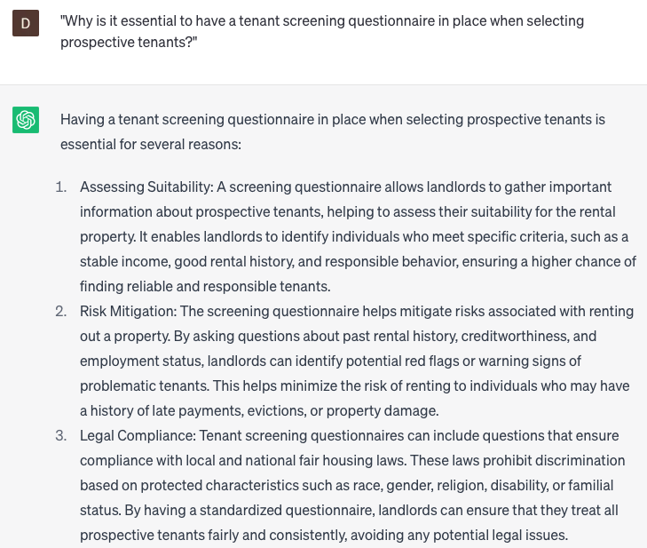

# Creating tenant screening questionnaires

### FILL-IN-THE-BLANK **PROMPTS:**

```jsx
Could you suggest a set of questions that can be incorporated into a tenant screening survey for a **[property type]** that allows pets, while ensuring compliance with **[local ordinance]** regulations?
```

```jsx
Within the context of the **[Fair Housing Act]**, how can you construct an unbiased tenant questionnaire, collecting vital **[screening criteria]** data while consciously avoiding any potentially **[discriminatory questions]**?
```

```jsx
What are recommended approaches for conducting background checks on potential tenants, especially when addressing **[screening concern]** concerns, and what are some important **[legal considerations]** to keep in mind?
```

### QUESTIONS-BASED P**ROMPTS:**

1. "Why is it essential to have a tenant screening questionnaire in place when selecting prospective tenants?"
2. "How can a comprehensive tenant screening questionnaire help ensure the safety and security of other tenants in the property?"
3. "What are the advantages of using a tenant screening questionnaire to assess the financial stability and reliability of potential tenants?"
4. "In what ways can a tenant screening questionnaire assist landlords in verifying the authenticity of the information provided by applicants?"
5. "What role does a tenant screening questionnaire play in mitigating the risk of rental payment defaults and late payments?"
6. "How does a tenant screening questionnaire aid landlords in identifying tenants who are more likely to take good care of the property?"
7. "What are the potential legal implications for landlords who do not utilize a tenant screening questionnaire during the tenant selection process?"
8. "How does a well-designed tenant screening questionnaire help landlords avoid potential discrimination claims by ensuring a fair and consistent evaluation process?"
9. "What impact can a thorough tenant screening questionnaire have on reducing tenant turnover and maintaining a stable and harmonious community?"
10. "Why is it important to regularly review and update the questions included in a tenant screening questionnaire to adapt to changing rental market dynamics and legal requirements?"

### EXAMPLES:

