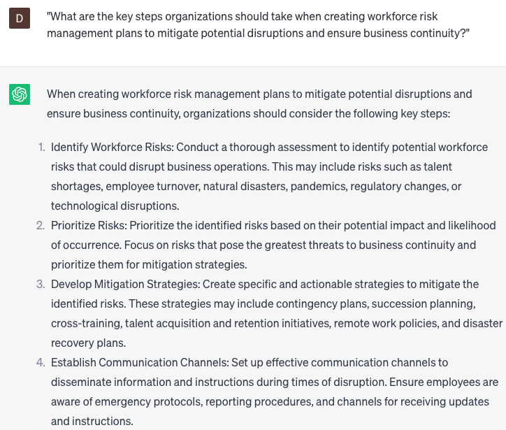

# Creating workforce risk management plans

### FILL-IN-THE-BLANK **PROMPTS:**

```jsx
What are a few **[specific strategies/techniques/tactics]** that can be employed to mitigate **[workforce risks/identified risks]**, and how can they be successfully implemented within **[organization name/industry]**?
```

```jsx
Could you offer examples of effective workforce risk management plans, either specific to the industry or based on best practices, and discuss how these plans can be customized and applied to **[organization name/industry]**?
```

```jsx
What are the various factors, whether internal, external, or environmental, that could influence the effectiveness of a workforce risk management plan? How can **[organization name/industry]** ensure that these factors are adequately monitored, addressed, or incorporated into their plan?
```

### QUESTIONS-BASED P**ROMPTS:**

1. "What are the key steps organizations should take when creating workforce risk management plans to mitigate potential disruptions and ensure business continuity?"
2. "How can organizations assess and prioritize workforce risks to effectively allocate resources and develop targeted risk management strategies?"
3. "What role does proactive identification and mitigation of talent-related risks play in creating robust workforce risk management plans?"
4. "How can organizations integrate workforce risk management plans with their overall enterprise risk management framework?"
5. "What strategies can organizations implement to address workforce risks associated with employee turnover, succession planning, and knowledge retention?"
6. "How can organizations leverage data analytics and predictive modeling to anticipate and mitigate workforce risks before they escalate?"
7. "What measures should organizations take to ensure compliance with regulatory requirements and industry standards in their workforce risk management plans?"
8. "How can organizations effectively communicate and train employees on their roles and responsibilities in managing workforce risks?"
9. "What contingency plans should organizations have in place to respond to unforeseen workforce risks, such as natural disasters or pandemics?"
10. "How can organizations regularly evaluate and monitor the effectiveness of their workforce risk management plans and make necessary adjustments?"

### EXAMPLES:

