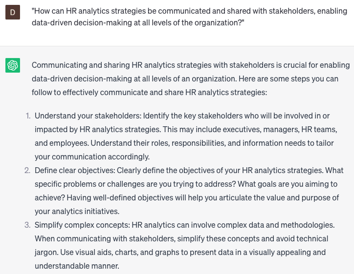

# Developing HR analytics strategies

### FILL-IN-THE-BLANK **PROMPTS:**

```jsx
Could you assist me in identifying the **[most important/key]** HR metrics **[or KPIs]** that are relevant for **[our organization/our specific industry or sector]**? We are in the process of developing our HR analytics strategy and require guidance on which metrics to prioritize, particularly considering the specific challenges or goals we have.
```

```jsx
I am tasked with creating a **[comprehensive]** plan for collecting HR data as part of our analytics project. Could you offer guidance on the best practices for **[collecting, cleaning, and storing]** HR data, taking into consideration our existing data infrastructure and available resources?
```

```jsx
We possess a substantial amount of employee data, yet we lack the knowledge on how to analyze it effectively. Can you propose **[advanced]** data analysis techniques that can help us derive valuable insights about our workforce, taking into account the specific questions we have or the hypotheses we want to test? Additionally, do you have any recommendations for data analysis tools or software that seamlessly integrate with our existing systems?
```

### QUESTIONS-BASED P**ROMPTS:**

1. "Why is it crucial for organizations to develop effective HR analytics strategies to leverage data-driven insights for strategic decision-making?"
2. "What factors should be considered when developing HR analytics strategies to ensure alignment with the organization's overall business objectives?"
3. "How can HR analytics strategies help identify patterns and trends in workforce data, enabling proactive talent management and succession planning?"
4. "In what ways can HR analytics strategies be utilized to measure the effectiveness of HR programs and initiatives, such as training, performance management, and employee engagement?"
5. "What techniques and methodologies can be employed in developing HR analytics strategies to derive actionable insights from large and complex HR datasets?"
6. "How can HR analytics strategies support workforce planning and predictive modeling, enabling organizations to forecast future talent needs and address skill gaps?"
7. "What measures should be taken to ensure data accuracy, integrity, and privacy when collecting and analyzing HR data for analytics purposes?"
8. "How can HR analytics strategies facilitate the identification of key performance indicators (KPIs) that drive HR and organizational success?"
9. "What steps should be taken to build a culture of data literacy within the HR function and across the organization to maximize the value of HR analytics?"
10. "How can HR analytics strategies be communicated and shared with stakeholders, enabling data-driven decision-making at all levels of the organization?"

### EXAMPLES:

