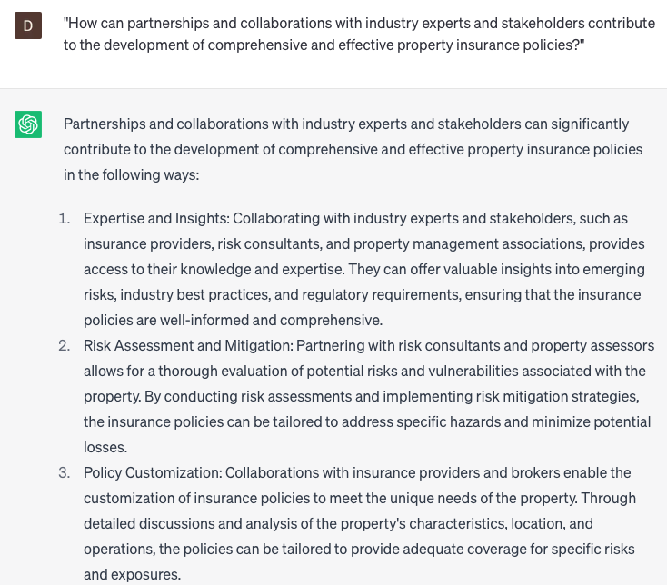

# Developing property insurance policies

### FILL-IN-THE-BLANK **PROMPTS:**

```jsx
How should property insurance policies for **[property type]** in **[location]** effectively address and manage the unique risks and hazards, taking into account relevant factors like **[additional factors]**? What strategies can be employed in the policy language to effectively mitigate these risks and provide optimal coverage?
```

```jsx
What are the significant patterns and trends observed in property insurance claims data for **[geographic region]** during the past **[time period]**? How can this valuable information be leveraged to make informed policy adjustments and develop effective risk management strategies?
```

```jsx
What are the key factors to consider when crafting property insurance policies tailored to **[business type]** in **[location]**, while taking into account various factors like **[additional factors]**? How can the policy language and coverage options be optimized to best meet the specific needs of this industry?
```

### QUESTIONS-BASED P**ROMPTS:**

1. "What potential risks and hazards specific to [PROPERTY TYPE] should be thoroughly assessed when formulating property insurance policies?"
2. "How can the unique characteristics of [LOCATION] influence the design and coverage of property insurance policies?"
3. "What additional factors, such as [ADDITIONAL FACTORS], need to be considered when developing comprehensive property insurance policies?"
4. "In what ways can the policy language be structured to effectively mitigate identified risks and hazards?"
5. "How can historical data and trends inform the development of property insurance policies to better align with the evolving needs of [PROPERTY TYPE] owners?"
6. "What are the best practices for incorporating risk management strategies into property insurance policies?"
7. "How can property insurance policies be tailored to address the specific requirements and challenges faced by [BUSINESS TYPE] in [LOCATION]?"
8. "What coverage options and endorsements are most suitable for protecting against the unique risks associated with [PROPERTY TYPE]?"
9. "What role does regulatory compliance play in the development of property insurance policies, particularly in relation to [SPECIFIC REGULATION OR LEGISLATION]?"
10. "How can partnerships and collaborations with industry experts and stakeholders contribute to the development of comprehensive and effective property insurance policies?"

### EXAMPLES:

