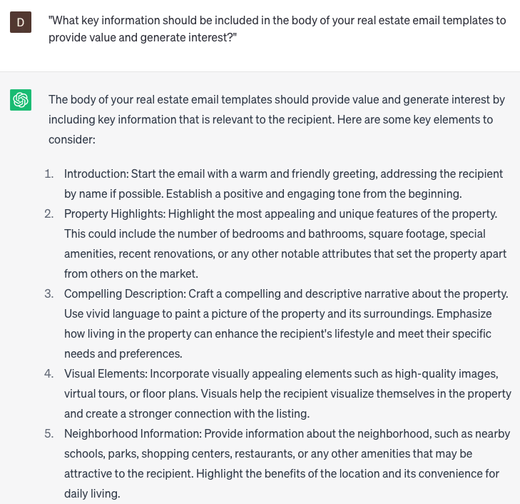

# Draft real estate email templates

### FILL-IN-THE-BLANK **PROMPTS:**

```jsx
Can you assist me in creating a customized email template for an attractive **[type of property]** located in the sought-after **[neighborhood/city]**? I would like to emphasize the appealing **[features]** of the property and ensure its strong appeal to potential **[target buyer(s) - family/couple/single]**.
```

```jsx
Engage potential **[investors/business partners]** with a compelling cold email template designed to showcase your expertise and attract lucrative **[type of real estate deal - flip/rental/commercial]** opportunities. Take cues from the principles outlined in the book 'Influence: The Psychology of Persuasion' by Robert Cialdini and craft a persuasive message that combines the power of social proof, highlighting **[success stories]** success stories from your previous real estate deals, with a compelling call to action inviting recipients to schedule a call and explore mutually beneficial possibilities.
```

```jsx
I require an email template for reaching out to prospective buyers who have expressed interest in acquiring a desirable **[type of property]** in the **[neighborhood/city]**. Could you compose an email that encompasses the essential **[type of information]**?
```

### QUESTIONS-BASED P**ROMPTS:**

1. "How can you craft compelling real estate email templates that effectively engage your audience and drive meaningful interactions?"
2. "What are some proven subject line strategies that can increase open rates and encourage recipients to read your real estate email?"
3. "How can you personalize your real estate email templates to create a sense of connection and relevance for each recipient?"
4. "What key information should be included in the body of your real estate email templates to provide value and generate interest?"
5. "How important is it to utilize visually appealing elements, such as images or graphics, in your real estate email templates?"
6. "What are some effective techniques for using storytelling and compelling narratives in your real estate email templates to captivate your audience?"
7. "How can you leverage data and segmentation to send targeted and tailored real estate emails that resonate with specific buyer personas?"
8. "What are some successful approaches to writing strong and persuasive calls-to-action in your real estate email templates?"
9. "How can you effectively follow up and nurture leads through automated real estate email sequences?"
10. "What role does testing and analyzing the performance of your real estate email templates play in optimizing your email marketing strategy?"

### EXAMPLES:

