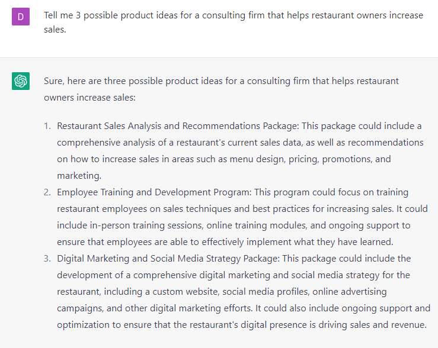

# Generating Product Ideas

### FILL-IN-THE-BLANK PROMPTS**:**

```jsx
Tell me **[number]** possible product ideas for a **[type of business]**.
```

```jsx
Give me a list of 4 product ideas I can create as a **[type of business]**.
```

```jsx
My customers are struggling with **[pain points]** and they want to **[dream outcome]**. 
Brainstorm 10 ideas for product I can create to solve their problems.
```

### OPEN-ENDED PROMPTS:

1. “What do you think will be the biggest trend in [industry] in the next 5 years?”
2. “What are the top 5 trends impacting [type of industry] right now?”
3. “What could be new products to offer as a [type of industry] serving [niche]?”
4. “Tell me where is the [name of the industry] going.”
5. “What new product could a [type of business] offer to its customers?”
6. “Tell me 3 possible product ideas for a consulting firm that helps restaurant owners increase sales.”
7. “Give me a list of 4 product ideas I can create as a carpet cleaning business.”

### EXAMPLES:

