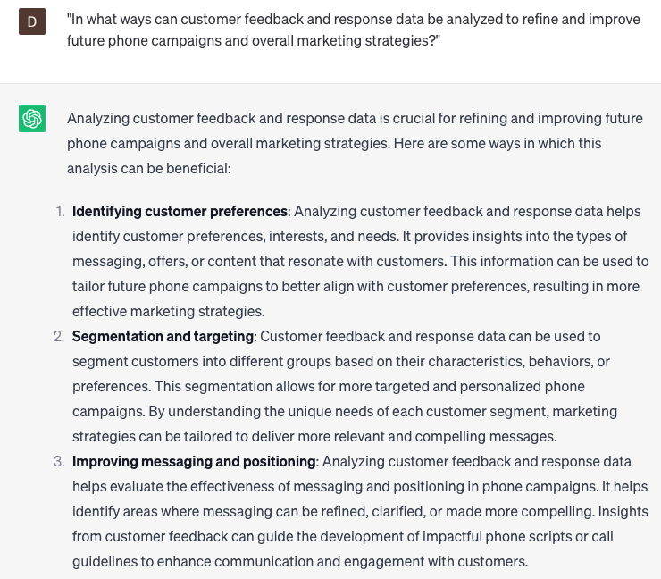

# Generating phone campaigns to promote products or services

### FILL-IN-THE-BLANK **PROMPTS:**

```jsx
Taking into account **[specific market research or data]**, could you propose some phone campaign ideas to effectively promote **[product/service]** to the **[target audience]** within **[specific location or demographic]**?
```

```jsx
In what ways can I harness the potential of **[specific technology or platform]** to develop a compelling phone campaign that effectively promotes **[product/service]** and resonates with the **[target audience]**?
```

```jsx
What are a few conceivable hurdles or difficulties that I might face while devising a phone campaign to market **[product/service]**, and what are some viable strategies or alternatives that can be employed to overcome them?
```

### QUESTIONS-BASED P**ROMPTS:**

1. "How can generating phone campaigns effectively promote products or services and drive customer engagement?"
2. "What key elements should be included in phone campaigns to capture the attention and interest of potential customers?"
3. "How can personalized and targeted messaging be incorporated into phone campaigns to maximize their impact?"
4. "What strategies can be employed to deliver compelling product or service benefits and value propositions during phone campaigns?"
5. "How can call scripts or talking points be designed to address common objections or concerns raised by potential customers during phone campaigns?"
6. "What role does effective call scheduling and timing play in optimizing the reach and response rates of phone campaigns?"
7. "What are the benefits of utilizing customer data and segmentation to tailor phone campaigns to specific audience segments or demographics?"
8. "How can call monitoring and performance tracking be utilized to assess the success and effectiveness of phone campaigns?"
9. "What techniques can be used to enhance customer interaction and engagement during phone campaigns, such as incorporating interactive elements or special offers?"
10. "In what ways can customer feedback and response data be analyzed to refine and improve future phone campaigns and overall marketing strategies?"

### EXAMPLES:

