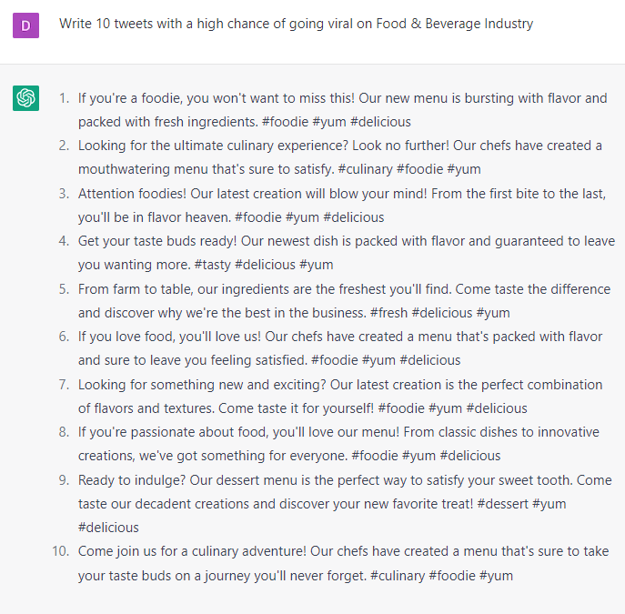

# Getting Your Tweets/Threads to Go Viral

### FILL-IN-THE-BLANK **PROMPTS:**

```jsx
Write 10 tweets with a high chance of going viral in **[niche].**
```

```jsx
Optimize this tweet to go viral: **[copy and paste tweet/thread].**
```

```jsx
Tell me 5 characteristics of tweets that go viral about **[topic]** on Twitter and Threads**.**
```

```jsx
Create an attention-grabbing tweet around **[topic].**
```

```jsx
Create 3 tweets that will be shared widely by influencers in **[industry]**. Make sure they appeal to **[audience]** and encourage them to share the tweet. **[For Threads add: Make sure each is no longer than 75 tokens]**
```

### EXAMPLES:

