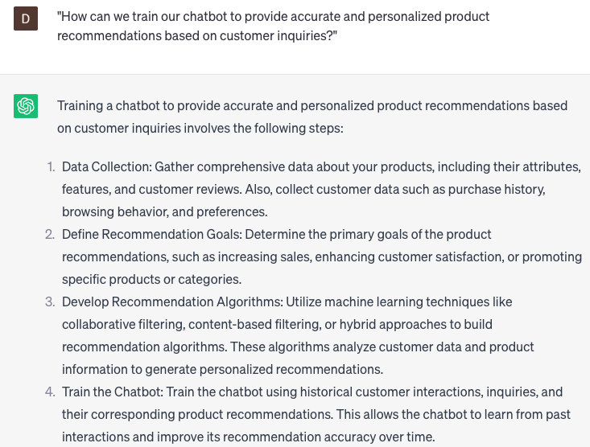

# Handling chatbot inquiries for product recommendations

### FILL-IN-THE-BLANK **PROMPTS:**

```jsx
I require assistance in addressing a customer inquiry pertaining to **[product category]**. Can you suggest some products with **[product feature]** that would effectively cater to their needs?
```

```jsx
I need your assistance in responding to this customer's inquiry. They are seeking recommendations for a **[product category]** that possesses **[specific product feature]**. Can you provide any suggestions?
```

```jsx
I'm facing difficulties in addressing this customer's inquiry regarding **[product category]**. Could you assist me by providing ideas for **[product feature]** products that would suit their needs?
```

### QUESTIONS-BASED P**ROMPTS:**

1. "How can we train our chatbot to provide accurate and personalized product recommendations based on customer inquiries?"
2. "What strategies can we employ to ensure our chatbot understands the unique preferences and needs of customers when making product recommendations?"
3. "Are there any specific algorithms or machine learning techniques we should utilize to enhance the chatbot's product recommendation capabilities?"
4. "How can we continuously update and refine the chatbot's training data to improve the relevance and accuracy of product recommendations?"
5. "What measures should we take to ensure the chatbot can handle complex product inquiries and offer suitable alternatives or options?"
6. "How can we incorporate customer feedback and ratings into the chatbot's product recommendation process to enhance its reliability?"
7. "Are there any specific guidelines or constraints we should set for the chatbot when recommending products, such as budget limitations or inventory availability?"
8. "What steps can we take to provide seamless handoff from the chatbot to human agents when customers require more detailed or personalized product recommendations?"
9. "How can we leverage chatbot analytics and customer interaction data to assess the effectiveness of product recommendations and make necessary improvements?"
10. "What strategies should we implement to continuously train and update the chatbot's product recommendation capabilities to stay up-to-date with evolving customer preferences and market trends?"

### EXAMPLES:

