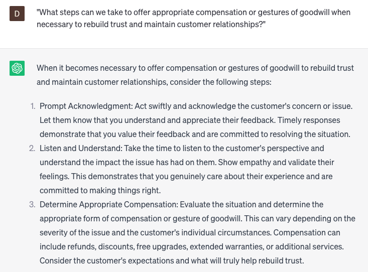

# Handling customer complaints

### FILL-IN-THE-BLANK **PROMPTS:**

```jsx
Could you share **[number]** strategies or techniques aimed at addressing a prevalent **[specific type of complaint]** within my industry or business? Additionally, I would appreciate any tips on how to effectively implement these strategies, taking into consideration my **[specific circumstance]**.
```

```jsx
In an effort to enhance my proficiency in handling customer complaints, I am seeking guidance specifically in the area of **[specific area of improvement]**. Could you please share **[number]** best practices, strategies, or techniques that are tailored to my **[specific level of experience]** and are applicable to my **[specific business or industry]**?
```

```jsx
I am currently facing a customer complaint that is exceptionally **[adjective describing the level of difficulty]**, demanding a distinctive approach for resolution. Could you please suggest some inventive or unconventional strategies or techniques that I can employ to address this issue, taking into consideration my **[specific constraints]**?
```

### QUESTIONS-BASED P**ROMPTS:**

1. "How can we effectively handle customer complaints to ensure a satisfactory resolution and maintain customer loyalty?"
2. "What steps should we follow when addressing customer complaints to demonstrate empathy and understanding?"
3. "Are there any specific protocols or escalation procedures we should adhere to when dealing with escalated customer complaints?"
4. "How can we actively listen to customers' concerns and gather all necessary information to address their complaints effectively?"
5. "What measures can we take to ensure prompt and timely responses to customer complaints, minimizing any inconvenience or frustration?"
6. "Are there any best practices for de-escalating tense situations and managing customer emotions during the complaint resolution process?"
7. "How can we ensure that we communicate transparently and provide regular updates to customers while working on resolving their complaints?"
8. "What strategies can we employ to prevent similar complaints from occurring in the future and improve our overall customer experience?"
9. "How can we gather feedback from customers after resolving their complaints to ensure their satisfaction and identify areas for improvement?"
10. "What steps can we take to offer appropriate compensation or gestures of goodwill when necessary to rebuild trust and maintain customer relationships?"

### EXAMPLES:

