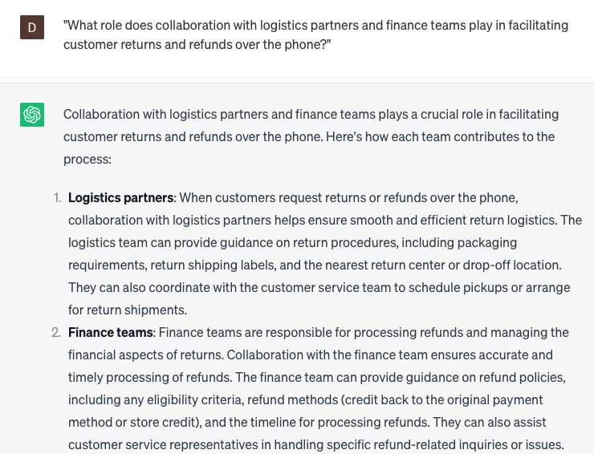

# Handling customer returns and refunds over the phone

### FILL-IN-THE-BLANK **PROMPTS:**

```jsx
I am currently assisting a customer who has **[recently purchased/ordered]** a **[product/service]** and wishes to initiate a return. Could you provide me with precise instructions on how to handle the return process, including any relevant deadlines or fees that may apply?
```

```jsx
The customer has requested a refund for their **[product/service]**, but the payment was made using a **[credit/debit]** card that has now expired. Can you provide guidance on determining the most suitable approach for processing the refund? This includes deciding whether to issue a check or credit the customer's account.
```

```jsx
I have a customer who wishes to initiate a return. However, they are **[missing/unable to locate]** the original purchase receipt. I would appreciate your assistance in determining if we can proceed with the return despite the absence of the receipt.
```

### QUESTIONS-BASED P**ROMPTS:**

1. "How can handling customer returns and refunds over the phone ensure a smooth and satisfactory resolution for customers?"
2. "What key information and documentation should be gathered during phone conversations to process customer returns and refunds accurately?"
3. "How can active listening and empathy be incorporated into phone interactions to understand the customer's concerns and provide reassurance?"
4. "What strategies can be employed to clearly communicate return and refund policies, procedures, and timelines over the phone?"
5. "How can customer service representatives guide customers through the necessary steps for initiating returns and obtaining refunds over the phone?"
6. "What role does collaboration with logistics partners and finance teams play in facilitating customer returns and refunds over the phone?"
7. "What are the benefits of offering alternative solutions, such as exchanges or store credits, as options for customers during return and refund discussions over the phone?"
8. "How can customer service representatives proactively follow up with customers after processing returns and refunds to ensure satisfaction?"
9. "What techniques can be used to document and analyze common return and refund issues to identify areas for process improvement?"
10. "In what ways can ongoing training and knowledge sharing empower customer service representatives to effectively handle customer returns and refunds over the phone?"

### EXAMPLES:

