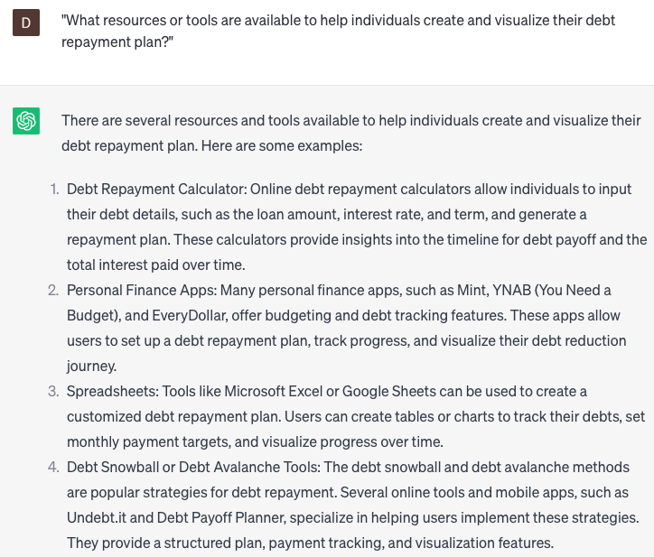

# Help create debt repayment

### FILL-IN-THE-BLANK **PROMPTS:**

```jsx
What is the most effective debt repayment strategy for an individual with a debt of **[amount]** and **[number]** sources of income?
```

```jsx
For individuals seeking to create a debt repayment plan, what steps or advice can you provide to **[manage debt/pay off loans effectively]**? Explore strategies for **[prioritizing debts/creating a repayment schedule/negotiating with creditors]** that can lead to **[debt freedom/financial relief/improved credit score]**.
```

```jsx
Can you suggest a suitable debt consolidation plan for an individual with **[number]** credit cards and a total outstanding balance of **[amount]**?
```

### QUESTIONS-BASED P**ROMPTS:**

1. "What strategies or tips do you recommend to individuals looking to create a debt repayment plan?"
2. "Can you provide insights on how prioritizing and organizing debts can help individuals tackle them more effectively?"
3. "How can budgeting and expense tracking contribute to creating surplus funds for debt repayment?"
4. "What role does negotiating with creditors or exploring debt consolidation options play in easing the burden of debt?"
5. "Can you explain the benefits of snowball or avalanche methods for repaying debts and how individuals can choose the right approach?"
6. "How can individuals avoid incurring additional debt while focusing on repayment efforts?"
7. "What resources or tools are available to help individuals create and visualize their debt repayment plan?"
8. "Can you provide examples of success stories where individuals have successfully paid off significant amounts of debt?"
9. "What considerations should individuals keep in mind when deciding between making extra debt payments or saving for emergencies?"
10. "How can individuals stay motivated and track progress while working towards their debt repayment goals?"

### EXAMPLES:

