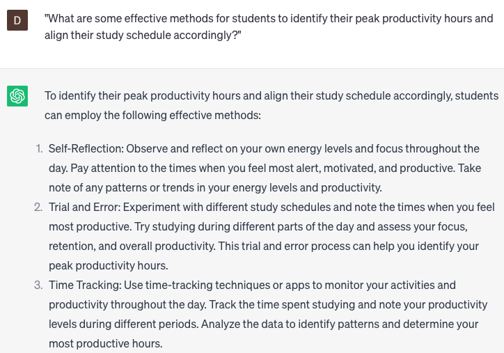

# Help plan study schedule

### FILL-IN-THE-BLANK **PROMPTS:**

```jsx
Could you create a customized study schedule for the upcoming semester, considering my goal of improving grades in **[subjects]**? I aim to dedicate **[hours]** hours per week to studying. Please note that I have classes on **[days]** and other commitments on **[days].**
```

```jsx
I'm aiming to improve my critical thinking and problem-solving skills to excel in **[subjects]**. Could you create a study schedule inspired by the "Pomodoro Technique" described in the book "The Pomodoro Technique" by Francesco Cirillo? The schedule should incorporate dedicated study sessions, short breaks, and longer breaks, optimizing my learning efficiency while dedicating **[hours]** hours per week to studying.
```

```jsx
I have a time constraint to complete an online certification course in **[topic]** within **[timeframe]**. Can you assist me in creating a schedule that enables me to manage my other responsibilities while ensuring timely completion of the course?
```

### QUESTIONS-BASED P**ROMPTS:**

1. "How can developing a structured study schedule help students manage their time effectively and improve their academic performance?"
2. "What strategies can students use to prioritize their study tasks and allocate sufficient time to each subject or topic?"
3. "In what ways can creating a study schedule that incorporates regular breaks and self-care activities contribute to better focus, productivity, and overall well-being?"
4. "How can students leverage digital tools and apps to create personalized study schedules that can be easily tracked and adjusted?"
5. "What are some effective methods for students to identify their peak productivity hours and align their study schedule accordingly?"
6. "How can students break down larger study goals into smaller, manageable tasks and integrate them into their daily or weekly study schedule?"
7. "What role does setting realistic and achievable study goals play in the process of planning an effective study schedule?"
8. "How can students create a balance between academic subjects, extracurricular activities, and other commitments when designing their study schedule?"
9. "What are some techniques for incorporating active learning strategies, such as practice quizzes or group discussions, into a study schedule to enhance understanding and retention?"
10. "How can students review and revise their study schedule periodically to ensure it remains adaptable and aligned with their changing needs and priorities?"

### EXAMPLES:

