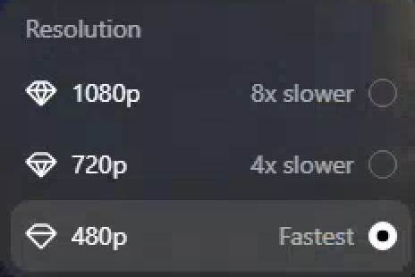
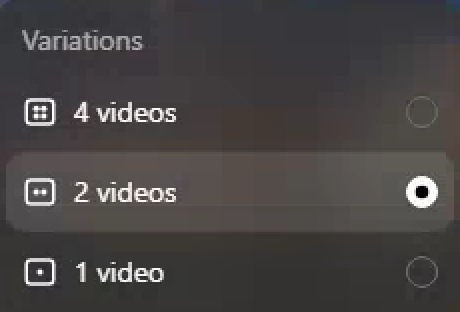
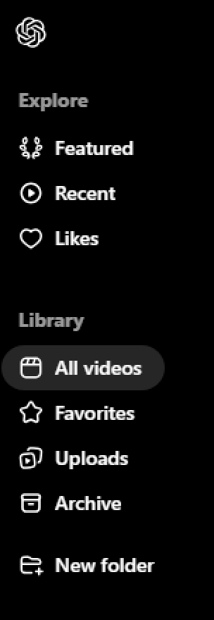

# How to Use It

In this section, you will learn how to create your first video using Sora.

Here's how you can do it step by step:

1️⃣ **Log into** [**https://openai.com/sora/](https://openai.com/sora/)** and click on **"Start now".**

2️⃣ **Enter your prompt**.

3️⃣ **Customize your video**:

- Select a **style preset** to match the tone of your video.
    
    
    

- Adjust the ****settings:

**→aspect ratio**

**→resolution**

**→duration**

- Choose the **number of variations** to generate.
    
    
    

- Hover over the **"?" icon** to see how many credits your chosen settings will use.
    
    
    

4️⃣ **Generate your video.**

5️⃣ **Edit your video**:

- **Trim or expand** the video to adjust its length.
    
    
    

- Use **Remix** to replace, remove, or re-imagine elements in your video.
- Try **Blend** to transition seamlessly between this video and another.
- Use **Loop** to make a repeating version of your video.

**6️⃣ Download your video.**

**🤔 What’s next?**

✅ Click on your **account icon** to view your generated videos. 

✅ You can also find them in the Dashboard under **'All videos.’**

✅ You can check how many credits you have left by looking next to the **'Credits'** section.

