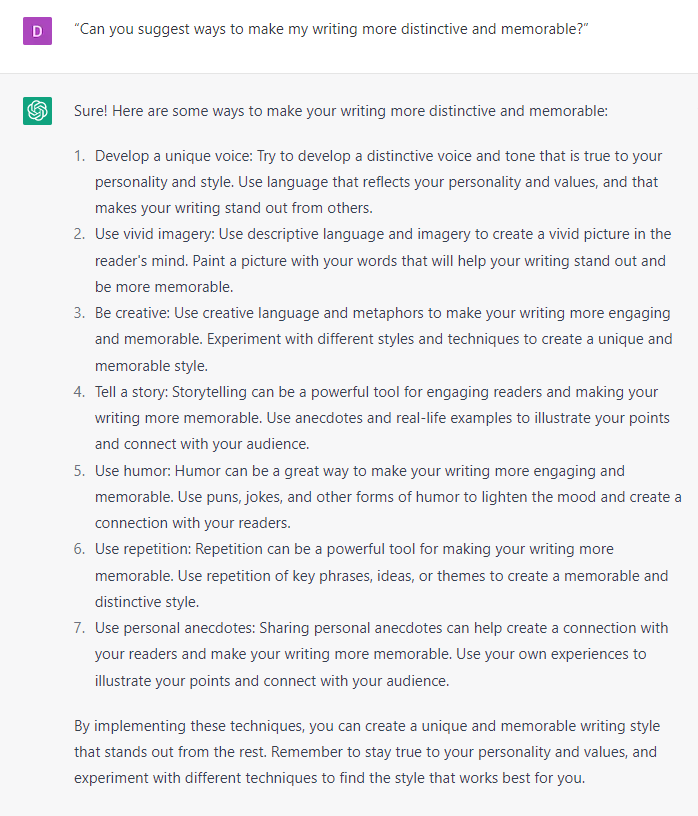

# Identifying Your Unique Brand Voice

### FILL-IN-THE-BLANK **PROMPTS:**

```jsx
Prompt 1: Analyze the following text for tone of voice and style. Apply that exact style and tone of voice to all your future responses

Prompt 2: Add more **[humor/statistics/shorter sentences/questions/playfulness].**
```

```jsx
List the adjectives you would use to describe the tone of voice and style of this text: **[copy and paste text]**

Apply that exact style and tone of voice to write **[new text].**
```

### OPEN-ENDED PROMPTS:

1. “What are the key characteristics of this writing style: [copy and paste a text].”
2. “Can you help me identify any common phrases or expressions that I tend to use in my writing? [copy and paste a text].”
3. “[copy and paste a text]. How does my writing style compare to other writers in my niche or industry?”
4. “What emotions or feelings does this writing tend to evoke in readers? [copy and paste a text].”
5. “[copy and paste a text]. Can you provide examples of my writing that demonstrate my unique tone of voice and style?”
6. “What are some strengths and weaknesses of this writing style, and how can I improve? [copy and paste a text].”
7. “How can I adapt this writing style for different audiences or purposes? [copy and paste a text].”
8. “What do these writing choices (such as sentence structure, vocabulary, and tone) say about my personality and values? [copy and paste a text].”
9. “Can you suggest ways to make this text more distinctive and memorable? [copy and paste a text].”
10. “How can I ensure that this writing style is consistent across different types of content and platforms? [copy and paste a text].”

### EXAMPLES:

