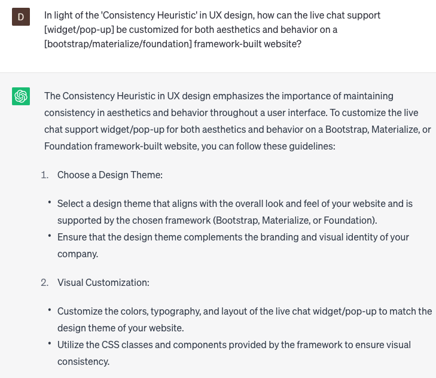

# Implement live chat support

### FILL-IN-THE-BLANK **PROMPTS:**

```jsx
Could you suggest a live chat support **[plugin/extension]** for the **[e-commerce platform]** e-commerce platform that provides **[features]** features?
```

```jsx
In light of the 'Consistency Heuristic' in UX design, how can the live chat support **[widget/pop-up]** be customized for both aesthetics and behavior on a **[bootstrap/materialize/foundation]** framework-built website?
```

```jsx
Can the live chat support functionality be implemented using the **[Twilio/TalkJS/Intercom]** API, and if so, what are the necessary steps to achieve this integration?
```

### QUESTIONS-BASED P**ROMPTS:**

1. "How can we effectively implement live chat support on our website to provide real-time assistance and enhance customer satisfaction?"
2. "What are the key features and functionalities that should be considered when selecting a live chat software or platform for our website?"
3. "How can we customize the live chat interface to align with our brand identity and provide a seamless integration with our website design?"
4. "What staffing considerations should be made to ensure prompt and efficient responses to customer inquiries through the live chat support system?"
5. "Are there any automation or chatbot capabilities that can be integrated with the live chat support to handle common queries and improve response times?"
6. "How can we measure and track the performance of our live chat support, such as response time, customer satisfaction ratings, or conversion rates?"
7. "What strategies can be implemented to proactively engage website visitors through proactive chat invitations or targeted messages?"
8. "What security measures should be taken to protect customer data and ensure the confidentiality of chat conversations during live chat interactions?"
9. "How can we effectively train and empower our support team to provide exceptional customer service through the live chat channel?"
10. "What resources or support documentation are available to assist in the implementation and optimization of live chat support on our website?"

### EXAMPLES:

