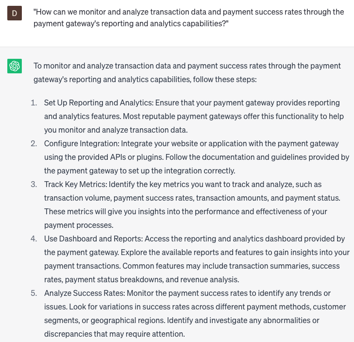

# Implement payment gateway

### FILL-IN-THE-BLANK **PROMPTS:**

```jsx
As I revamp my e-commerce website, I am seeking recommendations for the top payment gateway providers available in the market that align with my **[budget]** budget and fulfill my technical requirements. Here are my technical requirements: **[list technical requirements]**.
```

```jsx
Given the e-commerce landscape in **[country]**, what would be your choice for an efficient payment gateway for **[website/app name]**? Could you share your strategy for integrating this gateway into the checkout process, considering the principles of 'Frictionless Design'?
```

```jsx
Could you suggest a payment gateway that is compatible with **[currency/region]** and offers competitive transaction fees? Additionally, could you provide guidance on how to configure it to seamlessly integrate with **[platform type]** platform?
```

### QUESTIONS-BASED P**ROMPTS:**

1. "How can we seamlessly integrate a payment gateway into our website to securely process online transactions?"
2. "What are the key considerations when selecting a payment gateway provider that aligns with our business needs and supports the desired payment methods?"
3. "How can we ensure the payment gateway implementation is compliant with relevant security standards and regulations, such as PCI DSS?"
4. "Are there any specific programming languages or frameworks that should be utilized to effectively implement the payment gateway on our website?"
5. "What steps are involved in configuring and testing the payment gateway to ensure a smooth and error-free transaction process?"
6. "How can we customize the user interface and checkout experience to provide a seamless integration between our website and the payment gateway?"
7. "What measures can be taken to handle and store sensitive customer payment information securely, such as tokenization or encryption?"
8. "Are there any additional features or functionalities offered by the payment gateway provider that can enhance the user experience or streamline the payment process?"
9. "How can we monitor and analyze transaction data and payment success rates through the payment gateway's reporting and analytics capabilities?"
10. "What resources or support documentation are available to assist in troubleshooting and resolving any issues that may arise during the payment gateway implementation?"

### EXAMPLES:

