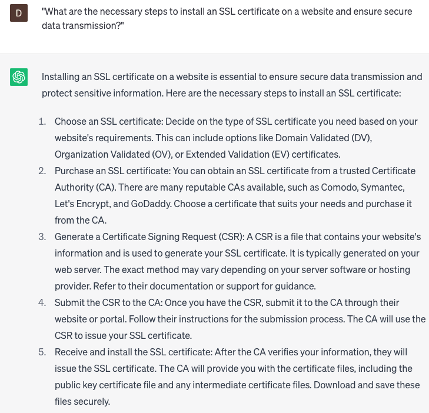

# Install SSL certificate

### FILL-IN-THE-BLANK **PROMPTS:**

```jsx
What are the steps to install an SSL certificate on my **[website]** hosted on **[hosting platform]**? Can you provide guidance on the installation process?
```

```jsx
I acquired an SSL certificate for my **[type of website]**. Provide clear instructions on how to install it on my **[server]**. Explain the importance of SSL for website security and user trust.
```

```jsx
My purpose is to install an SSL certificate for my **[type of website]**, which utilizes **[CMS name]** as the underlying content management system. Can you assist me in generating a CSR, acquiring a trusted SSL certificate, and successfully installing it on my web server?
```

### QUESTIONS-BASED P**ROMPTS:**

1. "What are the necessary steps to install an SSL certificate on a website and ensure secure data transmission?"
2. "How can we select the right type of SSL certificate that suits the specific needs and requirements of our website?"
3. "What preparations need to be made before installing an SSL certificate, such as generating a Certificate Signing Request (CSR)?"
4. "What are the recommended methods for verifying domain ownership during the SSL certificate installation process?"
5. "How can we configure the web server to enable HTTPS and redirect HTTP traffic to HTTPS after installing the SSL certificate?"
6. "What potential challenges or errors may arise during the SSL certificate installation, and how can we troubleshoot them effectively?"
7. "Are there any additional security measures or best practices that should be implemented alongside SSL certificate installation?"
8. "How can we ensure seamless compatibility and proper functioning of the SSL certificate across different web browsers and devices?"
9. "What are the options for automating SSL certificate renewal and staying updated with the latest security protocols?"
10. "What tools or resources are available to verify and validate the successful installation of the SSL certificate, including checking for HTTPS encryption?"

### EXAMPLES:

