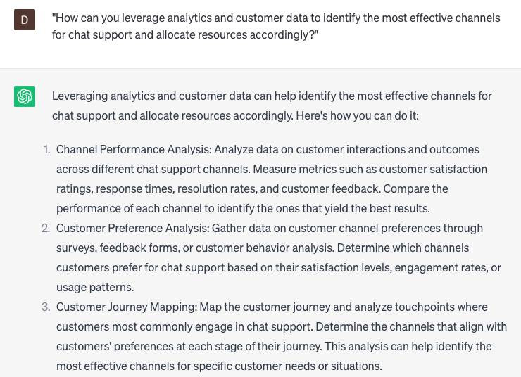

# Managing chat presence across channels

### FILL-IN-THE-BLANK **PROMPTS:**

```jsx
What are the best strategies for proficiently overseeing chat presence on **[messaging platform 1], [messaging platform 2]**, **[social media platform]**, and **[website]**, while guaranteeing a cohesive brand voice and tone across all channels?
```

```jsx
Which combinations of **[customer relationship management software]** and **[chatbot platform]** integrations are compatible with ChatGPT to automate chat presence management and enhance response time on **[messaging platform]** and **[social media platform]?**
```

```jsx
Which **[key performance indicators]** would you recommend tracking and measuring using ChatGPT to evaluate the effectiveness of my chat presence management strategy on **[messaging platform 1], [messaging platform 2]**, and **[social media platform]**? Furthermore, how can these metrics be utilized to drive data-informed improvements?
```

### QUESTIONS-BASED P**ROMPTS:**

1. "How can you effectively manage chat presence across multiple channels to provide a consistent and seamless customer experience?"
2. "What strategies can be implemented to ensure timely and responsive chat support across various communication channels?"
3. "In what ways can you prioritize and allocate resources to manage chat presence effectively across different channels?"
4. "What role does omni-channel integration play in maintaining a unified chat presence and avoiding customer frustration?"
5. "How can you leverage chatbots or virtual assistants to extend chat presence and support across multiple channels?"
6. "What measures can be taken to monitor and optimize chat response times and availability across various channels?"
7. "How can you tailor chat interactions to specific channels while maintaining a consistent brand voice and service level?"
8. "What are the best practices for implementing chat routing and escalation mechanisms to ensure efficient management of chat presence?"
9. "How can you leverage analytics and customer data to identify the most effective channels for chat support and allocate resources accordingly?"
10. "What are some innovative approaches or technologies that can enhance the management of chat presence across different channels and improve customer satisfaction?"

### EXAMPLES:

