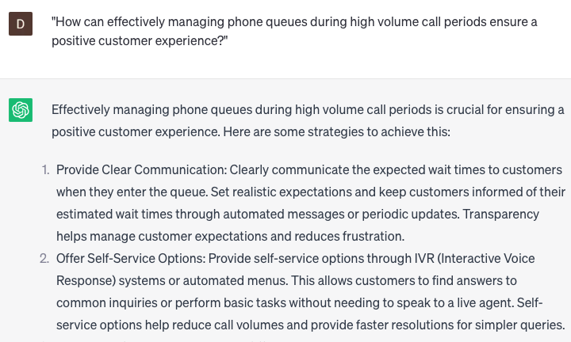

# Managing phone queues and handling high volume call periods

### FILL-IN-THE-BLANK **PROMPTS:**

```jsx
What **[is the average/expected] [hold/wait]** time for **[customers/callers]** during **[peak/high volume/busy] [hours/periods]** and how can we **[reduce/minimize/shorten]** it?
```

```jsx
What **[methods/strategies/approaches]** are considered the most effective for **[prioritizing/triaging/sorting] [calls/callers]** in the **[queue/line]** during **[high volume/busy] [periods/hours]**, and how can we successfully **[implement/enforce]** them?
```

```jsx
What is the established **[process/procedure]** to **[escalate/transfer] [calls/callers]** to a **[human/live] [agent/support representative]** when it becomes **[necessary/required]** during **[high volume/busy] [periods/hours]**, and how can we **[optimize/improve/streamline]** this process?
```

### QUESTIONS-BASED P**ROMPTS:**

1. "How can effectively managing phone queues during high volume call periods ensure a positive customer experience?"
2. "What key strategies and tools should be employed to efficiently handle a high volume of incoming calls?"
3. "How can call routing and intelligent queuing systems be utilized to minimize wait times and maximize customer satisfaction?"
4. "What role does clear and concise communication play in managing phone queues and setting realistic expectations for callers?"
5. "How can staffing and resource allocation be optimized to handle peak call periods and minimize customer wait times?"
6. "What are the benefits of providing alternative communication channels, such as live chat or self-service options, to alleviate phone queue congestion?"
7. "How can automated call-back systems be leveraged to offer callers the option to receive a return call instead of waiting in the queue?"
8. "What techniques can be used to monitor and analyze call data in real-time to identify and address bottlenecks in the phone queue?"
9. "How can customer segmentation and prioritization be implemented to ensure urgent or high-value calls are handled promptly during high volume periods?"
10. "In what ways can ongoing training and support be provided to customer service representatives to effectively manage phone queues and deliver quality service even under high-pressure situations?"

### EXAMPLES:

