# Nuclear_AI_Files

Welcome to Nuclear AI Files!

Inside these 290+ pages you'll find the best AI tools, strategies and implementations you can use this year to grow your business in less time and with less effort.

**Our AI experts tested over 2000 tools**, and compiled this ebook for you by selecting the best ones for you.

For each tool we've compiled comprehensive manuals to make it super easy to use them.

You'll also find everything you need to know about each AI tool and strategy, including a step-by-step tutorial.

(*So no, this is NOT like those 10-page ebooks you find out there.*) There's no need to follow a specific order.

**To use this handbook you simply have to:**

● open the contents

● identify the area in your business where you need AI's assistance — whether it's content creation, marketing, video production, or aspects

● turn to that section for guidance

This way you'll be able to find the right AI tool for your business and install it in your workflow seamlessly...

...without having to search through *dozens* of blog articles and videos to find the perfect AI solution for you.

Enjoy!

NUCLEAR AI FILES 1 dariuslukas.academy/

**TABLE OF CONTENT**

**CHAPTER 1: Give Superpowers to Your ChatGPT Account…………………………………….….4** 1. How to make ChatGPT more creative................................................................................4 2. Rarely used ChatGPT functions......................................................................................................................16 3. Bland output from ChatGPT? Do THIS......................................................................................................21 4. Stop wasting time on ChatGPT.....................................................................................................................24 5. The fastest way to grow a company through ChatGPT................................................................ 27 **CHAPTER 2: Get a Team of Marketers to Work For You…………………………………………..30** 1. Test your way to marketing success........................................................................................................... 30 2. AI for affiliate mastery: your new toolkit..................................................................................................34 3. Build your website with these 3 AI tools................................................................................................. 38 4. AI-powered landing pages in minutes!.................................................................................................. 40 5. Get a new AI marketing assistant............................................................................................................... 44 6. Boost SEO & Marketing with this AI tool................................................................................................ 48 **CHAPTER 3: Create Your Monthly Content in 3 Hours a Week……………………………….53** 1. Transform ideas into professional designs with Canva.................................................................. 53 2. Create any image you can think of............................................................................................................. 62 3. The best alternative to Midjourney............................................................................................................. 65 4. Create presentations in seconds..................................................................................................................69 5. Repurpose your content with these AI tools....................................................................................... 84 6. Create stunning videos in seconds!........................................................................................................... 87 7. Video, audio and image generation all in ONE tool!.......................................................................94 8. Take your videos and podcasts to the next level.............................................................................102 9. All you need for an AI video is here!..........................................................................................................106 10. High-quality videos 10x times faster ⚡................................................................................................ 110 11. Convert articles into videos easily...............................................................................................................117 12. Convert text to speech for free 🗣️............................................................................................................. 121 13. Create high-quality audio content in minutes ⏰.........................................................................126 14. All-in-one AI tool for your content 🤖......................................................................................................131 15. Automate your video content in 3 simple steps.............................................................................138 16. Create an AI Avatar and duplicate yourself........................................................................................147 17. Create AI designs in seconds!...................................................................................................................... 153 18. Transcribe and summarise instantly!.....................................................................................................158 **CHAPTER 4: Get Professional Texts Without Hiring Writers………………………….……..162** 1. Simplify your writing............................................................................................................................................ 162 2. 100 writing tools into one! 🥇.........................................................................................................................173

NUCLEAR AI FILES 2 dariuslukas.academy/

3. Improve your writing process 🚀................................................................................................................179 4. How to save time on your content ✍🏻.....................................................................................................183 5. The best AI tools for readers 📖................................................................................................................... 189 **CHAPTER 5: Get AI to Manage Your Social Media Accounts………………………………….193** 1. No time to work on a Youtube Channel? Do this 🎥......................................................................193 2. Here are 3 AI tools that make you viral on all social media platforms! 📈.....................202 3. Manage all social platforms with this AI tool!.................................................................................... 210 **CHAPTER 6: Cut Your Working Hours In Half With AI……………………………………………216** 1. Too many tasks? Use these 3 AI tools.......................................................................................................214 2. Get your emails organised fast ⚡............................................................................................................. 216 3. The best time-saving AI tools on a budget 💲..................................................................................222 4. Save time on daily tasks.................................................................................................................................. 228 5. AI note takers: Otter vs Fireflies 🏆............................................................................................................233 6. Meetings made easy: auto notes and summaries........................................................................240 7. Organise your information visually...........................................................................................................243 8. Implement AI on what you already do 📈..........................................................................................248 9. 3 ways to get unstuck through AI.............................................................................................................250 10. Find persuasive data with AI.......................................................................................................................252 11. Create your online course with AI!............................................................................................................257 12. Sell online courses effortlessly.................................................................................................................... 261 13. Get everything you need from your videos...................................................................................... 266 14. Next-level screen recordings!.....................................................................................................................272 15. AI customer support that feels human!..............................................................................................276

NUCLEAR AI FILES 3 dariuslukas.academy/

***CHAPTER 1***

*Give Superpowers to Your ChatGPT Account*

● **AI Tool**: ChatGPT

● **Category**: Chatbot

● **What it helps you with**: any kind of task

● **Link to website**:

---

**1. How to make ChatGPT more creative**

Something most ChatGPT users ignore is actually what makes it super powerful. **ChatGPT parameters.**

More specifically, to give your ChatGPT superpowers you need to know about three fundamental parameters: temperature, diversity_penalty, and best_of.

There would be a long list of parameters:

NUCLEAR AI FILES 4 dariuslukas.academy/

But for now it’s important for you to focus on these three:

**a) temperature**

Typically ranging from 0 to 1. It affects the randomness of the model’s output. A higher value results in more diverse outputs. A lower value makes the output more deterministic and focused.

● Low temperature (0-0.3): focused, consistent, conservative outputs.

● Medium temperature (0.3-0.7): balanced creativity and coherence/consistency.

● High temperature (0.7-1): highly creative and diverse, maybe less coherent.

NUCLEAR AI FILES 5 dariuslukas.academy/

For example, when editing books, it is often preferable to set a low temperature in order to maintain consistency rather than excessive creativity in the writing style and content.

**b) diversity_penalty**

Typically ranging from 0 to 2. It encourages the model to produce a diverse set of responses by penalising repeated tokens.

● low diversity penalty (0): no penalty applied, might have repetitive phrases.

● medium diversity penalty (1): balance between diversity and coherence.

● high diversity penalty (2): maximum diversity, might affect coherence. It will try to invent new ways of thinking.

For example, when using ChatGPT to reformat large text for articles and books, it is often necessary to reduce the occurrence of repetitive phrases.

**c) best_of**

The range can include any positive number. It instructs the model to generate a specified number of responses and return the best one according to its internal scoring. By iterating and connecting data, the aim is to produce acceptable or optimal cases of data that align with user expectations.

NUCLEAR AI FILES 6 dariuslukas.academy/

 **Implementation of Parameters**

**Prompt:**

temperature=**[desired number]**

diversity_penalty=**[desired number]**

best_of=**[desired number]**

Suggest me **[input].**

---

**Example 1**:

temperature=**1**

diversity_penalty=**2**

best_of=**5000**

Suggest me **names of blogs for horse caring for horses that have 3 legs.**

ChatGPT responds with more creativity as a result of all the parameters at a high level.

**Example 2**:

ChatGPT responds with more creativity as a result of all the parameters at a low level.

NUCLEAR AI FILES 7 dariuslukas.academy/

NUCLEAR AI FILES 8 dariuslukas.academy/

**Example 3**:

This example shows that the higher the level of parameters are, the higher the creativity and diversity of the response.

Now, let’s go deeper and **test one of the other parameters on the list.**

I chose the **‘presence_penalty’ paramete**r.

Basically, **this parameter controls how creative or focused the output of the model is**.

When the ‘presence_penalty’ is set to a low value (for instance 0.2), the model tends to be more creative and generates responses that may be more imaginative. It allows the model to come up with new and unique ideas, and the responses might be less predictable.

On the other hand, when the ‘presence_penalty’ is set to a high value (for instance 0.9), the model generates responses that are more predictable. It decreases the model's creativity level and makes the output more precise and on-point.

NUCLEAR AI FILES 9 dariuslukas.academy/

In simple terms, a low ‘presence_penalty’ lets the model think outside the box, while a high ‘presence_penalty’ keeps the model more focused and responses are more reliable and consistent.

My team and I ran some tests with the **presence_penalty parameter** on ChatGPT 3.5 (the free version of ChatGPT). And today I am going to share what we found.

Here is the comparison of the three example prompts I am about to show you: one with no requests about presence_penalty, one with low presence_penalty, one with high presence_penalty.

Let’s begin.

**EXAMPLE #1: no presence_penalty**

Prompt:

*You are a high-level content writer with years of experience in the biz-opp niche. Give me 10 email ideas I can develop in my weekly value emails and that would resonate with my audience.*

*I am a fitness coach and my expertise is bodybuilding and powerlifting for men.*

Output:

*Subject: Weekly Value Emails for Fitness Enthusiasts - Bodybuilding and Powerlifting Edition*

*Email 1: "Fueling Your Gains: Nutrition Tips for Maximum Muscle Growth"*

*In this email, provide insights on optimal nutrition strategies for muscle building, including macronutrient breakdown, meal timing, and nutrient-dense food choices.*

*Email 2: "Crushing Plateaus: Techniques to Break Through Strength Plateaus" Share effective techniques and training methods to help your audience overcome strength plateaus and continue making progress in their powerlifting journey.*

*Email 3: "Injury Prevention and Recovery: Taking Care of Your Body"*

*Discuss the importance of injury prevention and offer tips for proper warm-ups, mobility exercises, and recovery techniques to keep your audience in peak condition.*

*Email 4: "Effective Workout Splits: Designing Your Training Program"*

NUCLEAR AI FILES 10 dariuslukas.academy/

*Provide guidance on structuring workout splits tailored to bodybuilding and powerlifting goals, highlighting the importance of balancing volume, intensity, and recovery.*

*Email 5: "The Mind-Muscle Connection: Enhancing Your Training Performance" Explore the concept of the mind-muscle connection and explain how your audience can improve their mind-muscle connection to optimise muscle recruitment and maximise their training results.*

*Email 6: "Supplement Spotlight: Must-Have Supplements for Serious Lifters" Introduce and review essential supplements that can benefit bodybuilders and powerlifters, explaining their potential benefits and how to incorporate them into a well-rounded regimen.*

*Email 7: "Setting Goals for Success: The Power of Goal Setting in Fitness"*

*Discuss the importance of setting clear and measurable goals in bodybuilding and powerlifting, offering practical tips for setting realistic targets and staying*

*motivated throughout the journey.*

*Email 8: "The Importance of Rest and Recovery: Strategies for Optimal Performance" Educate your audience on the significance of adequate rest and recovery in muscle growth and strength gains, providing actionable tips on sleep optimization, active recovery, and stress management.*

*Email 9: "Building Your Support Network: Finding Your Fitness Community" Highlight the benefits of finding like-minded individuals within the fitness community, whether through local gyms, online forums, or social media, and encourage your audience to seek support and accountability.*

*Email 10: "The Mental Game: Overcoming Challenges and Staying Committed" Address common mental challenges faced by bodybuilders and powerlifters, such as self-doubt, motivation slumps, and the fear of failure. Share strategies and mindset techniques to help your audience stay committed and push through obstacles.*

*Remember to personalise these email ideas with your unique voice, personal experiences, and additional insights to make them resonate even more with your audience.*

**EXAMPLE #2: presence_penalty at 0.2**

NUCLEAR AI FILES 11 dariuslukas.academy/

Prompt:

*presence_penalty=0.2*

*You are a high-level content writer with years of experience in the biz-opp niche. Give me 10 email ideas I can develop in my weekly value emails and that would resonate with my audience.*

*I am a fitness coach and my expertise is bodybuilding and powerlifting for men.*

Output**:**

*Certainly! Here are ten email ideas for your weekly value emails that cater to your audience of men interested in bodybuilding and powerlifting:*

*1. Subject: "Unlocking Your Full Potential: The Power of Progressive Overload" - Discuss the importance of progressive overload in strength training and provide practical tips on how to implement it effectively in their workouts.*

*2. Subject: "Nutrition Secrets for Maximal Muscle Growth"*

- *Share valuable insights on nutrition strategies specifically tailored for muscle growth, including macronutrient ratios, meal timing, and supplementation recommendations.*

*3. Subject: "Avoiding Plateaus: Strategies for Continuous Strength Gains" - Offer guidance on breaking through training plateaus by incorporating advanced techniques such as deloading, periodization, and variation in training modalities.*

*4. Subject: "Building an Impressive Physique: Focus on Mind-Muscle Connection" - Explain the concept of mind-muscle connection and its impact on muscle development. Provide tips and exercises to enhance this connection and optimise results.*

*5. Subject: "Mastering the Bench Press: Techniques for a Stronger Upper Body" - Dive into the intricacies of the bench press, covering proper form, variations, accessory exercises, and programming suggestions to help your subscribers achieve a stronger and more developed upper body.*

*6. Subject: "Fueling Your Workouts: Pre- and Post-Training Nutrition"*

NUCLEAR AI FILES 12 dariuslukas.academy/

- *Educate your audience about the significance of pre- and post-workout nutrition, offering practical advice on what to eat before and after training sessions to maximise performance and recovery.*

*7. Subject: "Unleashing Your Leg Day Potential: Training Tips for Powerful Lower Body"*

- *Share effective leg training strategies, including compound lifts, accessory exercises, and training protocols designed to build strength, size, and definition in the lower body.*

*8. Subject: "Supplementation Demystified: What Works and What Doesn't"*

- *Address common misconceptions about supplements, and provide insights into evidence-based supplements that can enhance performance, recovery, and muscle growth.*

*9. Subject: "Mindset Matters: Harnessing Mental Strength in Your Fitness Journey" - Discuss the importance of mindset and mental resilience in achieving fitness goals, offering practical techniques and strategies to overcome challenges and stay motivated.*

*10. Subject: "Maximising Recovery: Sleep, Rest, and Optimising Results" - Emphasise the crucial role of recovery in muscle growth and strength development. Provide tips on improving sleep quality, managing stress, and incorporating active recovery techniques for better results.*

*These email ideas cover a range of topics related to bodybuilding and powerlifting, providing valuable information, tips, and strategies to help your audience achieve their fitness goals. Remember to customise and adapt the content to align with your own expertise and brand voice.*

**EXAMPLE #3: presence_penalty at 0.9**

Prompt:

*presence_penalty=0.9*

*You are a high-level content writer with years of experience in the biz-opp niche. Give me 10 email ideas I can develop in my weekly value emails and that would resonate with my audience.*

*I am a fitness coach and my expertise is bodybuilding and powerlifting for men.*

NUCLEAR AI FILES 13 dariuslukas.academy/

Output:

*Subject: Weekly Value Emails for Bodybuilding and Powerlifting Enthusiasts*

*Email 1: "Unlock Your Full Potential: Maximising Strength Training with Proper Form"*

*Email 2: "Fueling Your Gains: The Ultimate Guide to Pre- and Post-Workout Nutrition"*

*Email 3: "Avoiding Common Pitfalls: Overtraining and Injury Prevention Strategies"*

*Email 4: "Building the Perfect Routine: Designing a Training Program Tailored to Your Goals"*

*Email 5: "Mastering the Big Lifts: Bench Press, Squat, and Deadlift Technique Tips"*

*Email 6: "Supplements Uncovered: The Science Behind Effective Muscle-Building Supplements"*

*Email 7: "Breaking Through Plateaus: Strategies for Overcoming Training Stagnation"*

*Email 8: "The Mind-Muscle Connection: Unleashing the Power of Mental Focus in Your Workouts"*

*Email 9: "Achieving Aesthetic Balance: Sculpting Your Physique through Targeted Training"*

*Email 10: "The Power of Recovery: Optimising Rest and Sleep for Muscle Growth"*

*These email ideas focus on providing valuable content that resonates with bodybuilding and powerlifting enthusiasts. They cover a range of topics, including training techniques, nutrition, injury prevention, supplementation, overcoming plateaus, and the importance of recovery. Each email can provide practical tips, evidence-based strategies, and motivational insights to keep your audience engaged and motivated on their fitness journey. Remember to customise the content to fit your unique voice and style, ensuring that it resonates with your specific audience.*

So… who won?

NUCLEAR AI FILES 14 dariuslukas.academy/

It’s pretty clear that output #1 and #2 (no presence_penalty and presence_penalty at 0.2) are more creative and high-quality compared to output #3 (presence_penalty at 0.9).

The quality and creativity between #1 and #2 is not that different, though. There *is* a difference, but is not game-changing (in this example, at least).

So **the takeaway here** is that the best thing to do is probably to keep this parameter in your toolbox when you use ChatGPT, especially when writing a normal prompt doesn’t deliver a satisfying output.

Sometimes including this parameter in your prompts can help you substantially with a better output, while sometimes you will get just a very good answer from ChatGPT.

NUCLEAR AI FILES 15 dariuslukas.academy/

**2. Rarely used ChatGPT functions**

In this section I want to give insights about some cool ChatGPT tricks that are rarely used, but that will improve your results.

I want to walk you through **4 rarely used ChatGPT functions and implementations** that you can use starting today in any task. I’ll also give you examples for practical situations.

Let’s begin! 😎

Let’s start with number 1:

**1. MAX TOKENS**

The ‘max tokens’ parameter limits the length of the response by specifying the maximum number of tokens it can generate. This is very useful especially in copy and content. When we want a catchy line or a summary that fits within a specific word count, we can set the maximum tokens to ensure responses hit the mark.

Why can’t we use ‘words’? GPT doesn’t really understand word count, but thinks more in terms of tokens, which is just a different measurement.

Here are some practical examples (apply them after giving a good amount of context to ChatGPT):

● Social Media Posts:

Prompt: "Generate a captivating social media caption for our new product image. Keep it within 50 tokens”

● Ad Copy:

Prompt: "Craft a compelling tagline for my ad. Keep it within 10 tokens for

NUCLEAR AI FILES 16 dariuslukas.academy/

maximum impact."

● Chatbot Response:

Prompt: "Provide a concise answer to the customer's query about our shipping policy. Keep it to 30 tokens or less."

And in case you are wondering, token length doesn't count the same as words, but you don’t have to do any hard work to convert them! Open AI provided us with a simple :

This way you will know what to ask ChatGPT for in your token limit.

**2. TEXT COMPLETION**

Text completion is another cool feature. It's like having a writing buddy who knows just what to say to complete our sentences or fill in the missing parts. We can use it to generate engaging blog intros, complete dialogue, or assist with writing a

NUCLEAR AI FILES 17 dariuslukas.academy/

compelling email body.

It’s very handy when we are writing our own copy and we get stuck in some sentences and can’t keep going forward.

If you’re up to it, you can also train a ChatGPT chat about your company values, offers and branding, so that when you write emails, posts, etc. you will let it autocomplete many parts.

All you have to do is write inside your prompt: [AI completes the text]. And it will do the rest.

**3. MULTI-TURN CONVERSATIONS**

Want to know a secret principle about ChatGPT and AI? Treat it like an assistant, not like a Google search.

What I mean by that is have a conversation, providing feedback on the answers it gives.

This is effective because the more you structure your AI work in conversations, the more ChatGPT will learn and improve.

This brings me to talking about multi-turn conversations, which can be mostly useful for brainstorming ideas and finding solutions to problems you wouldn’t think of.

Multi-turn conversations simply means to maintain context with a conversation, not just writing one single prompt, but a series of questions, comments and feedback on the answers it gives you. This way your conversation becomes an interactive

dialogue.

Here’s a practical example for a lead generation coaching business:

"I'm a lead generation coach and I want to expand my services. What are some

NUCLEAR AI FILES 18 dariuslukas.academy/

potential areas I can focus on?"

AI: "That's exciting! Let's brainstorm together. Can you tell me more about your current services and target audience?"

"Currently, I offer lead generation strategies for B2B companies targeting the technology sector."

AI: "Great! Building on that, have you considered offering specialised lead generation workshops or webinars tailored specifically for SaaS companies? This could help you establish a niche expertise and attract a highly targeted audience."

"That's an interesting idea! What other areas do you think I could explore?"

AI: "Another potential area to explore is providing lead nurturing and conversion optimization services. Many businesses struggle with converting leads into

customers, so offering guidance on optimising sales funnels and lead nurturing campaigns could be a valuable addition to your services."

"I like that suggestion! What about incorporating LinkedIn lead generation strategies into my coaching?"

AI: "Absolutely! LinkedIn is a powerful platform for B2B lead generation. You could offer personalised coaching on optimising LinkedIn profiles, prospecting strategies, and effective outreach techniques to help your clients generate high-quality leads through this platform."

It can go on as much as you want.

**4. SALES CALLS ANALYSIS & IMPROVEMENT**

ChatGPT can be a valuable tool for analysing sales calls, in multiple ways. First off, through sales calls transcription analysis.

If you train the model to analyse conversation dynamics, identify sales techniques, and extract valuable insights, you will create your personal AI sales coach, which tells you how to improve and optimise conversion rates.

For instance, you can prompt the AI with sales call transcriptions (you can use

NUCLEAR AI FILES 19 dariuslukas.academy/

to transcribe sales calls) and ask it to highlight all the objections raised by customers and suggest effective ways to overcome those.

But it doesn't end here.

You can also improve by simulating sales calls with ChatGPT. Here is the first prompt you can use to start the simulation:

*I am a sales rep for a [niche] business. Today I will simulate a sales call with you. Pretend you are a customer. In this simulation use a colloquial language and act like a [target audience].*

Example:

*I am a sales rep for a lead generation coaching business. Today I will simulate a sales call with you. Pretend you are a customer. In this simulation use a colloquial language and act like a male business owner over 35.*

NUCLEAR AI FILES 20 dariuslukas.academy/

**3. Bland output from ChatGPT? Do THIS**

How many times were you unhappy with the output you got from ChatGPT because of the tone and style it used? 🙄

Like in anything with ChatGPT, we have to give specific instructions. If we don’t tell AI *how* to write the output, we will get just generic and bland copy/content.

Plus, it will be *clearly* written by AI. No good!

The solution is using **tone modifiers**.

But wait, what are tone modifiers? After a lot of testing, we saw that when you add a combo of specific adjectives to your input you can manipulate the output.

So all you have to do is add this sentence at the end of your prompt: *Please write the output with a [enter the tone combo] tone.*

Now, let’s see what these tone combos are, shall we? Down below you will find a list of situations where tone modifiers can really help you out.

**1. Formal communications**

When it comes to formal communication, such as business emails, formal reports, and legal documents, the **"professional + straightforward"** tone combo is the best choice. With this combo you establish yourself as a reliable and authoritative voice.

**2. Engaging Sales and Marketing Copy**

If you want to write compelling sales emails, persuasive marketing campaigns, and customer service messages you will have to be engaging, yet professional at the same time. That’s where the **"friendly + professional"** tone combo comes into play.

This combo allows you to connect with your audience on a deeper level, building trust and nurturing long-lasting relationships.

NUCLEAR AI FILES 21 dariuslukas.academy/

When it comes specifically to sales copy, there are also two more tone modifiers to keep in mind: **“persuasive, informal, conversational”** and **“emotionally**

**compelling”**. These are the adjectives that ChatGPT uses to describe good sales copy, so keep them in mind.

**3. Expert opinions**

You have to write a thought leadership article or an industry report? The

**"authoritative + informative"** and **"authoritative + expert"** combos are there to help you. With these combinations your text will help you position you as a go-to resource in your niche.

Of course, depending on the situation you can adjust them. For instance, if you have to speak in a formal presentation, then you may also use the **“authoritative + professional”** combo.

**4. Urgent communications**

For limited-time offers, promotional campaigns, and time-sensitive announcements, the **"urgent + persuasive"** combo will give you great results. By leveraging this tone, your message becomes more compelling to take immediate action.

**5. Social media, blog content and conversations**

Everyone’s tone of voice on blogs and social media is different, but many brands will use a **"casual + conversational"** tone. Unleash your creativity, ignite discussions, and form authentic connections with your audience.

If your goal is to get more engagement, then you can opt for the **“casual + funny”**combo, or even the **“humorous + informal”** combo.

**6. Business proposals and instilling trust**

There are some situations where you need the other person to trust you. Business

NUCLEAR AI FILES 22 dariuslukas.academy/

proposals, investor pitches, conversations with clients… even in sales copy, when your goal is to instil trust. In those cases the **"professional + trustworthy"** tone combo is your golden ticket, because it will help you present your ideas with professionalism and create trust.

**7. Sensitive communications**

Some conversations are very hard. When we don’t know what to say to address sensitive topics, crisis communications, or customer service matters, the **"serious + empathetic"** combo really saves the day. It will help you communicate in the best way possible and demonstrate compassion and sincerity, ensuring the other person feels heard and supported.

**8. Motivational speeches**

Business owners and team managers need to know how to motivate and inspire other people, whether they are clients or team mates. You can help them in their path to success with the **"positive + enthusiastic"** tone. This tone modifier infuses your message with optimism and infectious energy, I’m sure many of you will find it useful!

Test these tone modifiers with ChatGPT and see the magic happen.

**One last suggestion**: do your tests with your tone of voice and find the best combos for you. What I just showed you are the general combos that work on ChatGPT, but your tone of voice is unique, so you will have to find what tone modifiers work best for your messaging, copy and content.

NUCLEAR AI FILES 23 dariuslukas.academy/

**4. Stop wasting time on ChatGPT**

One of the things ChatGPT is here to help us with is **saving more time**.

So if you are using it you are probably already saving a handful of hours every week.

What if we could stop wasting valuable time and make the process even faster?

Seems impossible? Read this section to find the truth. 🔍🕵🏻‍♂️

What you will find out today is 3 ways **you can work better and be more organised inside ChatGPT**, helping you boost your productivity even further.

Let’s begin! 👨🏻‍💻

**1. CREATE YOUR TRAINED AI ASSISTANTS**

If you start a new conversation with ChatGPT every single time you log in to work… you are wasting valuable time.

Because instead of creating new conversations and having to train them each time, you can just continue the convos you already started. The language model will be already trained on that topic or task, and the initial output will be much better.

So **the first step is to ask yourself: what are the 3-10 most recurring tasks you work on every week?**

Once you know that, you can create one conversation for each topic/task. Convo after convo you will have created a trained AI assistant that knows how you write, what you need and what is the best way to respond.

Let’s make an example.

Maybe you are an entrepreneur and you often work on these tasks: strategy, product innovation and speaking to events.

In this case you could create 3-10 convos on ChatGPT, which could be: 1. Company strategy

2. Innovating product A

NUCLEAR AI FILES 24 dariuslukas.academy/

3. Innovating product B

4. Innovating product C

5. Presentation on topic A

6. Presentation on topic B

These AI conversations will function as your AI team that learns from you prompt after prompt.

By doing this you won’t have to write a long initial prompt every single time to train the language model about your company and who you are, because you already did it once… so why should you do it twice?

**2. USE THE FAST LANE OF PROMPTS**

Another way to save time while working on ChatGPT is to be able to write the prompts you write most frequently… faster.

How? There is a tool called that allows you to create shortcuts for anything you want.

Let’s say you are a web developer, and you often use ChatGPT to find bugs inside code.

Instead of writing a prompt like:

*I want to find the bug inside a piece of code. Here is the code you need to analyse:[insert code here]*

You could set up a shortcut where you just have to write:

*/bug*

And the whole prompt will appear in front of your eyes.

You’d still have to edit, but you’d save the time it takes to do something repetitive, which is writing the actual prompt.

It’s even faster than copying and pasting, as you don’t have to switch between windows or files.

NUCLEAR AI FILES 25 dariuslukas.academy/

You can download the Chrome extension from the or directly from the .

**3. DON’T LOSE HOURS OF WORK**

It already happened in the last few months, it may happen again.

Open AI could encounter glitches or bugs that disable the chat history function, and you may lose all the work you have done. Yes, all at once.

So do yourself a favour and export your chats. You can copy and paste the outputs you prefer into a Google Doc or Word file, but if you want to create the back-up file in just one click, it’s pretty easy to do in ChatGPT.

Here is what you have to do:

1. Click on your account in the bottom left corner of the page 2. Click on ‘Settings’

3. Click on ‘Show’, near ‘Data Controls’

4. Click on Export Data at the bottom

5. Confirm the export

If you need more find more info, here is the OpenAI tutorial on how to export the conversations:

NUCLEAR AI FILES 26 dariuslukas.academy/

**5. The fastest way to grow a company through ChatGPT**

There are many things that need to be in place for maximum growth…

But **feedback from your audience** after a launch is one of the *fastest* ways to do it - yet, one of the most overlooked ones. 🚀

And today we will see a 5-step process where you can leverage AI to grow consistently after all your launches.

Ready?

Then let’s start with number 1…

1. **DIVE INTO BUYER INSIGHTS**

First things first, let's get inside the minds of your amazing buyers.

Reach out to them and find out what made them whip out their credit card and say, 'This is it!'.

This is your opportunity to have meaningful conversations with your customers and understand the key factors that influenced their decision to purchase from you.

Ask them to share 1-3 reasons that resonated with them the most and give them something for free in exchange. These insights will be pure gold, and they’ll be revealing the secret sauce that makes your product or service irresistible to your target audience.

If you don’t feel like coming up with a nice email to write, make ChatGPT write it. You can use this prompt:

*Hi ChatGPT, I want to email my customers and ask them what are the 1-3 reasons why they bought [name of the product].*

*If they answer honestly in exchange I will give them [insert the name and explanation of what you will give them].*

*Can you please write it for me? Make it [adjectives of your tone of voice]*

2. **UNRAVEL THE MYSTERY BEHIND NON-BUYERS**

Now, let's talk about the folks who *didn't* hit that "Buy Now" button.

NUCLEAR AI FILES 27 dariuslukas.academy/

Connect with non-buyers and dig deep.

Ask them what stopped you from jumping on board, what doubts or hesitations held them back. And give them something for free in exchange for this info.

This feedback is invaluable as it provides insights into the barriers and objections that prevented conversions. Remember, every objection presents an opportunity for growth.

Want AI to write the email to send? No problem:

*Hi ChatGPT, I want to email my customers and ask them what are the 1-3 reasons why they didn’t buy [name of the product].*

*If they answer honestly in exchange I will give them [insert the name and explanation of what you will give them].*

*Can you please write it for me? Make it [adjectives of your tone of voice]*

3. **BRING IT ALL TOGETHER**

Time to consolidate your findings, my friend!

Copy and paste all those juicy answers (from both buyers and non-buyers) right from your inbox into a Google Doc.

This centralised hub will become your treasure of customer insights.

4.**SUPERCHARGE WITH CHATGPT**

Now it’s time to leverage AI and make ChatGPT summarise the key takeaways from all that valuable feedback. Positive or negative, you'll get a bird's-eye view of what your audience loves and where they need a little extra love.

Here is a prompt you can use:

*Context: I asked my audience (buyers and non buyers) why they did or didn’t buy my [product or service] called [name of the product or service].*

*Here are the answers:*

*[paste from the Google Doc]*

*Now please summarise all the positive and negative things they said about this product.*

NUCLEAR AI FILES 28 dariuslukas.academy/

*Put the insights in a table with two columns: on the left you put the reasons why customers bought, on the right the reasons why people didn’t buy.*

5. **ROCK THE FAQs**

Now that you have this table (you can paste it into a spreadsheet or Google Doc) you can put those insights into action, my friend!

You can ask ChatGPT to generate a list of FAQs based on the buyer motivations and barriers that stopped people from buying.

These FAQs will become your secret weapon, because these are all angles you can use in your landing pages, email sequences, product pages, and so on.

Anticipate those burning questions, address concerns upfront, and watch those sales soar! 🎉

This is how you grow consistently with your audience.

NUCLEAR AI FILES 29 dariuslukas.academy/

***CHAPTER 2***

*Get a Team of AI Marketers to Work For You*

**1. Test your way to marketing success**

● **AI Tool**: multiple

● **Category**: marketing

● **What it helps you with**: get more ideas and

materials to test new

things

● Link to website:

---

When it comes to copywriting and marketing, we all have a good friend on our side: split tests (or tests in general).

It’s kind of fun, right? You test a new version against the best performer, then when you have the new best performer time to test a new version.

Yes, it’s fun, except the fact that when things don’t convert, you’re leaving money on the table 💸 But what if you could optimise all (or a big part) of your marketing assets and test more copy for your promotions?

You would be able to increase your conversion rates, and decrease your cost of acquisition.

How does that sound? 🤑

With AI it’s possible, and I’ll show you how.

1. **TEST NEW COPY VERSIONS**

NUCLEAR AI FILES 30 dariuslukas.academy/

Let’s start from ChatGPT.

Something in your funnel is not working? Could be the ad hook, could be the body copy, or maybe the CTA?. Or who knows, maybe the problem lies in the landing page copy.

In these cases the first thing to do would be to test more headlines (in the ad and on the landing page) and CTAs.

Here’s a prompt you can use:

*Hi ChatGPT, my sales funnel is not converting well, and I need to run some tests to get a higher conversion rate.*

*Context:*

*Here is the current [ad/landing page headline/CTA]:*

*[paste your current ad/landing page headline or CTA]*

*Examples:*

*Here are some [ad/landing page headlines/CTAs] that worked for this product previously that I want you to take as example:*

*[paste some examples you want to imitate]*

*Instructions:*

*Create 20 new versions of the current headline. Make them more compelling*

2. **GET SUGGESTIONS ABOUT YOUR WEBSITE BASED ON PERFORMANCE**

Create new high-converting landing pages without a developer? Yup, with .

With this tool, all you need is one prompt, and you get a landing page that is optimised based on thousands of high-converting landing pages.

Permar also analyses your performance, gives you suggestions for improvements and automatically implements those changes.

NUCLEAR AI FILES 31 dariuslukas.academy/

3. **CREATE AND TEST NEW LEAD MAGNETS**

Testing new lead magnets is a great way to find the best vehicle to get new leads into your email list… and AI is here to help you just with that, because it allows you to take something you have already done and turn it into a new lead magnet.

Here is what you can do:

- choose a topic

- gather the most performing pieces of content you have created on that topic (both long-form and short-form)

- feed ChatGPT with your content multiple times

- edit the final text

- put the text into a Canva template

The first prompt could be:

*You are a high-level marketer specialised in creating lead magnets. I run a business that sells [products or services you offer]. Today I want to create a new lead magnet with the content I already created.*

*Here is a [type of content] I created: [insert content]*

*Rewrite it so that I can use it as a lead magnet*

The following prompts will contain more pieces of content to feed ChatGPT:

*Here is [type of content] I created: [insert content]*

NUCLEAR AI FILES 32 dariuslukas.academy/

*Add the content to the lead magnet you are writing*

This way you can easily create new lead magnets to test every week! 🚀

NUCLEAR AI FILES 33 dariuslukas.academy/

**2. AI for affiliate mastery: your new toolkit**

● **AI Tool**: multiple

● **Category**: affiliate

marketing

● **What it helps you with**: streamline your affiliate activities and campaigns **● Link to website:**

---

Let’s dive into the exciting world of AI for affiliate marketing.

Over the past few years, affiliate marketing has become a great income source for people and a great lead source for businesses… and AI now plays a big role in streamlining processes.

It’s getting better at finding potential customers, making ads work great, and even predicting what customers might do next.

So, what's all the fuss about AI in affiliate marketing?

Well, imagine having AI as your secret weapon. It can help you make your marketing campaigns work better, find out what kind of content people like, and help you make smarter choices.

Now, picking the right AI tool is important. Once you find the perfect match, your marketing game will be on fire!

In this section we’ll see both sides of the affiliate marketing ‘coin’: from the

perspective of who IS an affiliate and from the perspective of who manages affiliates.

**PART 1: IF YOU ARE AN AFFILIATE**

There’s a great tool to help you get your affiliate marketing to the next level.

NUCLEAR AI FILES 34 dariuslukas.academy/

. it's like your content genie – it quickly checks out your website, comes up with catchy campaign names and titles, and with just a few clicks, you're creating Facebook ads, blog posts, YouTube Ads, and even Google Ads.

Sure, ChatGPT is cool, but it's not the best at knowing the specific rules for each social media platform.

. gathers everything up in one place, so all you need is a quick login and a couple of clicks, and you're set to rock!

Creating your affiliate campaign is a lot easier, it just takes you 3 steps:

*Step 1: Select Your Campaign Industry*

Begin by choosing your specific niche or industry. Define your intended audience and tailor the tone of your content accordingly.

*Step 2: Create Your Campaign Instantly*

Hit the *'Build*' button, and Super Affiliate A.I will make the campaign in a matter of seconds. It generates landing page text, email sequences for follow-ups, and even Facebook ad content.

*Step 3: Launch Your Campaigns*

NUCLEAR AI FILES 35 dariuslukas.academy/

Once the campaign is generated, you can effortlessly copy and paste the content wherever you wish to kickstart the campaign.

In simpler words:

1. Choose your niche

2. Define your audience and set the tone for your content. 3. Hit 'Build' to get landing page text, email sequences, and ads. 4. Copy-paste content and ignite your campaigns.

5. Launch with Confidence 🚀

As you can see, AI is changing the game in affiliate marketing, making things easier, faster, and more awesome!

Cool, right?

**PART 2: IF YOU MANAGE AFFILIATES**

If you use affiliates to generate leads for your business, that’s another game.

When you manage affiliates, you're onto a performance-based strategy – spending where it matters, and getting results that truly count.

The more high-quality affiliates you have, the more your business grows. Focusing on the right affiliates also helps you save money on marketing. And if you can

streamline the managing process, it’s easier to see how your affiliate marketing strategy is performing.

The good news is that you can make managing affiliates super easy with an AI tool called !

*What Can Trackdesk Do?*

Imagine handling all your affiliate stuff in one place – that's what Trackdesk does! It helps you take care of affiliates, referrals, and partners, all in one go.

Plus, it gives you really useful info, lets you change things easily, and helps you grow.

Trackdesk also lets you make groups for different affiliates. This way, everything stays neat and tidy, and your partnerships get even better.

NUCLEAR AI FILES 36 dariuslukas.academy/

Also, connecting Trackdesk with other tools you use is easy. And if you're not sure what to do, no problem! There's a team ready to help you get started.

To recap, here’s what you can do with Trackdesk:

1. Group Affiliates 🌐

2. Organise your affiliates for better management.

3. Integration Made Simple 🔄

4. Connect Trackdesk seamlessly with your favourite tools.

5. Expert Support 💬

NUCLEAR AI FILES 37 dariuslukas.academy/

**3. Build your website with these 3 AI tools**

● **AI Tool**: multiple

● **Category**: website

building

● **What it helps you with**: build your website in one day

**● Link to website:**

---

Here are 3 tools you can use right away to create your website:

1. **Build a website within 30 seconds**

is a new AI tool that allows you to create an entire website with images and copy in 30 seconds 🤯

You can edit the final product without code, and then use AI copywriting, SEO, analytics and a simple CRM to market your website.

So, the next time that you need a website, consider doing it within 30 seconds using this tool 😅

2. **Create videos from text**

lets you create completely new videos with text, images, or video clips, all from text descriptions.

You can use it to create simple videos like animated text that can help you turn static images into engaging reels or high-converting ads.

NUCLEAR AI FILES 38 dariuslukas.academy/

3. **Generate scripts for website content**

If you feel creating a video script is hard and tedious, is here to make it 10 times faster.

This AI allows you to create a short video script for TikTok, YouTube shorts, and Instagram Reels in less than 1 minute.

If you are using short form video content to grow organically, this tool will come in handy.

NUCLEAR AI FILES 39 dariuslukas.academy/

**4. AI-powered landing pages in minutes!**

● **AI Tool**: Plai

● **Category**: marketing

● **What it helps you with**: creating free landing

pages

**● Link to website:**

---

In this section , we're shining a spotlight on a tool that could transform your marketing strategy: **’s Free AI Landing Page Builder.**

Think about all those hours (and dollars) spent creating landing pages for your campaigns.

Now, imagine building one in just seconds...

makes it easy to create landing pages that *actually* convert.

Let’s dive in and show you how simple it is!

**How to Build Your First Landing Page with Plai (in 5 Simple Steps)** 1️⃣ Sign up for **free** at Plai.

2️⃣ Select “Landing Page Template” and click “Create”.

NUCLEAR AI FILES 40 dariuslukas.academy/

3️⃣ Add your website URL and a few key details about your product, service, or campaign.

NUCLEAR AI FILES 41 dariuslukas.academy/

4️⃣ Click **“Write for me”** and let the AI enhance your content.

NUCLEAR AI FILES 42 dariuslukas.academy/

5️⃣ Publish it, share it, and start converting!

💰**Pricing**

Currently, Plai’s AI Landing Page Builder is completely **free** to use.

If you want to access advanced features like **ad optimization, built-in Google Analytics, or Google Conversion Tracking**, Plai, offers four pricing plans:

● **Whitelabel Starter ($147/month)**: Manage 1-3 clients, add your branding, connect to GoHighLevel, and access AI tools for ad creation.

● **Whitelabel Plus ($297/month)**: Manage up to 8 clients, optimize ad spend, view client reports, and create multi-ad sets.

● **Whitelabel Pro ($497/month)**: Manage unlimited clients with done-for-you ad templates and advertising services.

● **Blacklabel ($999/month)**: Perfect for agencies managing up to 25 clients or franchises, with tailored tools and resources.

Each plan includes a free trial to help you get started!

The **free landing page builder** is a great place to start, allowing Plai to create the perfect page for you, tailored to your content, audience, and goals—driving customers to sign up or buy your product or service.

The best campaigns are built with smart tools. This one’s free.

NUCLEAR AI FILES 43 dariuslukas.academy/

**5. Get a new AI marketing assistant**

● **AI Tool**: multiple

● **Category**: marketing

● **What it helps you with**: streamline your

marketing activities

● Link to website:

---

The 3 tools I am going to show you here will operate as your new AI marketing assistant.

They are very simple to use, and they will help you create more and better marketing assets for your business.

1. **MAKE BETTER AD COPY ON LINKEDIN**

Crafting the perfect ad copy can be a real challenge, right? Well, LinkedIn has your back with its brand new AI-driven tool.

This tool takes data from your LinkedIn page and settings, including your objectives, target criteria, and audience, and suggests different versions of your ad's introductory text. And they're using the power of OpenAI models to make it happen.

Here's how it works: let’s say you're creating an ad campaign on LinkedIn. You simply input your copy into the "introductory text" box within the Campaign Manager. Then, when you toggle on the "Generate copy suggestions" feature, you'll unlock a treasure trove of alternative suggestions for your text. Cool, right?

NUCLEAR AI FILES 44 dariuslukas.academy/

But wait, that's not all.

They also rolled out a generative to help you write engaging LinkedIn posts *(only available for LinkedIn Premium subscribers).*

If you are already using LinkedIn for your brand, I would give these new tools a chance.

If you aren’t using Linkedin for your brand, maybe this is the right time to start ;)

2. **GET A CAMPAIGN ASSISTANT ON HUBSPOT**

HubSpot helped many marketers with automation, now it has your back with an amazing AI-powered tool called .

With Campaign Assistant, you can churn out landing page copy, marketing email content, and ad copy for your upcoming campaigns in minutes.

NUCLEAR AI FILES 45 dariuslukas.academy/

You just need to provide information about your campaign, choose a tone of voice that aligns with your brand, and select the type of asset you want to generate, whether it's a landing page, email, or ad.

Then, boom! You have your new copy assets.

Whether you are writing your own copy or your copy team needs new ideas, this tool could really help you generate more leads and sales.

The best part? Campaign Assistant is absolutely free to use! All you need to do is create a HubSpot account or log in to your existing one, and you’re in.

3. **USE YOUR FEED TO GET NEW IDEAS FOR CONTENT AND COPY**

Ever heard of ?

No? Then you’re missing out on something that will save you a lot of time.

This AI tool sends you weekly email summary of your YouTube and Substack feeds.

And this is great not just for your learning, but also because you can find many hooks, concepts and topics you can use in your copy and content.

NUCLEAR AI FILES 46 dariuslukas.academy/

All you need to do is identify the topics and concepts you think would work great for your audience and ask ChatGPT to tie that concept into your brand or product.

Here is a prompt you can use:

*Hi ChatGPT! Today I want to write a new [type of content] based on this concept: [paste the concept you found in the summary]*

*Write a [type of content] keeping in mind that my company sells [type of products], my audience is [target audience], and their main problem is [problem].*

This is a great way to create new assets from the content you already follow.

NUCLEAR AI FILES 47 dariuslukas.academy/

**6. Boost SEO & Marketing with this AI tool**

● **AI Tool**: MarketMuse

● **Category**: SEO &

marketing

● **What it helps you with**: it improves your SEO

● **Link to website**:

---

If you're a content creator looking to improve your SEO rankings or a marketing professional crafting a strong content strategy, can take your efforts to the next level.

This will make sure your content doesn't just rank but dominates the competition. 🌟

Let's dive in and see what it can do!

**Key Features:**

🧵 **Content Strategy Optimization:** Create a roadmap with competitive analysis and personalized recommendations.

NUCLEAR AI FILES 48 dariuslukas.academy/

🔍**Keyword Research**: Find high-impact keywords and discover related topics.

🖋**AI-Generated Content Briefs**: Get detailed outlines for articles, complete with headings, questions to answer, and internal linking suggestions.

NUCLEAR AI FILES 49 dariuslukas.academy/

📊**Content Scoring**: Evaluate your content's quality compared to competitors.

🚀**AI-Powered Research**: Save hours by letting MarketMuse analyze the best resources on your chosen topic.

NUCLEAR AI FILES 50 dariuslukas.academy/

🎯**SERP Analysis**: Understand what makes top-performing pages rank and use that insight to build better content.

**How to Use MarketMuse:**

**1. Get Started**:

Sign up for a **free account** and explore the platform.

**2. Build Your Content Strategy:**

Start with the **Topic Navigator** to discover relevant content ideas, then use the **SERP X-Ray** to analyze how those topics perform in search results.

Next, take advantage of the **Heatmap** to spot and prioritize content opportunities, and use **Connect** to map the relationships between topics.

NUCLEAR AI FILES 51 dariuslukas.academy/

**3. Create or Optimize Content**:

Use AI-generated briefs for new articles or get actionable recommendations to improve existing ones.

💰 **Pricing**

Right now, offers four pricing plans.

● The **Free plan** costs $0 and includes limited features, one user, and 10 queries per month.

● The **Optimize plan** is $99 per month ($999/year) and offers 100 tracked topics, 5 content briefs, and 1 strategy document each month.

● The **Research plan** costs $249 per month ($2,499/year) and includes 500 tracked topics, 10 content briefs, and 3 strategy documents monthly.

● The **Strategy plan** is $499 per month ($5,499/year) and offers 10,000 tracked topics, 20 content briefs, and 5 strategy documents each month.

Ready to take your SEO game to the next level?

NUCLEAR AI FILES 52 dariuslukas.academy/

***CHAPTER 3***

*Create Your Monthly Content in 3 Hours a*

*Week*

**1. Transform ideas into professional designs with Canva**

● **AI Tool**: Canva

● **Category**: Design and image generation

● **What it helps you with**: visuals and pictures

● **Link to website**:

---

Feeling uninspired staring at a blank canvas?

Canva added cool AI tools and they can transform your design process into a magical experience!

is here to transform your ideas into professional designs in a matter of seconds.

In this section I’ll walk you through each of the AI tools that you can start using in Canva one by one.

● **MAGIC DESIGN**🔮

**What can you do with Magic Design:** With , you can create a presentation within seconds. Just type your idea, and a variety of templates will appear for you to pick from.

NUCLEAR AI FILES 53 dariuslukas.academy/

**How to Use Magic Design:**

1. Access Magic Design from Canva's homepage or within the editor.

2. Describe the presentation you want to create in the search bar.

3. Add images by clicking "Media" and selecting from your uploads or uploading new images.

4. Click "See results" to generate a presentation or design.

5. Customise the results to match your brand's style.

**Why is it interesting?**

You can create presentations from text prompts in seconds and customise the results to match your brand's style.

**● MAGIC SWITCH** 🔁

**What can you do with Magic Switch:** allows you to transform and repurpose your designs into different formats and even auto-translate content. You can create summaries, blog posts, email drafts, and presentations with a few clicks.

**How to use Magic Switch:**

1. Click on the toolbar and select the desired option.

2. Select "Transform into Doc" to convert designs and their content into various formats.

3. Edit the new document.

NUCLEAR AI FILES 54 dariuslukas.academy/

For example, if you pick the "Summary" option, the AI will read the text on each slide and make a short summary of it in just a few paragraphs.

If you select the "Blog Post" style, the AI will use each slide to make a blog post that can include things like pie charts and data uploads.

There’s more!

Inside this tool there are multiple options and functions.

**● MAGIC EXPAND** 📷

**What can you do with Magic Expand:** This option allows you to turn vertical photos horizontal and fix framing in seconds.

**How to Use Magic Expand:**

1. Choose the photo you wish to edit.

2. Click "Edit photo" on the editor toolbar.

3. In the "Effects" tab, pick "Magic Expand."

4. Select your preferred size option or drag a crop handle to expand the image beyond its original borders.

5. Click the "Magic Expand" button and give it a moment to process your image.

NUCLEAR AI FILES 55 dariuslukas.academy/

does not work with images inside frames, grids, or page backgrounds.

**● MAGIC MORPH** 🌟

**What can you do with Magic Morph:** Add special effects to text and images with simple prompts.

**How to Use Magic Morph:**

 1. Start or open any design.

 2. In the editor's side panel, click on "Apps."

 3. Type in the search toolbar and select the Magic Morph option. Choose an element in your design, such as text, a simple graphic, or a shape.

 4. Describe how you want the chosen element to look. The more details you provide, like objects, colours, location, or surroundings, the better the result.  5. Click the "Magic Morph" button and wait for the tool to process the image.  6. To include the generated image in your design, simply click on it.

According to Canva, these are the most effective type of prompts:

**● MAGIC GRAB** 📷

**What can you do with Magic Grab:** Easily edit, resize, and move the subject of your photos.

NUCLEAR AI FILES 56 dariuslukas.academy/

**How to Use Magic Grab:**

1. Select the photo you want to edit.

2. Click "Edit Photo" on the editor toolbar and choose . 3. Drag the subject of the image to your desired position and resize it.

**What’s the difference?**

● **Magic Grab:** You can move the subject of the photo while keeping the background.

● **Background Remover:** This tool removes the background, so you only see the main thing in the picture.

● **Magic Eraser:** You can use it to get rid of anything you don't like in your photo.

**● MAGIC EDIT** 🎨

**What can you do with Magic Edit:** You can quickly get rid of things that bother you or add new things in your photos. Simply brush over the parts you want to change and describe what you want to add.

**How to Use Magic Edit:**

1. Select the photo you want to edit.

2. Click "Edit Photo" on the editor toolbar and choose . 3. Use your cursor to brush over the part of the photo you wish to modify. 4. Describe the changes you want to make and click "Generate".

5. Select from the results.

NUCLEAR AI FILES 57 dariuslukas.academy/

**● MAGIC MEDIA** 🖼️

**What can you do with Magic Media:** Create images and short videos from text prompts.

**How to Use Magic Media:**

**● For Text to Image:**

1. Open the editor's side panel, click on "Apps," and select

2. Describe the image you want, choose a style and aspect ratio, and click "Create your image."

3. To include the image you've created in your design, simply click on it.

**Why is it interesting?**

You have plenty of styles to choose from!

NUCLEAR AI FILES 58 dariuslukas.academy/

**● For Text to Video:**

1. Open the editor's side panel, click on "Apps" and select .

2. Describe the video you want, then click "Generate video."

3. To include the video you've created in your design, simply click on it.

NUCLEAR AI FILES 59 dariuslukas.academy/

**● MAGIC ANIMATE** ✨

**What can you do with Magic Animate:** Bring your designs to life with cool animations!

**How to Use Magic Animate:**

1. On the toolbar above the editor, click on "Animate".

2. Choose .

3. Select your preferred animation style.

**● MAGIC WRITE** 📝

**What can you do with Magic Write:** Get help with writing, rewriting, and

summarising text. You can use it for a wide range of purposes like social media posts, business plans, websites, blogs, poems, personal journaling, creative writing, and much more.

**How to Use Magic Write:**

**● To create text:**

1. Open a design or start a new one.

2. Find the Magic button at the bottom-right of the page or use the shortcut by typing / to open Canva Assistant.

3. From the options, select .

4. Enter your text.

NUCLEAR AI FILES 60 dariuslukas.academy/

**● To generate text from existing content:**

1. Choose the text you want to work with.

2. Click the Magic Write button on the toolbar that appears.

3. Select your preferred action from the dropdown options.

4. Wait for the tool to process your text, and you can choose to continue writing, summarise, rewrite, or apply other editing options.

The cool part? It supports over 15 languages, including Arabic, Korean or Malay.

Now that we went over these cool functions…

💰 **Wondering about pricing?**

In Magic Studio, you have access to free tools, some that fall under the "freemium" category, allowing you to try them before upgrading, and a few that are exclusively available with a **Canva Pro** upgrade.

I think these features in can really take your design game to the next level and help you save a lot of time.

NUCLEAR AI FILES 61 dariuslukas.academy/

**2. Create any image you can think of**

● **AI Tool**: Midjourney

● **Category**: Image

generation

● **What it helps you with**: visuals and pictures

● **Link to website**:

---

40 seconds.

That’s all it took to generate this image using AI:

The program is called , and the prompt I used was “A samurai riding a horse in a fluorescent forest.”

This image is 100% original and can be used in marketing materials.

*And that’s only the beginning…*

processes very long and detailed prompts that can generate amazing results.

Here’s one example:

NUCLEAR AI FILES 62 dariuslukas.academy/

**Prompt:**

*“A summer full of happiness, shinning sun, two tigers facing each other, pixar style bengala tigers, big bright eyes. Wear white gloves on paws, smile happy, delicate and fine, samurai tale, incredibly high detailed, Pixar style, bright colour, Natural light, Simple background with pure color,5 and Octane Render, trending on artstation, Gorgeous,ultra wide angle, 8K,hd realistic, 8K Hd glacier --ar 3:2”*

**Result:**

When you know how to create high-quality prompts (known as prompt engineering), AI can truly become a partner in your tasks.

Let’s analyse the prompt I used some more:

*“A summer full of happiness, shinning sun”*

👉 AI cannot process emotions, so we need to feed it with the emotional vibe that we are looking for.

*“two tigers facing each other, pixar style bengala tigers, big bright eyes. Wear white gloves on paws, smile happy, delicate and fine, samurai tale”*

👉 Always assume AI is the smartest EXECUTOR (not thinker) in the world. Give it as many precise directions as possible.

NUCLEAR AI FILES 63 dariuslukas.academy/

*“Incredibly high detailed, Pixar style, bright color, Natural light, Simple background with pure color, 5 and Octane Render, trending on artstation, Gorgeous, ultra wide angle, 8K,hd realistic, 8K Hd glacier”*

👉 These are all prompts about the quality of the image and also the setting in which it is created. It is like putting every single detail that’s in your head into paper, so the AI can provide the exact result you’re looking for.

And while Midjourney is not the most user-friendly platform yet, we have already used it to generate creatives for our ads!

Give it a try here→

NUCLEAR AI FILES 64 dariuslukas.academy/

**3. The best alternative to Midjourney**

● **AI Tool**: NightCafe Studio ● **Category**: Image

generation

● **What it helps you with**: visuals and pictures

● **Link to website**:

---

If you’re a digital artist, you might want to try this art generator. 😲

With you can easily create stunning images from text prompts.

The platform offers various models and styles, including oil paintings, anime-like art, cinematic, and more.

It may not be as versatile as other popular text-to-image generators like or , but it's definitely worth exploring.

🤔**How to use NightCafe Studio:**

1. Sign up and select “Create”;

2. Choose a model (DALL -E 3, Stable Video Diffusion, DreamShaper XL Lightning, or Creative Upscaler);

3. Pick a style (cinematic, dark fantasy, 3D game, artistic portrait, etc.); 4. Provide a text prompt;

5. Adjust settings if desired (select the number of images from 1 to 16); 6. Generate the image.

🎨 Here are the prompts that I’ve used:

*PROMPT 1: smiling girl, pastel pink hair, selfie, portrait photography, trendy*

NUCLEAR AI FILES 65 dariuslukas.academy/

*PROMPT 2: cat looking up, Van Gogh's Starry Night background, color painting*

*PROMPT 3: surrealist photography, modern, young woman sitting on a giant*

*abstract chair, hair blonde, she is wearing a golden dress, large collar, very detailed*

NUCLEAR AI FILES 66 dariuslukas.academy/

You can duplicate any image, allowing you to regenerate it after tweaking the prompt or changing the settings.

Additionally, there’s an option to animate your images.

While you can try this out for free, usually this feature is included with their paid PRO plan.

Therefore, it's important to choose the image carefully and consider whether you really want to animate it, as you might run out of credits.

You can also upscale the model and the size.

An upgrade to this feature is their paid “Creative Upscale” option where you can adjust the creativity level and generate more impressive images.

For example, they transformed a basic prompt that I gave (*smiling girl, pastel pink hair, selfie, portrait photography, trendy)* into this:

*PROMPT 4: smiling girl, pastel pink hair, selfie, portrait photography, trendy head and shoulders portrait, 8k resolution concept art portrait by Greg Rutkowski, Artgerm, WLOP, Alphonse Mucha dynamic lighting hyperdetailed intricately detailed Splash art trending on Artstation triadic colors Unreal Engine 5 volumetric lighting*

If you want to create a new image, just select **“RESET”**.

NUCLEAR AI FILES 67 dariuslukas.academy/

The platform also has an interactive community where users can share their artwork, participate in challenges, and earn credits.

Wondering about pricing? 💰

NightCafe offers up to **10 free Pro image generations (5 credits)**, allowing users to explore the platform's capabilities before committing to a subscription.

At the moment, you can choose between monthly and annual plans, with prices starting at **$4.49/month for 100 credits.**

Users can also purchase additional credits as needed, and any credits left unused will roll over to the next month.

That’s pretty cool, as many AI tools simply reset the number of credits at the beginning of the month, regardless of how many you have left.

NUCLEAR AI FILES 68 dariuslukas.academy/

**4. Create presentations in seconds**

● **AI Tool**: multiple

● **Category**: Presentations and design

● **What it helps you with**: visuals and presentations ● **Link to website**:

---

Let’s talk about PowerPoint presentations… and conveying ideas in general.

There are already some AI tools that can help you optimise your time when creating presentations. Just to name the obvious ones: you can write the slide text with ChatGPT, and create the slide images with Midjourney.

In this section, I’d like to walk you through **three powerful AI tools** that people around the world are using to work smarter.

Let’s get started!

**1. DECKTOPUS**

If you’re a sales professional crafting proposals that win clients or a marketing manager designing campaigns and reports, can transform the way you work.

is an AI tool that makes creating **professional presentations** easy, saving you time and delivering great results. 📊

It’s perfect for business presentations, sales pitches, and marketing proposals.

Let’s see how it works!

**Key Features:**

🧵**AI-Generated Content:** Use AI for scripting, research and copywriting.

NUCLEAR AI FILES 69 dariuslukas.academy/

🖋**Customizable Templates:** Choose from a variety of pre-designed templates tailored for different industries and use cases.

🔄**Drag-and-Drop Editor:** Easily add, edit, and rearrange elements in your presentation.

🔗**PDF to Presentation Conversion:** Transform PDF documents into dynamic, interactive slides in seconds.

🚀**AI Assistant:** Engage your audience with icebreakers and Q&A sessions created by the AI Assistant.

👨🏻‍🎨**AI-Generated Images:** Generate visuals from scratch using simple prompts.

NUCLEAR AI FILES 70 dariuslukas.academy/

🔧**Team Collaboration:** Manage all your decks, assign roles, and organize presentations across teams.

🎯**Analytics and Feedback:** Track viewer engagement and collect feedback to improve your presentations.

**How to Use Decktopus:**

1. **Sign Up and Log In**: Start for **FREE** and explore the platform.

2. **Create Your Presentation**:

○ **Start from Scratch**: Build your presentation from scratch.

○ **Use a Template**: Pick a template that fits your needs.

NUCLEAR AI FILES 71 dariuslukas.academy/

○ **Let AI Do the Work**: Have AI create your slides, content, and visuals for you.

💰 **Pricing**

Currently, Decktopus allows you to explore its features for **free**, but with limited templates and features.

For more advanced options, you can choose from two pricing plans:

● **Pro ($14.99/month billed annually):** Access to premium templates, advanced customization, and collaboration tools.

NUCLEAR AI FILES 72 dariuslukas.academy/

● **Business ($34.99/month billed annually):** Full access to all Pro features, plus branding options and custom domain connection.

**2. PRESENTATIONS.AI**

Whether you're starting from scratch, importing existing content, or enhancing your slides, this AI tool simplifies every step for you.

🎨 **How to Use It**

When you log in, you’ll see the **Dashboard,** where you can start your presentation in three ways:

1️⃣**Start from an Idea** – Let AI generate a presentation based on a simple prompt. Just describe your topic, and the platform will create slides with relevant content and visuals.

NUCLEAR AI FILES 73 dariuslukas.academy/

To make it even more **customized to your needs**, you can: ✔️**Choose the number of slides** (up to **30**);

✔️**Select your preferred language;**

NUCLEAR AI FILES 74 dariuslukas.academy/

✔️**Add a website or upload a relevant document** for AI to pull content from.

Once you’ve entered your details, the AI will generate a **presentation outline** for you.

At this point, you can:

✏️**Edit the title** of your presentation;

🔄**Rearrange the order of your slides;**

NUCLEAR AI FILES 75 dariuslukas.academy/

🎨**Personalize your design** by adding your **brand colors** and selecting a **custom font.**

NUCLEAR AI FILES 76 dariuslukas.academy/

When everything looks good, just hit **“Create Presentation”**, and that’s it! **Your AI-powered presentation is ready.**

You can export it as a PPT or PDF or share it via a link.

2️⃣**Import Your Content** – If you already have an outline, text document, or existing materials, you can upload them, and AI will structure them into a **well-designed** presentation.

3️⃣**Enhance Your Slides** – Already have slides but need a fresh look? Upload them, and AI will optimize the design, layout, and formatting to make them more engaging.

💰 **Pricing**

Right now, offers three plans:

● Starter (free for a limited time),

● Pro ($198/year),

● Enterprise (custom pricing for large teams).

NUCLEAR AI FILES 77 dariuslukas.academy/

**3. TOME**

isa research and presentation platform for sales and marketing professionals.

You can either use templates or create presentations from scratch. Templates will help you with:

● sales pitches

● fundraising pitches

● portfolios

● photo albums

● a lot of other things

But most probably what you’ll enjoy the most is creating a presentation from scratch. Once you log into the app, on the screen you’ll have to click on the ‘Create’ button at the top right corner.

From there you have to tell Tome about your needs. You can ask to create a presentation, just the presentation outline or even a story with images.

In just a few moments it will create a simple presentation of 7-10 slides, with text and images!

But wait, there’s more…

You’ll love this one.

NUCLEAR AI FILES 78 dariuslukas.academy/

If you don’t want to create presentations from scratch and want to explain concepts that are already written on documents, you can ask Tome to convert them into presentations.

You just have to click on the icon “Import Doc”.

**● LET’S TAKE A LOOK AT SOME EXAMPLES**

**1. Presentations:**

**PROMPT:** *Create a presentation about the key principles and strategies for effective leadership in the modern business environment. Share examples of successful leaders.*

NUCLEAR AI FILES 79 dariuslukas.academy/

**2. Images:**

**PROMPT:** *Team brainstorming ideas on a whiteboard.*

NUCLEAR AI FILES 80 dariuslukas.academy/

**3. Search images on the web (from platforms like Unsplash)**

**PROMPT:** *Entrepreneur working on a laptop.*

NUCLEAR AI FILES 81 dariuslukas.academy/

**4. Improve your content**

You can refine your content with the **AI edit** option.

Simply highlight the text you wish to enhance, then right-click and choose AI edit. Explore options like *Rewrite*, *Adjust tone* and *Fix spelling & grammar*.

💰 **Pricing**

As of now, Tome offers three pricing plans: **Basic ($0/month)** for users who need manual editing, template browsing, and unlimited sharing, but **without AI features; Professional ($16/month)** which includes **AI generation & design tools**,

engagement analytics, customized branding, access to 100+ templates, and PDF export; and **Enterprise (custom pricing)** which expands on Professional with AI

NUCLEAR AI FILES 82 dariuslukas.academy/

research & personalization, custom AI tuning, data integrations, company template imports, and white-glove setup & support.

🎁 **BONUS: Create Presentations with ChatGPT!**

Did you know you can use **ChatGPT** to generate presentations?

More than just searching the web for the latest trends and accurate information, you can ask the chatbot to create an entire presentation that you can **download and use instantly**.

Plus, you can take it a step further by **customizing the background** and even **generating unique images for your slides using DALL·E**.

NUCLEAR AI FILES 83 dariuslukas.academy/

**5. Repurpose your content with these AI tools**

● **AI Tool**: multiple

● **Category**: content

creation

● **What it helps you with**: creating short-form

videos from long-form

videos

**● Link to website:**

---

Use THESE tools to repurpose your content and scale your content strategy 📈

With , you can easily create social media posts from your longer content, and even schedule them to go live at the best times for your audience.

Lately uses AI to analyse your content and determine the best quotes, hashtags, and visuals that your audience likes and uses them in your social media posts. This saves you time and allows you to reach a wider audience with your content.

Basically, it allows you to always be sure what to post on social media leveraging your long-form content.

, , and work in a similar way too.

Now, let’s compare the most diverse ones, which are Pictory, Munch and 2short.

**● THE DIFFERENCES BETWEEN THESE CONTENT REPURPOSING AI TOOLS**

:

- This tool is specific for YouTube shorts. Very similar to Clips AI, it finds the most engaging parts of your content and uses it for your shorts, so that you can extend your reach, get more subscribers and grow your YouTube channel faster.

NUCLEAR AI FILES 84 dariuslukas.academy/

- **Advanced AI features:** the interesting part about this AI tool is that it offers advanced features such as facial tracking, one-click animated subtitles, unlimited high-quality exports, versatile aspect ratios, and more.

**This tool is great for people who use a lot of YouTube and want to grow fast.**

:

- The main difference about this tool is that it’s an **all-in-one platform**: Munch provides you with automatic editing, auto-caption generation, post-content creation, and publishing, all within a single, user-friendly tool.
- **Ride the Trends:** Marketers can leverage Munch's trend analysis, which helps identify clips with the highest potential to trend on social media platforms, thereby increasing content visibility. Munch leverages advanced AI

capabilities such as GPT, OCR, and NLP to analyse content and align it with social and marketing trends.

- **AI-Driven Editing:** Munch uses AI to keep the most important content at the centre of each video. This ensures that marketers can create high-impact clips. - **Distil The Context from your Long-form Content:** Munch seems very good at extracting nuggets from lengthy content, providing you with coherent, shareable clips to marketers.

**If you’re looking for a tool that helps you with all the aspects of content in only one place, Munch is the best choice.**

:

- Besides the video editing features we already saw in other tools (cutting engaging parts, captions, titles and so on), Pictory can also turn text, like and , into videos. You just have to copy and paste your text, edit it and in minutes you’ll get an insane output.
- Extract video snippets from sources like Zoom, Teams, and webinars.

You can build your custom branding by giving a new look to your videos -

- Everything runs in the cloud and runs on any computer

**If you are a “writer” person, meaning you like writing scripts, blogs, etc., or you have a lot of written material that you want to use for your video content, Pictory is the perfect tool for you.**

NUCLEAR AI FILES 85 dariuslukas.academy/

Of course, each of these tools has a specific price point, that’s something you will have to consider in your choice. You can find everything you need to know on their websites.

I hope this little overview will help you in your lead generation journey!

**BONUS SECTION** 🎁

*Do you have endless amount of audio content? Do THIS!*

Many marketers use podcasting and interviews as vehicles for grabbing attention. Is there a way to leverage that? With you can turn audio files into dynamic short videos.

NUCLEAR AI FILES 86 dariuslukas.academy/

**6. Create stunning videos in seconds!**

● **AI Tool**: VEED.io

● **Category**: video

generation

● **What it helps you with**: create videos with avatars ● **Link to website**:

---

Question: can you create high- quality videos that get your community engaged, while editing them fast and easy? 🤔

Editing videos can be VERY time consuming and creativity-killing, especially when you don’t know which one to choose.

combines all the necessary features on one platform, designed for easy navigation and high-quality video creation.

With you can efficiently create professional-looking videos for marketing, training, or education without spending a lot of time.

The platform offers a variety of templates for you to explore.

NUCLEAR AI FILES 87 dariuslukas.academy/

They have an easy-to-navigate interface, allowing you to experiment with *Settings*, *Media*, *Audio*, *Subtitles*, *Text* and *Elements*.

Plus, a huge library of stock videos and royalty-free audio, providing you with great resources for your video creations.

⚠️**The next features are what set** **apart from other AI video editing tools:**

**#1. Voice Cloning** 🤖

In veed.io you can use the **Text-to-Speech** feature to create a voice that sounds exactly like yours!

1. Open your project and go to **Audio**;

2. Choose **Voice Clone**;

3. **Add New**;

4. **Record**.

NUCLEAR AI FILES 88 dariuslukas.academy/

In order to create a clone from your voice, record yourself reading a paragraph of text out loud.

Alternatively, you can choose from their selection of over *30 voices* with various tones and speeds:

1. Open your project and go to **Audio**;

2. Select **Text To Speech**;

3. Add your text;

4. Choose the **voice**, **tone** (normal, casual, shouting) and **speed** (0.75x, 1.25x, custom);

5. **Generate**.

**#2. Avatars** 🧑‍💻

Generate your animated talking avatar with realistic facial expressions in seconds!

After choosing your avatar, you can easily generate talking head videos for your business using their **Text To Speech** tool.

NUCLEAR AI FILES 89 dariuslukas.academy/

**#3. Eye Contact AI** 👀

With this AI tool you can read your scripts unnoticeably!

VEED’s eye-tracking software makes it seem like you’re always looking at the camera, even when reading a script.

With this hack, you’ll look more confident and professional in all your videos.

Beyond this, they offer other cool features such as removing background noise, AI Image generation and voice dubbing.

NUCLEAR AI FILES 90 dariuslukas.academy/

From some testing, I found the following there are some very cool features that can be particularly useful:

**#1. Text to Video**💻

● You can create an entire video with a text prompt. For example: “*Share and* *review tools to help people schedule posts”*.

● In about 1-2 minutes, it creates a video that can be further edited and tweaked.

NUCLEAR AI FILES 91 dariuslukas.academy/

● Lastly, you can remove the watermark and export your video.

They also provide a cool article with .

**#2. Subtitles** 📑

Adding subtitles is a must in 2023, and VEED.io offers two options: ● **Subtitle** → Automatically generate captions;

● **Translate** → Subtitle your video in a new language.

**#3. Record and edit in one place**✏️

One of their recent updates includes the ability to edit directly on the canvas, which is a game-changer!

Instead of having to change some of the elements from the side panels, you can now click on them and edit them thanks to a contextual taskbar that appears just below it.

With this feature, you can spend more time on creativity and less on technical details.

They provide very useful on their website, such as tutorials, guides and videos with tips and VEED basics.

💰 **Pricing**

NUCLEAR AI FILES 92 dariuslukas.academy/

Currently, VEED offers a **free plan** and three paid tiers: **Lite (€10/month)** for basic video editing with no watermark and 1080p exports, **Pro (€26/month)** for AI tools, 4K exports, and full stock access, and **Enterprise (custom pricing)** for teams needing advanced features like custom templates, AI avatars, and priority support.

NUCLEAR AI FILES 93 dariuslukas.academy/

**7. Video, audio and image generation all in ONE tool!**

● **AI Tool**: Runway

● **Category**: content

creation

● **What it helps you with**: create video, audio and images

● **Link to website**:

---

It’s time to talk about an incredible AI tool that helps you create and edit your content in just a few seconds! 🤖

It’s called , and it generates videos, audio and images with one single prompt.

**#1. Videos** 📹

The first function is to generate videos, and with , you can generate videos using text, images or both. Let’s break them down.

● Text

**PROMPT:***a man in a cloak disappearing into a sandstorm on a dessert-like planet at sunset in the style of cinematic*

NUCLEAR AI FILES 94 dariuslukas.academy/

● Image

I uploaded this picture:

And it generated me a dynamic video with subtle motion.

NUCLEAR AI FILES 95 dariuslukas.academy/

● Image + Description

With Runway **you can also edit videos very easily**.

Runway not only offers essential functions like *Remove Background* and *Inpainting* but also advanced features like *Motion Tracking*.

● Remove Background

● Inpainting

● Color Grade

**● Super-Slow Motion**

**● Blur Faces**

**● Depth of Field**

**● Scene Detection**

NUCLEAR AI FILES 96 dariuslukas.academy/

● Extract Depth

**● Motion Tracking**

**#2. Audio** 🔊

🚀 This AI tool provides features like:

● Text to Speech

● Clean Audio

● Remove Silence

● Transcript

● Subtitles

So, it has everything you might need when it comes to audio!

**#3. Images** 🖼️

With Runway you can both create and edit images. If you want to generate a new image you can start from text or from another image.

● Text to Image

**PROMPT:** *a castle, ancient, towering, perched on a rugged cliff, with waves crashing, relentless and foamy, against the sheer, weather-beaten rocks below*

NUCLEAR AI FILES 97 dariuslukas.academy/

Choose from a grid of four images, then **Download**, **Save to Assets**, **Share** or

**Expand**.

● Image to Image

**PROMPT:** *a palm tree in the style of 2D hand drawn cartoon*

NUCLEAR AI FILES 98 dariuslukas.academy/

**● Train your own Generator →** with this advanced feature, you can train your own custom AI model and turn it into anything you want!

● **Infinite Image →** you can expand an image with **Text to Image** generation.

I uploaded an oil painting and then added a *“house in the 1700s”* as a prompt, and it expanded the original picture, offering me 4 options to choose from.

NUCLEAR AI FILES 99 dariuslukas.academy/

● **Image Variation ->** with this function you can generate new variations of an image.

**A. Edit images**

When it comes to editing your images, you’ll discover a set of basic tools, similar to what you would find in Canva’s Magic Studio, including:

● Expand Image

● Frame Interpolation

● Erase and Replace

● Backdrop Remix

● Image Variation

● Add color

● Upscale Image

NUCLEAR AI FILES 100 dariuslukas.academy/

**Now let’s talk pricing** 💲

Right now, Runway offers a **free Basic plan** with limited credits and watermarked videos, while paid plans include **Standard ($12/month)** with 625 credits,

watermark-free exports, and video upscaling, **Pro ($28/month)** with 2250 credits, custom voice creation, and 500GB of assets, and **Unlimited ($76/month)** which includes all Pro features plus unlimited video generations and full AI model access.

NUCLEAR AI FILES 101 dariuslukas.academy/

**8. Take your videos and podcasts to the next level**

● **AI Tool**: Descript

● **Category**: content

creation

● **What it helps you with**: write, record, transcribe, and edit your content

● **Link to website**:

---

Whether you’re an entrepreneur, a freelancer or an influencer, podcasts are a great way to create a lot of content and engage with your audience.

**So let’s explore how to take your videos and podcasts to the next level!**

If you’re looking to save your precious time, you should consider using this all-in-one AI tool for writing, recording, transcribing and editing your content called 🤩✅ Easily correct your mistakes and remove stuttering to improve your content. ✅ Integrate sound effects into your video for a more professional, high-quality video.

✅ Use templates to create videos with aspect ratios that suit various social media platforms.

✅ Add video-effects and green screen layers.

✅ Create AI voices and use text-to-speech to refine your content.

🔒**Key features:**

**1. Video editing** 🖥️

● Recordings are automatically transcribed; easily edit them like a document. ● Arrange visuals like you would on a slide.

NUCLEAR AI FILES 102 dariuslukas.academy/

**2. Podcasting** 🎧

● Achieve studio quality sound, without an actual studio;

● Remove unwanted words with a single click;

● Create an AI clone of your voice, then modify or add audio just by typing what you need.

**3. Transcription** 🎤

● Fast and accurate transcriptions;

● Supports audio in 22 languages;

● **Cloud sync**, with full version history;

● Comes with automatic speaker detection.

**4. AI voices** 🗣️

● Clone your voice and fix mistakes by generating new audio;

NUCLEAR AI FILES 103 dariuslukas.academy/

● Choose from their AI voices with different tones, emotions and accents.

With an user-friendly interface, allows you to export your work in different formats.

But wait, there’s more!

🤖**AI tools inside the AI tool:**

● **YouTube Shorts Maker** → Turn longer videos into YouTube Shorts.

● **Podcast Script Generator** → Generate outlines, interview questions and full scripts with the help of AI.

● **Video Volume Booster** → Boost the volume of a video or audio, without compromising the quality.

● **Video Background Changer** → Remove and change the background of a video without a green screen.

● **Instagram Video Editor** → Convert projects into Instagram reels.

🚀**To recap, create and edit content like a PRO with these features:**

⚡️ Studio-quality sound in one click;

⚡️ Edit video by editing text;

⚡️Remove filler words;

⚡️ AI voice cloning;

⚡️ Green screen effect

⚡️Eye contact;

NUCLEAR AI FILES 104 dariuslukas.academy/

… and much more.

💰**HOW MUCH DOES IT COST?**

Right now, you can get started with for **FREE**, no credit card required.

Paid plans start at $12 per month.

NUCLEAR AI FILES 105 dariuslukas.academy/

**9. All you need for an AI video is here!**

● **AI Tool**: Fliki

● **Category**: video creation ● **What it helps you with**: create videos from text, voice and AI avatars

● **Link to website**:

/

---

I’m going to walk you through an interesting AI tool that can help you take your video creation to the next level.

It’s called .

It’s an AI video generator that can transform your ideas into stunning visuals, and it’s perfect for marketing, social media, and ecommerce.

offers a rich library of royalty-free images, clips, and music.

This is a great way to add visuals and audio to your videos without having to worry about any copyright issues.

Best of all, everything you need is integrated into one platform: templates, a translator supporting 75+ languages, AI-generated voices, voice cloning, and more.

Let’s take a closer look at its features!

🎥**Text to Video:**

1. Enter your text.

2. Choose a personalised AI voice from a selection of 2000 voices in 75 languages.

3. Explore their library or let the AI select appropriate media to make your script shine.

4. Review and export the video once you’re satisfied with the result.

🗣️**Text to Speech:**

Create captivating videos without spending hours recording voiceovers. 🎤

NUCLEAR AI FILES 106 dariuslukas.academy/

Simply input your text, choose your preferred AI voice and captivate your audience’s attention with Fliki’s realistic voices.

You also have the option to customise the audio by adding pauses in your speech, selecting from various styles ranging from cheerful to serious, and controlling the pitch.

👤**AI Avatar:**

Choose from over 65 avatars to make your videos more appealing! 😎

NUCLEAR AI FILES 107 dariuslukas.academy/

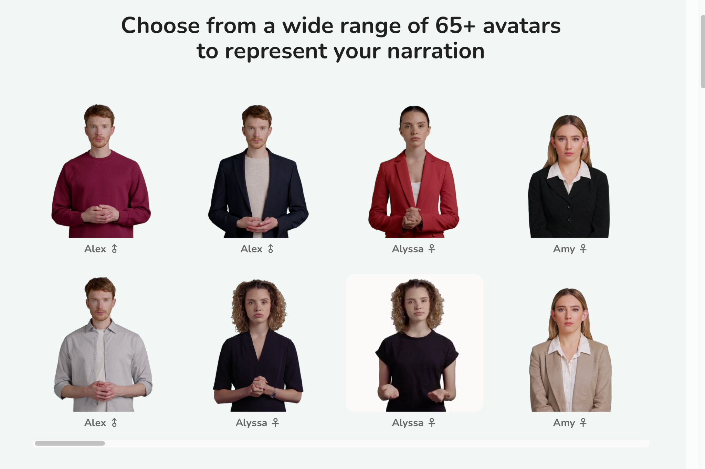

The process is just as simple:

Input your text, choose your AI voice, select your avatar, and you’re ready to share your fantastic content on social media!

🎙️**Voice Cloning** is another interesting feature that allows you to generate a realistic clone of your own voice.

**How to clone your voice in 3 simple steps:**

1. Record a 2 minute sample of your voice.

2. Add your script and select your voice from the list of AI voices. 3. Preview and export your audio.

Another interesting feature is that you have the option to convert your blog posts, presentations, tweets, or photos into video.

For example, simply provide a link to one of your blog articles, and Fliki will generate the audio for you. You can then personalise the video by adding various elements and experimenting with colours and fonts to make the video more engaging.

Alternatively, by pasting the link to your tweet, you can transform it into a captivating video with motion graphics and appealing visuals. 🖼️

NUCLEAR AI FILES 108 dariuslukas.academy/

That’s pretty cool especially considering that many AI video generators don’t provide anything similar!

🔄 Some alternatives to Fliki are:

● D-ID, which specialises in cost-effective talking head videos ● HeyGen, which offers a wide range of features for creating professional-looking videos with AI-generated avatars ● Descript, which excels at editing audio and video files.

💲Currently, provides a Free option with 5 minutes of credits per month, which might seem limited, but it's enough if you just want to test out the tool.

For those looking for more features, the Standard subscription starts at $28 per month. With this plan, you'll get 180 minutes of credits monthly. Additionally, you'll gain access to 150 ultra-realistic AI voices, and there won't be any watermarks on your videos.

NUCLEAR AI FILES 109 dariuslukas.academy/

**10. High-quality videos 10x times faster** ⚡

● **AI Tool**: OpusClip

● **Category**: short video creation

● **What it helps you with**: create short videos from long videos

● **Link to website**:

---

Whether you’re a content creator or a marketer, this AI tool is designed to help you save time and effort.

helps you repurpose your long videos into viral shorts, increasing reach and engagement on your social media platforms. 📈

The AI picks the highlighting moments of your video, rearranges them into a viral short, adds dynamic captions, AI-relayout, smooth transitions and finishes with a call-to-action.

**The process is simple: upload one long video, and get 10 engaging short clips.**👌

Let’s start from the beginning. **What types of videos can you upload?**

● Video podcasts

● Educational videos

● Commentary videos

● Product reviews

● Motivational speeches

● and more

For the sake of this ebook, I chose one of my recent YouTube videos, a 57-minute video, and opted to create short clips ranging from 30 to 60 seconds each. It took about 30 minutes for the entire process.

NUCLEAR AI FILES 110 dariuslukas.academy/

**Key Features of OpusClip**🔑

**#1. AI Curation**

OpusClip analyses your video to identify compelling hooks, extracts relevant highlights, and rearranges them into short videos with a potential of going viral.

**#2. AI Virality Score**

This AI tool generates a score indicating the virality potential of each short clip based on AI analysis on thousands of viral videos.

NUCLEAR AI FILES 111 dariuslukas.academy/

**#3. AI Co-Pilot**

NUCLEAR AI FILES 112 dariuslukas.academy/

This function allows you to choose a specific timeframe for clipping and search for sections based on keywords.

**#4. AI B-roll**

You can add relevant B-rolls to enhance storytelling.

**#5. AI Dynamic Layout**

With this you can automatically transition between full-screen, two-person, three-person, and screenshare to enhance the visual impact.

And if you don’t like the emojis, you can toggle them off. **#6. Active Speaker Detection**

NUCLEAR AI FILES 113 dariuslukas.academy/

Yes, OpusClip can analyse moving faces, and ensures your face remains centred within the video frame.

has an easy-to-use interface, which allows you to effortlessly edit your clips for additional improvements.

🔑**Other features inside the tool:**

● Caption animation;

● Trim & extend clips;

● Filler word removal;

● Zoom link;

● 1080p resolution;

● Multi-language;

● Trendy templates;

● Caption Translation.

🌟 And if you’re up for it, the **Pro Plan** offers additional **features** like:

● Team Workspace;

● Social media scheduler;

NUCLEAR AI FILES 114 dariuslukas.academy/

● Export to Adobe Premiere Pro;

● Various aspect ratios;

● Multiple brand templates;

● Custom fonts and music (Coming soon).

OpusClip supports a **wide range of languages**, including German, Portuguese, Dutch, Russian, Romanian, Slovak, Finnish and more to come.

The tool is intuitive and efficient, producing high-quality clips optimised for social media platforms like YouTube Shorts, TikTok and Reels. It works best with videos that have a clear structure and narrative.

**Now let’s talk pricing** 💲

You can use for **free**, enjoying 60 minutes of processing time refreshed monthly.

As of now, Opus offers three pricing tiers: **Starter ($15/month)** for individual creators with 150 monthly credits, AI clipping, animated captions, and auto-posting; **Pro ($14.5/month billed annually, normally $29/month)** with 3,600 yearly credits, team workspace, AI B-roll, and export to professional editors; and **Business (custom pricing)** for organizations needing priority processing, API access, custom

integrations, and dedicated storage.

NUCLEAR AI FILES 115 dariuslukas.academy/

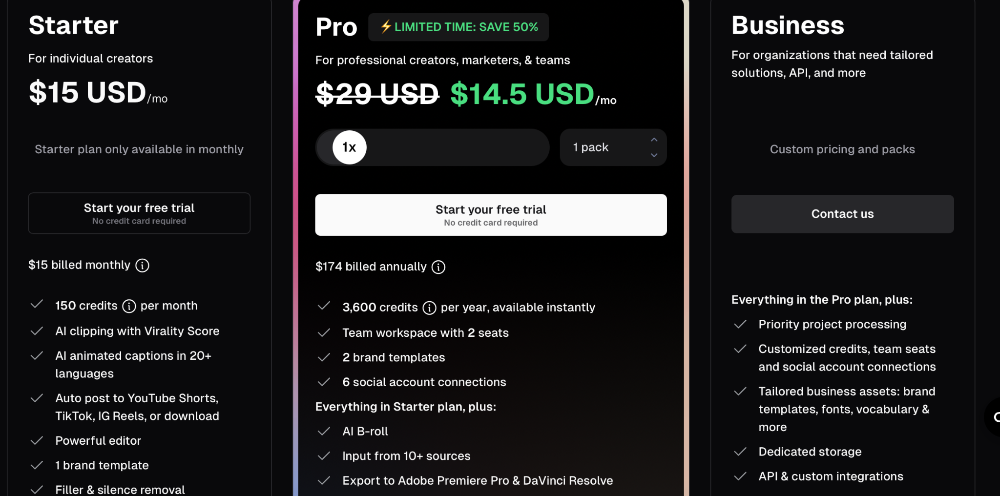

NUCLEAR AI FILES 116 dariuslukas.academy/

**11. Convert articles into videos easily**

● **AI Tool**: Lumen5

● **Category**: video creation ● **What it helps you with**: create videos from text ● **Link to website**:

---

Today let’s discover a tool that can transform your written content into professional-looking videos. 🤩

**canconvert written articles into captivating videos**. So if you’re a blogger or a content creator, it could be worth trying out.

Lumen5 offers an easy to navigate interface, making it simple for users to navigate and find the features they need.

The left-hand menu provides access to all the functionalities, such as uploading videos, managing projects, analytics, and more. Users can also create folders to organise their videos and projects.

More than that, they offer a variety of ready to use templates you can choose from.

**How to get started:**

To begin, just click on “New video”, from your dashboard.

Then, you’ll see 4 options:

NUCLEAR AI FILES 117 dariuslukas.academy/

1. **Text on media**: Convert a blog post or a document into a video.

2. **AI Voiceover**: Convert a blog post or a document to an AI voiceover video. For both **Text on media** and **AI Voiceover**, you’ll have to provide some details, such as:

*● What will your video be about?*

*● What is your video for?*

*● Outline what to reference in your script*

Then, paste or write the text you want to convert into a video script. Or simply paste the URL of your article.

Finally, select “Compose script”.

🤖 Now comes the most interesting part:

They have an **AI Script Composer** that generates multiple scripts based on your content.

You can choose the one that you prefer and aligns best with your video.

NUCLEAR AI FILES 118 dariuslukas.academy/

Afterwards, you can customise and edit your video by selecting a background image, adjusting text size and alignment, or adding music from Lumen5's library of

royalty-free songs.

3. **Voiceover:** Upload or record your own voiceover and convert to video. 4. **Talking head:** Upload or record your own talking head clip.

For **Voiceover** and creating **Talking heads**, all you have to do is upload a voiceover file of someone speaking clearly or use your microphone to record your own voiceover clip.

A standout feature is 's **Caption Video** option, which automates the captioning process for your voiceovers. While the tool may lack advanced editing capabilities, the captioning accuracy is quite impressive!

Another key feature of Lumen5 is its ability to **personalise videos** with custom themes, watermarks, fonts, and brand colours.

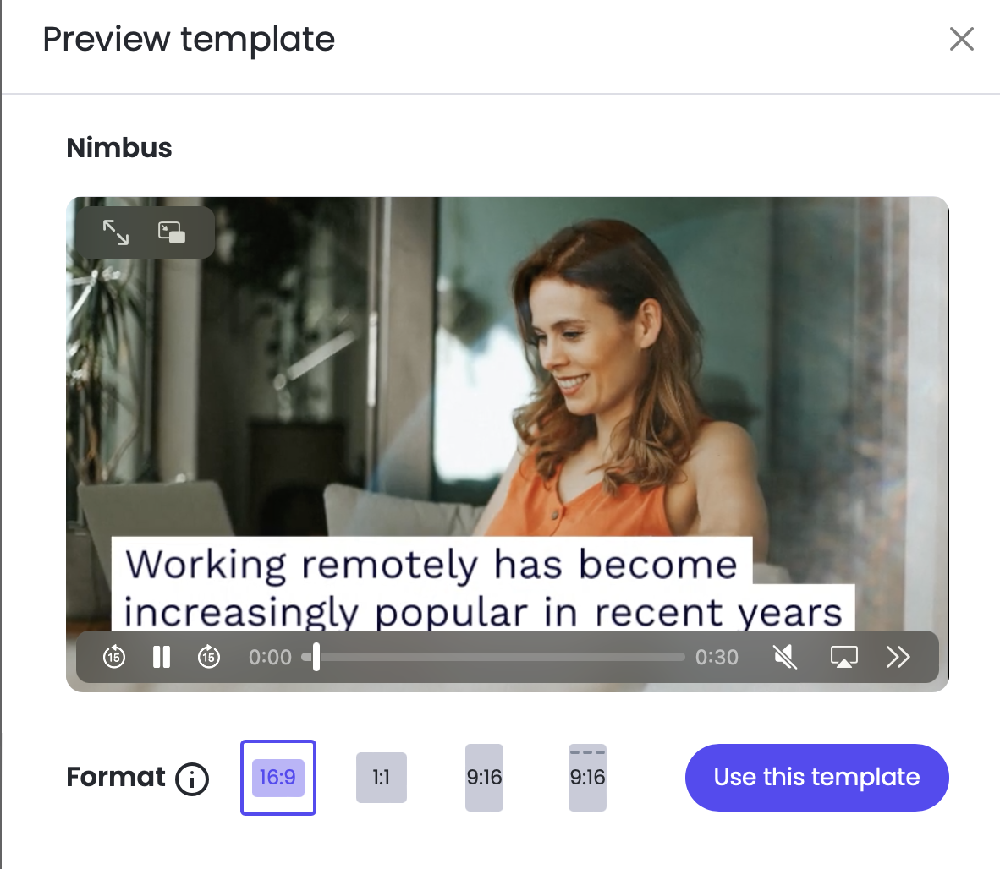

Users can easily customise their videos to match their brand identity, maintaining consistency in all their content.

And if you’re wondering about the price… 💰

NUCLEAR AI FILES 119 dariuslukas.academy/

Right now, Lumen5 offers four pricing tiers: **Basic ($19/month)** for simple, unbranded video creation; **Starter ($59/month)** for individual content creators with 1080p resolution and access to 50M+ stock assets; **Professional ($149/month)** for video storytellers with 500M stock assets, custom watermarks, and multiple brand kits; and **Enterprise (custom pricing)** for teams needing tailored solutions, branded

templates, collaboration tools, and enterprise security.

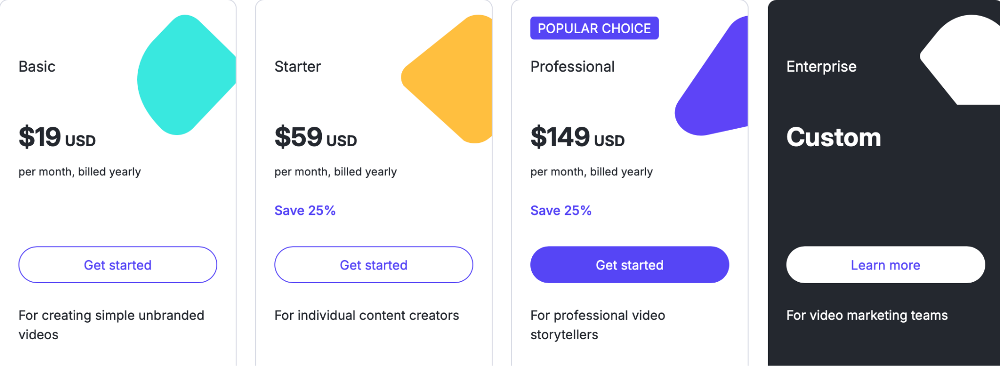

So if you have a small business, the free plan could probably already do the job for you!

While there are some limitations, such as the lack of advanced editing tools and limited editing capabilities, Lumen5 is a good solution for businesses and content creators looking to create video content from text or voiceover and engage with their audience.

NUCLEAR AI FILES 120 dariuslukas.academy/

**12. Convert text to speech for free** 🗣️

● **AI Tool**: ElevenLabs

● **Category**: text to speech ● **What it helps you with**: create realistic voices for your content

● **Link to website**:

---

In this section we’re talking about creating unique synthetic voices to use in video, podcasts, and audiobooks!

This tool is a must have for video creators and businesses. 😲

It’s called and is an advanced text to speech AI tool, making it easy to create realistic voices in a wide range of languages.

🤔**What is text to speech?**

**Text to speech**, also known as speech synthesis or TTS, is a **technology** that transforms written text into spoken audio.

NUCLEAR AI FILES 121 dariuslukas.academy/

🤔**What is an AI voice generator?**

**An AI voice generator isa tool** that converts text into spoken audio, replicating a natural human voice with authentic intonation and accents.

🚀**Why choose** **?**

✅ It works in **29 Languages,** including Arabic, Filipino, Tamil, Malay, Indonesian, Slovak, Greek, and more.

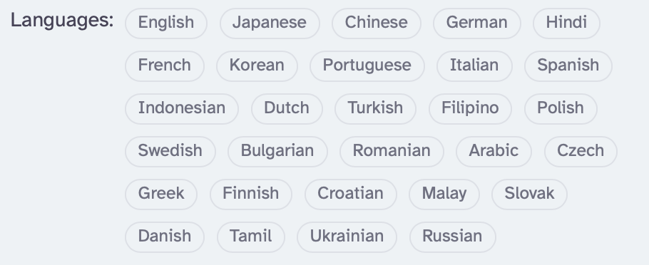

✅**120 Voices:** Realistic AI voices with emotive capabilities.

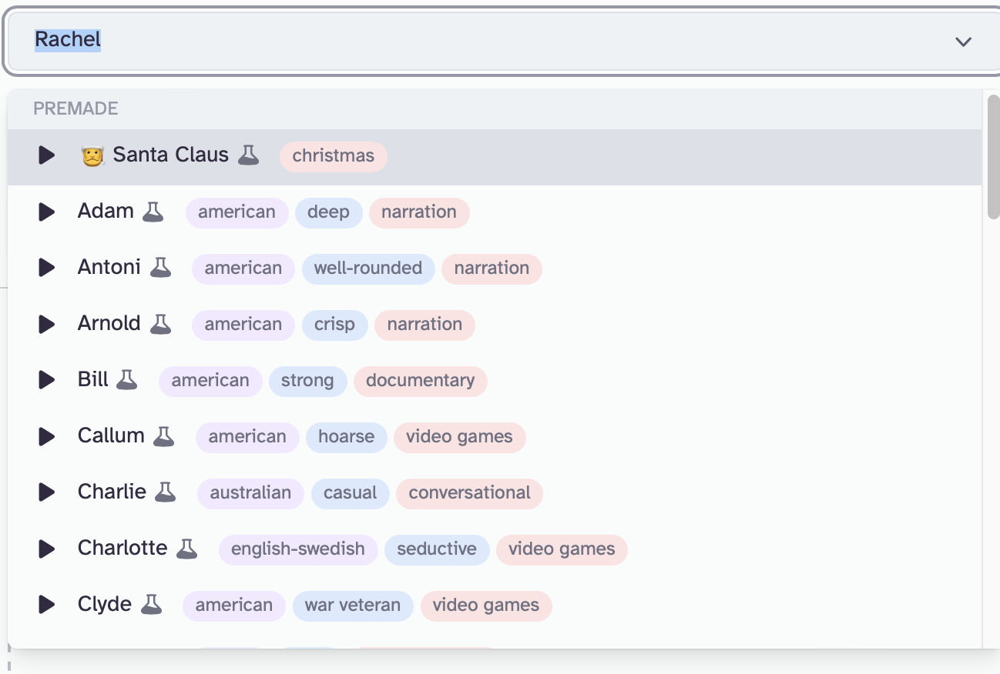

✅ **Intuitive Interface:** Easy to navigate platform.

NUCLEAR AI FILES 122 dariuslukas.academy/

✅**Online Text Reader:** Save time with an AI tool that can read any text, such as emails or PDFs.

🎁**Use cases:**

🚀 Videos;

🚀 Audiobooks;

🚀 Gaming;

🚀 AI Chatbots.

With , you can easily create characters and stunning audio experiences in minutes.

Now, let’s see how to generate Text to Speech.

🚀**How to get started:**

**Step 1:** Select a voice and adjust *“Settings”*.

**Step 2:** Input your text.

**Step 3:** Click *“Generate”* to convert your text into audio.

**Step 4:** Make any necessary adjustments.

**Step 5:** Download the audio.

🗣️ With ElevenLabs, you can also generate **Speech to Speech**!

Just upload an audio file, play around with *“Settings”*, and follow the same easy steps as when turning **Text into Speech**.

🤩 You can also **generate tailored AI Voices!**

1. **Clone your voice:** Create a voice that sounds like a real human.

2. **Create New Voices:** Generate high-quality audio content, tailored to your needs.

NUCLEAR AI FILES 123 dariuslukas.academy/

3. **Find Voices:** Share and discover voices within the ElevenLabs community.

💰**HOW MUCH DOES IT COST?**

As of now, ElevenLabs offers four pricing plans: **Free ($0/month)** with 10 minutes of high-quality text-to-speech, content translation, and API access; **Starter ($5/month)** with 30 minutes of text-to-speech, voice cloning, and commercial licensing; **Creator ($11/month, first month 50% off, normally $22)** with 100 minutes of text-to-speech, professional voice cloning, and higher-quality audio; and **Pro ($99/month)** with 500 minutes of text-to-speech, 1100 minutes of Conversational AI, studio-quality audio, and usage analytics.

NUCLEAR AI FILES 124 dariuslukas.academy/

Whether you're a podcaster, a content creator, or you have a business, allows you to generate authentic AI voices in seconds, saving you time and effort.

NUCLEAR AI FILES 125 dariuslukas.academy/

**13. Create high-quality audio content in minutes** ⏰

● **AI Tool**: Lovo.ai

● **Category**: voice generator ● **What it helps you with**: create audio content for your courses, videos, and voiceovers

● **Link to website**:

---

Whether you're a content creator, marketer, or educator, can help you create high-quality and engaging audio content in minutes!

You can use it for video games, e-learning courses, podcasts, or films.

Lovo.ai simplifies the process of creating voiceovers by offering a user-friendly platform with extensive customisation options.

You can easily adjust parameters such as pitch, emphasis, pronunciation, and pauses to create the perfect voice! 🥳

Lovo.ai offers various editing functions, including clipping, splicing, and adding background music.

You can export your audio files in different formats such as MP3, WAV, and AAC.

One advantage is that the platform provides tutorials and resources to help users get started.

**How to get started:**

1. Register on the lovo.ai website.

2. Select a voice from the library.

3. Type or paste your text into their text editor.

4. Click the "Generate" button to produce the audio content. 5. Edit and export your audio files.

🚀**Key features:**

NUCLEAR AI FILES 126 dariuslukas.academy/

🎙️**AI Voice generator:** Create realistic voiceover with Lovo’s text-to-speech feature.

You can choose from 500+ voices and 100+ languages and accents.

1. Type or paste your text.

2. Hit “Generate”.

3. Export and download your audio!

📝**Auto Subtitle Generator:** Add engaging subtitles to your videos.

Generate dynamic subtitles that make your videos stand out in 3 simple steps:

1. Upload your video and select “Auto Subtitles”.

2. Personalise and animate them! Change colour, font and background. 3. Export and download your video!

🤖**Voice Cloning:** Create custom voices and integrate them into your projects.

1. Open a project and click on “Voice Cloning”, on the left side of the screen. 2. Record one minute or upload your voice.

3. Click on “Add voice” to complete the voice cloning process.

You can even create a library with your cloned voices and access them anytime!

🎨**AI Art Generator:** Create images for your videos.

NUCLEAR AI FILES 127 dariuslukas.academy/

1. Describe the image you want to generate.

2. Choose a style (painting, photorealistic, anime, etc).

3. Generate your image.

4. After generation, you will get 3 variations.

5. Download the images and add them to your video.

✍️**AI Writer:** Turn your ideas into compelling scripts with their AI, **Genny Write**.

You can choose from different tones: friendly, funny, informative, etc.

And if you provide the length of the video you want to generate, Genny will write a script for you with the perfect word count.

NUCLEAR AI FILES 128 dariuslukas.academy/

🤔Now let’s take a look at Love.ai’s **Pros** and **Cons**:

**Pros:**

● Simple interface;

● Highly realistic voices;

● Extensive customisation options;

● Wide range of AI voices and languages;

● Voice cloning feature.

**Cons:**

● Lack of integrations;

● May encounter occasional pronunciation or inflection challenges.

💰**Pricing**

Currently, LOVO offers three pricing plans: **Basic ($24/month per user, billed annually at $288)** with 2 hours of voice generation, 5 voice clones, auto subtitles, 500+ AI voices in 100+ languages, and Full HD exports; **Pro ($24.48/month per user, billed annually, first year 50% off)** with 5 hours of voice generation, multilingual voices, unlimited voice cloning, AI script and sound effects, and team collaboration; and **Pro+ ($75/month per user, billed annually at $900, first year 50% off)** with 20 hours of voice generation, voice enhancement, 400GB storage, and priority support.

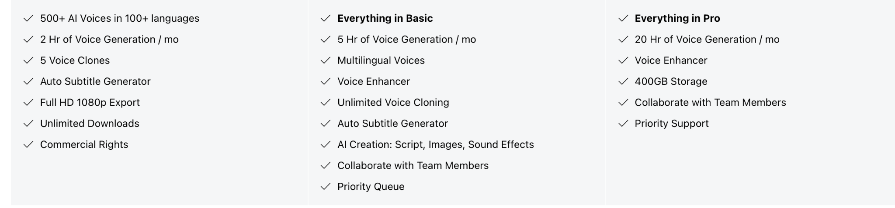

And if you’re curious… what are the alternatives? 🗣️

NUCLEAR AI FILES 129 dariuslukas.academy/

**:** Offers realistic AI voiceovers and **integrations with Canva and Google Slides**.

**:** Provides a wide range of languages and **AI avatars** for voiceovers and **AI art** generation.

**:** User-friendly platform with text-to-speech capabilities and additional features like **video translation and transcription**.

NUCLEAR AI FILES 130 dariuslukas.academy/

**14. All-in-one AI tool for your content** 🤖

● **AI Tool**: Simplified

● **Category**: content

marketing

● **What it helps you with**: create, design and plan your content

● **Link to website**:

/

---

‘Create anything you can imagine with AI’.

This is the slogan of this AI tool.

With d, you can write, design, create, plan, and publish all your content in one place.

This tool is ideal for bloggers or small businesses looking to efficiently create content without the need to switch between multiple apps or platforms… boosting your productivity to the next level.

Simplified can assist you with various tasks like social media posts, blog ideas, email writing… pretty much anything you need to write.

For creating a blog post, you can design images and graphics, and then utilise AI to assist with writing the content.

Their templates are well-crafted, easy to customise, and available in various sizes suitable for platforms like Instagram, LinkedIn, Facebook, Pinterest, YouTube, and more.

d offers AI features for both writing and design.

So let’s have a look at what they have to offer!

**I.AI Writer** ✍️

With their AI content generator, you can craft persuasive copy for Facebook ads, product descriptions, emails, landing pages, YouTube descriptions, and more.

NUCLEAR AI FILES 131 dariuslukas.academy/

**How to use it:**

1. Access the **AI Writer** from your *Dashboard*.

2. Choose between *Write with AI* or *Explore Templates*.

3. Select your language and creativity level, complete the prompt, click *Generate*, and choose your preferred content.

The AI Writer can be used for both creating content and optimising existing content.

You can generate content in over 30 languages!

II. **AI Design** 🎨

Similar to Canva, you can personalise their templates to design posters, brochures, flyers, business cards, or create your own from scratch.

NUCLEAR AI FILES 132 dariuslukas.academy/

**Use cases:**

● Generate images;

● Resize designs for Facebook, Instagram and other social media platforms; ● Crop images with pre-determined ratios and clipping shapes;

● Animate elements;

● Remove background;

● Use their stock library for stunning visuals.

**III.** **AI Video** 🎥

Quickly create viral content with AI! 🤖

NUCLEAR AI FILES 133 dariuslukas.academy/

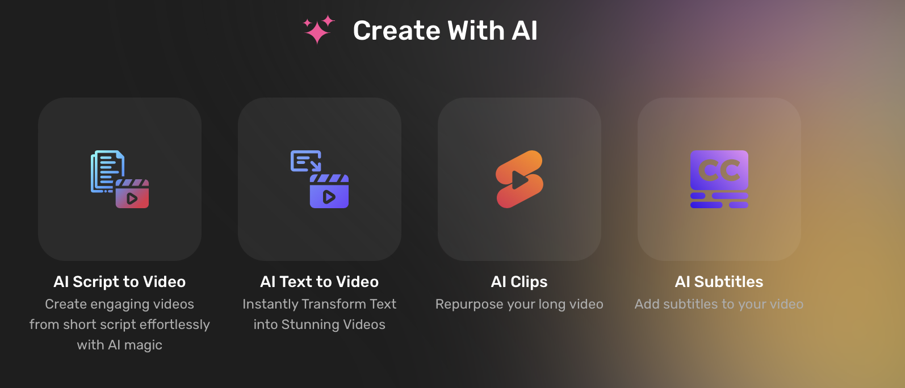

✅ Simplified offers **trendy captions** ready for use, or you can customise them to match your brand's colour, font, and style.

✅ You can easily repurpose your content with their **text-based clip creator**. Cut clips from a video and edit as you like to create new content.

✅ Create stunning videos for your audience with **PRO transition effects and animations** that make your videos pop.

✅ Add **background music, songs and sound effects** from their free stock library.

✅ Generate AI **text-to-speech** in 20+ languages.

**IV.Social Media AI**

NUCLEAR AI FILES 134 dariuslukas.academy/

Integrate your social media channels, create and customise your designs and schedule your posts for optimised productivity. 🤩

✅ Connect and manage multiple social media accounts;

✅ Organise, plan and schedule your posts from one platform;

✅ Create and edit image, video and text posts;

✅ Collaborate with your team in real time: tag, comment and assign work.

**Now let’s talk pricing** 💰

If you’re a creator looking for essential AI features, this is the right tool for you. They offer a **FREE** plan that does an excellent job.

NUCLEAR AI FILES 135 dariuslukas.academy/

At this moment, Simplified offers three paid plans: **One ($20/month, billed annually)** for individual users, including 100K AI words, 100 AI designs, 50 AI videos, 200 minutes of AI clips, and 7 social media connections; **Growth ($83.30/month, billed annually)** for teams with 5 seats, 250K AI words, 500 AI designs, 150 AI videos, 900 minutes of AI clips, bulk social scheduling, and 30 social media connections; and **Enterprise (custom pricing)** for large teams needing unlimited AI content, API access, workflow automation, and priority support.

NUCLEAR AI FILES 136 dariuslukas.academy/

🔄Alternatives to include , , and .

NUCLEAR AI FILES 137 dariuslukas.academy/

**15. Automate your video content in 3 simple steps**

● **AI Tool**: D-ID

● **Category**: video

generation and AI avatars ● **What it helps you with**: automating your short

form video content

● **Link to website**:

---

If you’re looking for ways to automate your short form video content, this AI tool is for you!

is a video generator that allows you to create and personalise your own talking avatar.

They offer a variety of presenters, providing a human-like experience for your audience.

Curious about how to bring your ideas to life, all while saving time and resources? ⏰I’m going to show you how to automate this process in three simple steps:

**1. Come up with ideas!**💡

We’re going to use ChatGPT to brainstorm some ideas. For that, I’m going to use the following prompt:

**PROMPT:**

*My primary goal with my content is to [describe your goal].*

*I talk about [topic].*

*My target audience is [target audience].*

*Make sure I can turn each idea into a short-form video, considering the following: 1. All content ideas need to be actionable or inspirational.*

*2. They need to include at least 1 number.*

NUCLEAR AI FILES 138 dariuslukas.academy/

*Come up with 10 ideas.*

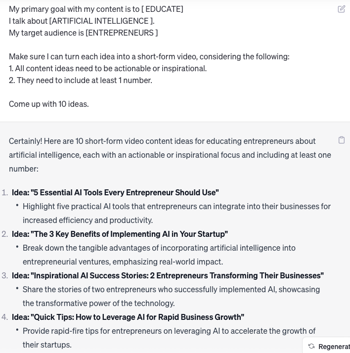

ChatGPT provided me with 10 ideas. Now, I just need to pick one and move on to the next step and create the script for the video.

**2. Generate your script!** 📚

Now, let’s create an engaging script!

NUCLEAR AI FILES 139 dariuslukas.academy/

**PROMPT:**

*Write a script about[write the idea you selected] for an educational and informative 1-minute video.*

*Format the script as follows:*

- *Hook;*
- *Peak interest by talking about the results they will get; -Discuss solution;*
- *Discuss how to apply the solution;*
- *Call to action.*

*The hook should start with one of the following lines:*

- *Here’s an [topic] secret nobody seems to know about*
- *Ever wondered how [type of people] are able to generate [result]?*

*Total script should be a maximum of 120 words with extremely conversational tone and casual word choice.*

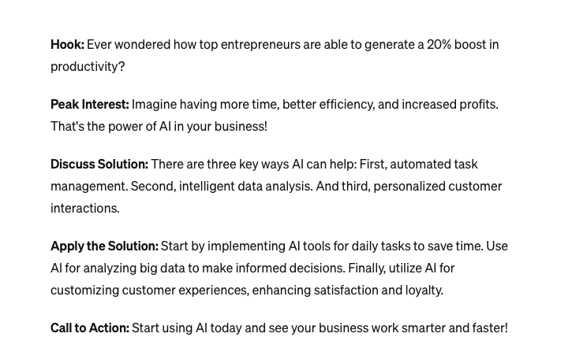

You can tweak and adjust the script to make it more actionable or informative, depending on the purpose of your video.

NUCLEAR AI FILES 140 dariuslukas.academy/

**3. Create your avatar!**👤

Next step is to go to and create your avatar.

**Here’s how to create your video:**

1. In the **Creative Reality Studio**, click on the **+Create Video** button;

2. Choose a presenter (you also have the option *Generate AI presenter*);

NUCLEAR AI FILES 141 dariuslukas.academy/

3. Add your script (you can copy-paste your text and even upload your own audio);

4. Pick the language for your avatar (available in over 100 languages); 5. Choose a voice (with 14 voices you can access for free and additional PRO voices);

6. Generate and download your video!

NUCLEAR AI FILES 142 dariuslukas.academy/

It’s as simple as that!

offers a free trial allowing you to create a 5-minute video (20 credits). Each credit covers about 15 seconds of video.

In my video using the ChatGPT script, I only used 3 credits.

They offer monthly and annual subscription plans with additional features worth exploring.

NUCLEAR AI FILES 143 dariuslukas.academy/

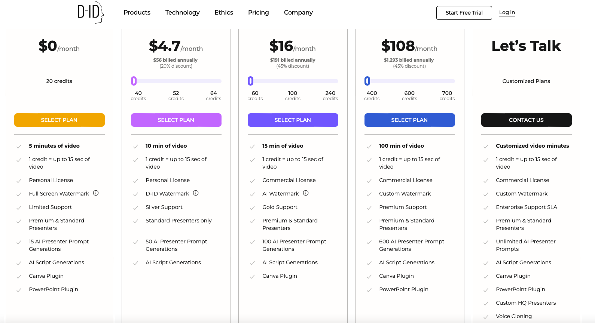

Now, let’s get back to our video…

A cool thing is that D-ID has a Canva plugin, so you can quickly adjust and improve your video.

For further editing, you can also use to add captions.

And now you have an avatar that does all the talking, saving you from the hassle of filming yourself or spending money on expensive equipment.

**BONUS SECTION** 🎁

Here are **two FREE AI tools** for your content:

I.

WIth this AI tool, you can **sync video to audio** in any language.

You can use it for movies, podcasts, games or animations.

Their interface is very user-friendly:

1. Simply upload a file or paste a link;

2. Upload an audio file or create one from text;

NUCLEAR AI FILES 144 dariuslukas.academy/

3. Hit *Generate*.

You can give it a try for **FREE** and enjoy 7500 credits. Subscriptions start at $19 per month.

II.

Similar to Opus Clip, this tool helps you generate TikTok videos, Reels and Shorts from YouTube videos.

Simply follow these steps:

Paste the YouTube link or drop a file; 1.

NUCLEAR AI FILES 145 dariuslukas.academy/

2. Choose your desired video settings: *Edit shorts*, *Crop*, *Add Captions*, or *Add* *Emojis*;

3. Select duration (maximum 1 minute or auto);

4. Click *Generate*.

In just a few minutes, your Shorts will be ready to go, complete with a virality score and the option to edit them.

Of course, you can give it a try for free, and subscriptions start at $23 per month.

NUCLEAR AI FILES 146 dariuslukas.academy/

**16. Create an AI Avatar and duplicate yourself**

● **AI Tool**: HeyGen

● **Category**: video

generation and AI avatars ● **What it helps you with**: create an AI avatar for

your content

● **Link to website**:

---

Ever heard of? It’s one of the most popular AI video generators and is mostly known for its realistic AI avatars.

However, now I’m going to show you 3 features that are absolutely mind blowing (*and not many people know about*)!

1. Make an AI clone of yourself;

2. Instantly change the language that you’re speaking in; 3. Talking photo generation.

Let’s start from the beginning!

HeyGen offers hundreds of AI avatars, voices and templates for various use cases, such as product marketing, content marketing, sales outreach, etc**.**

**How to use HeyGen to create a video:**

1. Click "Create Video" at the top right.

2. Choose an avatar, for example "Briana".

NUCLEAR AI FILES 147 dariuslukas.academy/

3. Add your script: you can choose **Text Script** or **Audio Script**. 4. Adjust speed and pitch.

5. Click "Play" to preview.

6. "Submit" to publish.

It’s as simple as that.

Now, let’s delve into the mind-blowing features I teased you about!

**#1 Make an AI clone of yourself**🤖

NUCLEAR AI FILES 148 dariuslukas.academy/

To create your own AI avatar with HeyGen, you'll need a professional camera shooting at 4K resolution, a greenscreen, and good lighting (*follow the recording guidelines explained* ).

After you finish recording, email the footage to the HeyGen team for review.

Upon approval, you can use your custom avatar on any video you create using HeyGen.

**Once you've created your AI avatar, you can make it speak using the Voice Cloning feature!**

It supports eight languages: English, German, Polish, Spanish, Italian, French, Portuguese, and Hindi.

To clone your voice, go to the "Voice" menu, click "Clone Voice," and follow two simple steps: "Record Consent" and "Record Voice."

The process takes about two minutes.

I believe this feature really sets them apart from other AI video generators. ✨**#2. Record in one language, translate in 40+ languages**🌐

You can record in over 40 languages, such as Arabic, Indonesian, Polish, Tamil, etc. All you have to do is upload your video or paste a Google Drive / YouTube video URL, choose the language in which you want to translate your video, and select the number of speakers.

Then select “Translate your video” and “Download” it.

NUCLEAR AI FILES 149 dariuslukas.academy/

This feature sets you up for unlimited content creation and can help you reach a wider audience.

**#3 Talking Photo**📸🗣️

HeyGen's TalkingPhoto feature lets you animate any photo and add a human voice in over 100 languages and accents.

Just provide a script, and HeyGen will bring your image to life!

On the HeyGen dashboard, select “Make a TalkingPhoto Video”.

Then choose one of the next options:

1. Generate a TalkingPhoto by describing your ideal avatar.

2. Upload a TalkingPhoto by selecting a photo from your computer.

3. Selecting one of the existing TalkingPhotos from HeyGen.

NUCLEAR AI FILES 150 dariuslukas.academy/

In no time, you can transform Mona Lisa into a dynamic talking photo with accurate lip-syncing and a real human voice.

**Integrations** 🔗

✅ ChatGPT Plugin;

✅ Canva App;

✅ Zapier;

✅ and more.

This way, you can easily automate your tasks and boost your productivity. 🚀

💰**Pricing:**

NUCLEAR AI FILES 151 dariuslukas.academy/

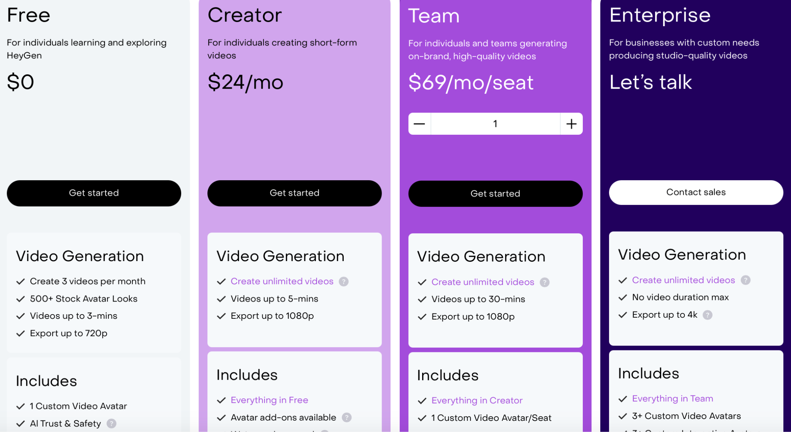

offers a **FREE TRIAL** with limited features. You get 3 videos per month, 500+ stock avatars, 3-minute videos, and 720p exports

You can also convert web content into videos using a URL. It's completely free to try out and see if you like it.

NUCLEAR AI FILES 152 dariuslukas.academy/

**17. Create AI designs in seconds!**

● **AI Tool**: Galileo AI

● **Category**: video

generation and AI avatars ● **What it helps you with**: create AI designs in

seconds

● **Link to website**:

---

Looking for an AI tool for user interface design?

You’re in the right place. 🎨😎

Whether you’re working on a mobile app or a website, can help you create stunning designs in a matter of seconds.

🔥 **How to get started:**

First, go to the **Explore** section to gather some inspiration for your next design. You can scroll through and find a lot of interesting ideas and designs made by the community, both for mobile and web.

NUCLEAR AI FILES 153 dariuslukas.academy/

After that, you can dive into creating your own design. 🥳You have two options for this:

🖌️ **Text-to-UI**

1. Choose either **Mobile** or **Web**, depending on your project.

2. Describe your design.

*Profile page of an album on a music app, including a header with the album cover, title, artist name, and a tracklist.*

*Rental app listing page for Barbie’s Malibu house, highlighting unique amenities.*

*Search tab in a music app displaying a search bar at the top, followed by a grid view of music categories.*

NUCLEAR AI FILES 154 dariuslukas.academy/

NUCLEAR AI FILES 155 dariuslukas.academy/

3. Make it **Public** or **Private**.

4. **Generate** your design!

🎨 **Image-to-UI**

1. Choose either **Mobile** or **Web** depending on your project. 2. Upload an image (*supports JPG and PNG up to 5MB*). 3. Give a request (=prompt).

Example: *This is a homepage for a real estate app, turn this wireframe into a high fidelity design.*

4. Select a theme (*colors and font*).

5. Choose the number of variants you want to generate (*1-4*). 6. Make your design **Public** or **Private**.

7. And click **Generate**.

NUCLEAR AI FILES 156 dariuslukas.academy/

💰 **Pricing**

At this point in time, Galileo offers three pricing plans: **Standard ($16/month, billed annually at $192)** for personal projects, providing 1,200 credits per month (~120 design generations), unlimited code and Figma exports, and mobile and web UI generation; **Pro ($32/month, billed annually at $384)** for professionals needing **private mode**, 3,000 credits per month (~300 design generations), and all features from Standard; and **Enterprise (custom pricing)** for organizations requiring unlimited generations, the fastest processing speed, advanced data privacy, and priority support.

NUCLEAR AI FILES 157 dariuslukas.academy/

**18. Transcribe and summarise instantly!**

● **AI Tool**: HappyScribe

● **Category**: content

creation

● **What it helps you with**: transcribes meetings,

videos and audio files

● **Link to website**:

---

If you work with videos and want to save time while automating your content creation, you’ve got to try !

You can transcribe meetings, videos, or audio files and even get **summaries** sent directly to your inbox—a handy feature for staying organized.

So, what makes it different from other transcription tools? 🤔

It offers **“style guides,”** where you can set preferences for timing, formatting, grammar corrections, and speaker identification.

’s **Glossary** feature lets you add specific terms—like brand names or slang—so your transcriptions or translations stay accurate and consistent.

🎁 **And here’s a big bonus:** there’s **no limit** on uploads! You can upload files of any size or length, and since it handles both transcription and subtitles, you don’t need to switch between tools.

If you’re working with long videos that need transcription or subtitles, HappyScribe is the perfect solution.

Ready to give it a try? Let’s dive in!

**How to Use It**

1. **Sign up** for a **free** account.

2. Click **Create** and choose the option you need: Transcript, Subtitles, Translated Subtitles, or Import Subtitles.

NUCLEAR AI FILES 158 dariuslukas.academy/

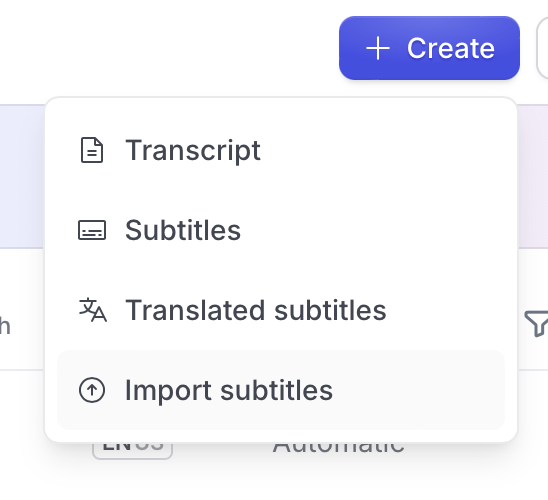

3. Upload your **audio or video** files from your device, other platforms, or by pasting a link.

4. Use the **editor to tweak transcripts** and subtitles or **collaborate with your** **team**.

NUCLEAR AI FILES 159 dariuslukas.academy/

5. **Download** your finished project in various formats.

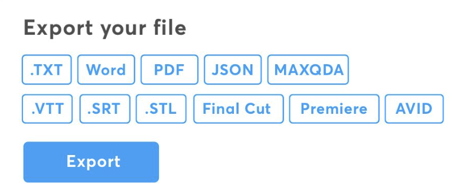

**Key Features:**

🖋 **Automatic Transcription & Subtitles:** Convert audio and video into text.

🌍 **Multi-Language Support:** Transcribe and subtitle in over 120 languages.

🎨 **Subtitles:** Customize fonts, styles, and timings.

📧 **Email summaries:** Receive quick content summaries directly in your inbox. 🤝 **Collaboration Tools:** Work with your team on editing and reviewing transcripts in real time.

🔍 **Speaker Identification:** Automatically label who’s speaking in your audio.

NUCLEAR AI FILES 160 dariuslukas.academy/

🔗 **API & Integrations:** Connect with tools like YouTube and Zapier to streamline your workflow.

**Pricing**

Right now, Happy Scribe offers four plans:

● **Free Plan ($0)** includes 10 minutes of transcription, subtitles and translations per file with watermarked video exports.

● **Basic Plan ($17/month)** provides 120 minutes per month and watermark-free exports.

● **Pro Plan ($29/month)** offers 300 minutes per month, advanced export formats like SRT, MP4, and JSON, plus watermark-free exports.

● **Business Plan ($49/month)** includes 600 minutes per month, up to 3 user seats, workspace roles, and unlimited style guides and glossaries. Add-ons for human-made transcription are available starting at $1.90/min.

NUCLEAR AI FILES 161 dariuslukas.academy/

***CHAPTER 4***

*Get Professional Texts Without Hiring Writers*

**1. Simplify your writing**

● **AI Tool**: Hypotenuse

● **Category**: AI writing

● **What it helps you with**: write SEO texts and

branded texts

● **Link to website**:

---

In the fast-paced world of online content, it's important to keep your audience interested and engaged, which can be quite challenging sometimes.

, an AI tool designed to simplify writing and content creation, provides a solution to this challenge.

As you explore Hypotenuse's features, you'll see how *Content Detective* makes research easier, *Hypo Doc* simplifies the analysis of long documents, and the *AI Image Generator* sparks your creativity.

But there's more and I'll guide you through each of its features, so you can make the most of and take your content creation to the next level.

After all, in this dynamic digital world, staying ahead is not just an option; it's the key to success!

Let’s have a closer look inside all the functionalities of this amazing content creation tool! 🚀

**● CONTENT DETECTIVE**

NUCLEAR AI FILES 162 dariuslukas.academy/

Content Detective conducts real-time internet research on your behalf. It provides key insights and sources, allowing you to create an initial working draft based on the gathered information, significantly reducing research time.

**How to use it:**

● Step 1: Provide a topic or keyword.

● Step 2: Hypotenuse analyses the web and extracts key talking points and reliable sources.

● Step 3: Use these insights to kickstart your content creation process.

**● HYPO DOC**

Upload a PDF, and AI will provide answers and information based on the document's content.

**How to use it:**

● Step 1: Upload your PDF.

● Step 2: Ask Hypotenuse anything about it, from generating a LinkedIn post to extracting key insights.

● Step 3: Hypotenuse instantly provides insights based on your queries.

NUCLEAR AI FILES 163 dariuslukas.academy/

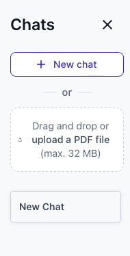

**● AI IMAGE GENERATOR**

Describe the image you need, and the AI generates a customised image to meet your specific requirements, saving time typically spent searching for suitable images. However, it may require a good prompt and some testing to get the desired image.

**How to use it:**

● Step 1: Describe the context for your image.

● Step 2: Choose a *Type*, *Aesthetic*, *Mood and lighting*, *Artist or style*, and an *Aspect ratio & Size*

● Step 3: Hypotenuse generates stunning, unique images tailored to your requirements.

NUCLEAR AI FILES 164 dariuslukas.academy/

NUCLEAR AI FILES 165 dariuslukas.academy/

**● AI BATCH GENERATOR**

The bulk content generator provided by Hypotenuse AI enables users to easily create high-quality, SEO-optimised content in large quantities, from product descriptions to Instagram captions. It supports importing data via CSV or Shopify.

**How to use it:**

● Step 1: Import your data via CSV or Shopify.

● Step 2: Choose the language and tone for your content.

● Step 3: Hypotenuse generates high-quality content in bulk, optimised for SEO.

**● AI ARTICLE & BLOG WRITER**

It guides you through the process of writing, starting with creating a title, developing a thorough outline, and ultimately producing a full article.

**How to use it:**

● Step 1: Describe your topic and add SEO keywords.

● Step 2: Hypotenuse generates catchy article titles and detailed outlines. ● Step 3: Create content drafts and edit them.

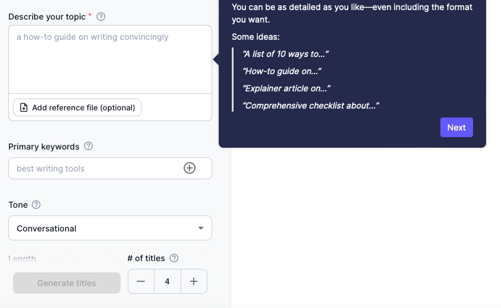

**● AI PRODUCT DESCRIPTION GENERATOR**

You can upload product images and add attributes or an original description, and the AI generates new and unique copy.

NUCLEAR AI FILES 166 dariuslukas.academy/

**How to use it:**

● Step 1: Upload product images and attributes.

● Step 2: Hypotenuse generates SEO-friendly product descriptions. ● Step 3: Edit and organise the content.

**● SLOGAN GENERATOR**

The slogan generator helps create unique and attention-grabbing headlines and slogans tailored to your business and target audience.

**How to use it:**

● Step 1: Describe your product or service and add keywords. ● Step 2: Hypotenuse suggests engaging slogans and taglines.

● Step 3: Choose the one that resonates with your brand.

NUCLEAR AI FILES 167 dariuslukas.academy/

**● INSTAGRAM CAPTION GENERATOR**

Easily create engaging captions for your social media posts, just by providing brand and audience details for context.

**How to use it:**

● Step 1: Add brand and audience details.

● Step 2: Hypotenuse generates catchy Instagram captions.

● Step 3: Choose your favourite or edit them for a personalised touch.

NUCLEAR AI FILES 168 dariuslukas.academy/

**● GOOGLE ADS & FACEBOOK ADS GENERATOR**

Describe the topic and desired keywords, and the AI generates compelling ad copy.

**How to use it:**

● Step 1: Describe your topic and keywords.

● Step 2: Hypotenuse generates ad headlines and descriptions. ● Step 3: Choose the variations that suit your campaign goals.

**● AI PARAPHRASING TOOL**

Is your content a little too formal or rigid? Give it a more casual, friendly tone using this rephrasing AI tool.

**How to use it:**

● Step 1: Paste your content.

● Step 2: Choose a tone for rewriting.

● Step 3: Hypotenuse rephrases content to enhance its clarity.

NUCLEAR AI FILES 169 dariuslukas.academy/

**● AI SUMMARISING TOOL**

You can create summaries for paragraphs, articles, documents, and even videos. You have the choice to make your summary in either a paragraph or bullet point format.

**How to use it:**

● Step 1: Add your content.

● Step 2: Choose between paragraph or bullet-point summaries. ● Step 3: Hypotenuse generates concise summaries.

NUCLEAR AI FILES 170 dariuslukas.academy/

**● HYPOCHAT**

HypoChat is designed to assist in generating business copy and fact-based content from various sources, such as links, documents, or the internet.

**How to use it:**

● Step 1: *Ask AI anything…*

● Step 2: Extract information from the web, summarise documents, and generate content with ease.

**And here’s the best part!**

It seamlessly integrates with Shopify, APIs, and WordPress.

💰 **Ok, but what’s the price?**

The cool thing is that you can try it for free. This trial lets you explore its features to make sure it suits your needs before committing. It's a great way to experience firsthand how it can improve your workflow.

NUCLEAR AI FILES 171 dariuslukas.academy/

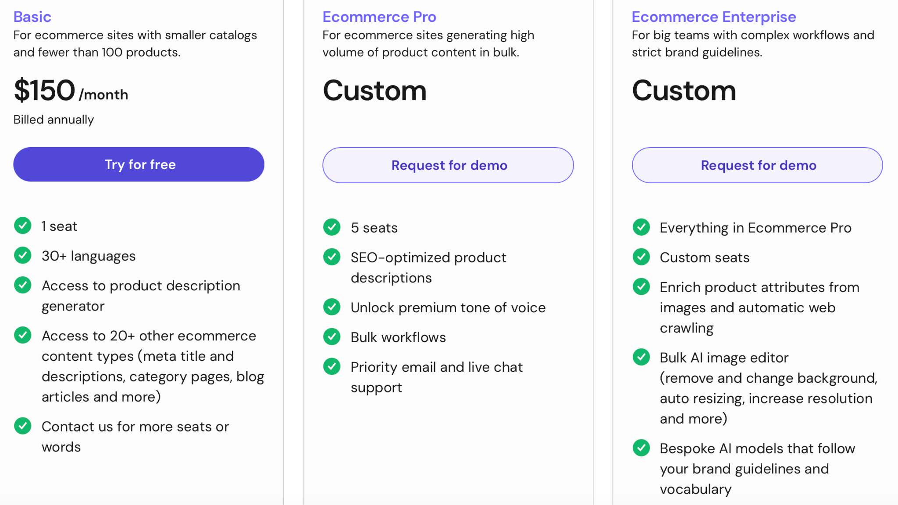

Whether you're a content writer, marketer, or business owner, can clearly help you to get an easier experience creating content, improving your SEO, and boosting your online presence.

NUCLEAR AI FILES 172 dariuslukas.academy/

**2. 100 writing tools into one!** 🥇

● **AI Tool**: HyperWrite

● **Category**: AI writing

● **What it helps you with**: write and edit your texts, get more ideas, perfect your writing

● **Link to website**:

---

In this section: improve your writing and create high-quality content in seconds! From catchy headlines to persuasive emails, this AI tool called empowers you to work efficiently and make the most of your time.

This AI tool helps you with:

📝 Writing

🗣️ Communication

🔍 Research

**AI Tools inside the AI tool I.**

has over **100 AI tools** available to simplify your workflow, such as: **Flexible AutoWrite:** Assists in creating engaging content.

**Rewrite Content:** Rephrases and improves existing content.

**AI Speech Writer:** Crafts persuasive speeches based on an outline or description. **Summarizer:** Highlights the main points and key information.

**Email Responder:** Generates professional replies.

**AI Writer:** Creates content on any topic and in any format.

NUCLEAR AI FILES 173 dariuslukas.academy/

**Explain Like I’m 5:** Breaks down complicated concepts using relatable examples and simple language.

**Magic Editor:** Improves the clarity, tone and style of your content.

**Ask AI:** Provides questions to any questions you may have.

NUCLEAR AI FILES 174 dariuslukas.academy/

**Multilingual Email Responder:** Generates emails in any language.

**Grammar Help:** Provides answers to grammar questions.

**Job Elevator Pitch:** Crafts a compelling elevator pitch for job interviews.

**Social Media Ad Copy:** Generates compelling social media ad copy for your product.

**Tweet Generator:** Creates tweet ideas based on a given topic.

NUCLEAR AI FILES 175 dariuslukas.academy/

**TikTok Script Writer:** Writes engaging scripts for TikTok.

So yeah, there’s quite a lot in there!

🎁**Other features:**

● Write like Shakespeare

● Pokemon Fanfiction Generator

● Anniversary Card Maker

● Movie Recommender

● Grocery List Writer

**II.Assistant**

With HyperWrite Assistant you can automate many parts of your work! 🤖

Their Assistant is a simple **Chrome extension** that uses AI to perform tasks on your behalf, from booking a flight to email management and even ordering food.

Currently handling simple tasks, it's in the early stages of development and may struggle with complex requests.

**III.** **Create New Tool**

And here comes the most exciting part: you can even create your own AI tool! 🤩

NUCLEAR AI FILES 176 dariuslukas.academy/

Similar to creating your own GPT with ChatGPT, you need to provide a name, description and instructions.

For instance, I created an SEO assistant, an expert in writing LinkedIn posts, website copy, email messages, research reports, social media content and marketing content.

Currently in Beta, this feature is still being tested and improved before its final release.

🆓**You can try it for free!** Start for **FREE** and enjoy monthly credits.

For more complex tasks, you can choose from their **Premium** or **Ultra** subscriptions.

NUCLEAR AI FILES 177 dariuslukas.academy/

NUCLEAR AI FILES 178 dariuslukas.academy/

**3. Improve your writing process** 🚀

● **AI Tool**: Natural Readers ● **Category**: text to speech ● **What it helps you with**: editing your content

● **Link to website**:

---

Feeling tired of your usual writing process? 🤔

How about trying something new and more effective?

Imagine this:

You begin your creative journey the old-fashioned way, writing down your ideas or by drawing inspiration from ChatGPT.

You have the first draft ready…

**But here's the twist: The real magic happens during editing!**

With , you can make your editing process smoother. No more staring at the screen for hours, analysing every word.

You can simply copy and paste your text onto their website, and it turns your words into a voice that sounds remarkably like a real person, with various voices to choose from.

**Why does it work so well?**

Because it lets you focus entirely on perfecting your writing!

While Natural Readers reads your text aloud, you can hear how it sounds and focus on fixing areas that need a little improvement.

● You can easily spot typos, ensuring none sneak past your editing radar 🌟● If you're a writer who values time, you'll appreciate the feature that lets you speed up the reading 📚

● You can also take a screenshot of your text, and NaturalReaders will automatically generate the audio.

NUCLEAR AI FILES 179 dariuslukas.academy/

**Here are the steps:**

1. Copy Text: First, copy the text you want to read.

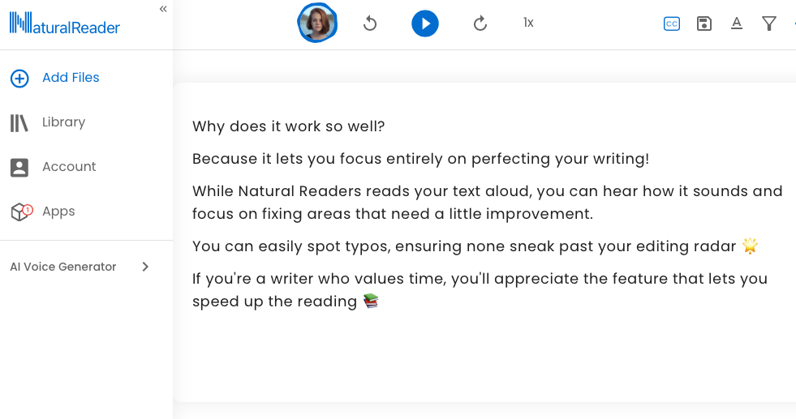

2. Play Button: Next, click the "Play" button in the NaturalReader window. This will start reading the text aloud. You can also use this button to pause and resume reading.

NUCLEAR AI FILES 180 dariuslukas.academy/

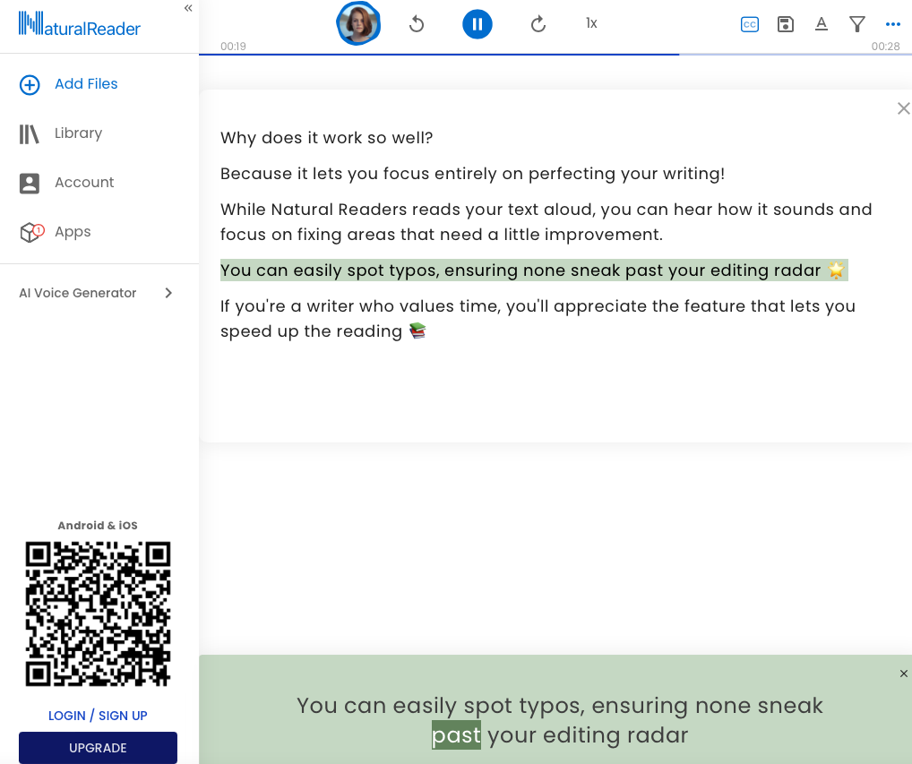

3. Download Audio: Finally, if you wish to save the audio, you can download it (in order to use this feature, you’ll have to upgrade to Plus).

The best part?

People who use the free version can listen to Premium Voices for up to 20 minutes a day and Plus Voices for up to 5 minutes a day.

You can upgrade for access to premium voices or stick with the free plan.

But what if you want to use it to create videos instead?

In case you want to use NaturalReaders **for commercial use**, such as YouTube videos or e-learning, you have to sign up for their AI Voice Generator, an application

designed to provide voiceover audio with a commercial licence:

NUCLEAR AI FILES 181 dariuslukas.academy/

🌟They have a **Pronunciation Editor** - this feature lets you change how certain

words are pronounced.

🚀With their **Advanced Tune** feature, you can adjust the pitch and volume of words.

📢Additionally, they provide a range of **voice styles**, from sad to cheerful, excited, or

angry.

I hope this introduction to has sparked your curiosity for a more

efficient editing experience.

Happy writing and editing!

NUCLEAR AI FILES 182 dariuslukas.academy/

**4. How to save time on your content** ✍🏻

● **AI Tool**: Rytr

● **Category**: text generation ● **What it helps you with**: writing content and copy ● **Link to website**:

---

is a great AI tool for copywriters, marketers, bloggers, and businesses seeking to simplify content creation.

Whether you're drafting emails, brainstorming blog ideas, or crafting social media ads, this AI tool can be super helpful.

Let’s see how it works.

looks a lot like Google Docs. To begin, create a new document and then select the AI features you want to use from the menu on the left.

🔧**Here’s how it works:**

**1. Select language** 🌐

You can choose from over 30 languages.

**2. Tone of voice** 🎵

NUCLEAR AI FILES 183 dariuslukas.academy/

Select from 20+ tones to determine the voice of your content.

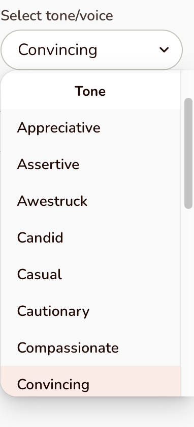

**3. Use case**📋

Pick your content type from the dropdown list. They support 40+ use cases.

NUCLEAR AI FILES 184 dariuslukas.academy/

**4. Add input** 📝

Include keywords, phrases or titles.

**5. Generate variations** ✨

Choose how many variations you want Ryte to generate (1-3) and select the creativity level (e.g., optimal / none / medium / high).

**6. Ryte for me** ✍️

Keep generating variations until you achieve the desired outcome.

Let’s say you want to generate a **Blog Idea & Outline** on the topic "What is affiliate marketing?". In that case, you would choose the "informative" tone and set the creativity to "optimal".

After generating the content, you have options like "Change Tone",

"Improve/Rephrase", "Change Length", or "Insert Content" for further adjustments.

🔍If you wish to insert new content and add a paragraph, simply select the text. Here’s an example:

NUCLEAR AI FILES 185 dariuslukas.academy/

You can edit and refine the text as needed, such as adding a conclusion sentence,

shortening or improving sentences, etc.

**Here’s what you can do with Rytr:**

● **Correct basic grammar mistakes:** This option will fix any grammar errors.

● **Rephrase:** If you're interested in the information but not the way it's presented, this option will rephrase it.

NUCLEAR AI FILES 186 dariuslukas.academy/

● **Write a paragraph:** This will generate content based on the selected text.

● **Expand:** This will provide further details on a snippet of content you like.

● **Shorten:** Opposite of "Expand", this option is ideal for summarising blog ideas or any generated content.

● **Append:** Useful for academic writing purposes.

● **Check for plagiarism:** If you're not sure about Rytr's output, you can verify it for plagiarism at any time.

In a nutshell 🥜, **Rytr:**

✅ Covers over 40 different use cases, including blog writing, social media advertising, and crafting SEO meta titles;

✅ Can write in more than 30 languages;

✅ Offers over 20 tones;

✅ Includes a built-in feature to check for plagiarism;

✅ Can handle SEO tasks;

✅ Offers a browser extension for seamless content creation across various online platforms.

💰**As for pricing:**

You can use for FREE, as long as you don't exceed the character limit. If you do, you'll either need to wait until the next month or upgrade to a paid plan.

The character limit for the free version is quite small (10k characters per month), essentially serving as a free trial.

For $9 per month, you can copy unlimited content each month and create one personalised tone of voice.

NUCLEAR AI FILES 187 dariuslukas.academy/

is one of the most affordable AI writing tools available. Therefore, if you’re on a tight budget, this tool can be an ideal choice.

NUCLEAR AI FILES 188 dariuslukas.academy/

**5. The best AI tools for readers** 📖

● **AI Tool**: multiple

● **Category**: content

summarisation

● **What it helps you with**: get book summaries and insights

**● Link to website:**

---

As entrepreneurs, marketers and service providers, investing in ourselves is always on the top of our list, right?

And what does everyone mention in these cases?

Courses… Mentors… *Books*

Yes, books. That’s what we are talking about today.

Because as much as we like reading them, time is still a scarce resource. ⏳

But, what if we could ‘download’ books into our minds in just minutes?

*No, you don’t have to wire your brain to a new tool as if it was an episode of Black Mirror!*

Yet, with AI we can cut down a big chunk of the time it takes to read a book (and re-read, when we like it).

We can even get summaries so that we can decide if we want to read the whole book or not.

So let’s break down 4 ways you can get the knowledge from all the books you want in just minutes with AI 📚

**1. Turn a book into easily digestible content** 📑

NUCLEAR AI FILES 189 dariuslukas.academy/

You don’t have time to read a whole book, and prefer a 15-minute video or audio instead?

Or maybe a short text that you can read with your morning coffee?

Then is what you need.

CEOs, founders, leaders, and sales professionals use this tool to *take the best-selling business and personal development books, and summarise the big ideas into 15 minute videos you can watch with your team, audio you can listen to on the go, and text that you can read while you drink your morning coffee.* (readshark.com)

You can try it for free, before paying for the subscription.

This could be very useful when you haven’t read a specific book yet, but also when you have already read it.

But the best thing is that when you grow thanks to a book, you can easily share it with others, and they grow too.

**2. Learn about the book content 10x faster**

Here are 3 things you can do to learn about the content of a book faster:

 1. Ask questions and get answers about a book

 2. Get complicated concepts explained like you were a 5 year-old  3. Compare books between each other

NUCLEAR AI FILES 190 dariuslukas.academy/

Lucky for us, does all these 3 things together. And you just have to sign up for free to use it!

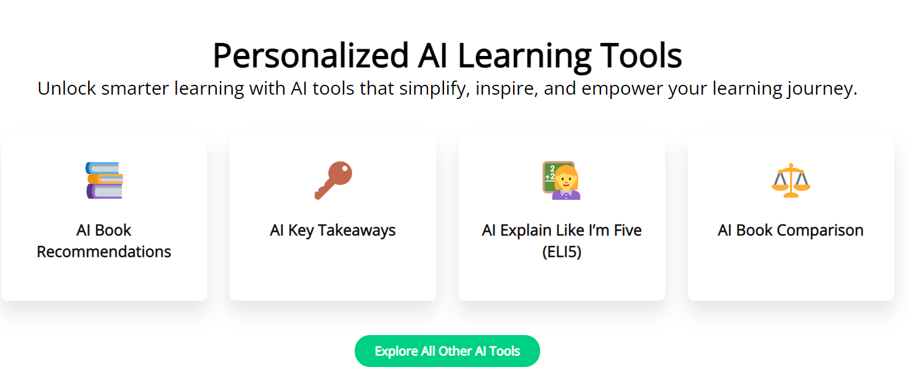

**3. Keep your takeaways in a table** 📅

Let’s say you have just finished reading an incredible business book, but you don’t like taking notes because you don't want to feel like it’s high-school again. It would be very useful to create a slick table with **all takeaways for your specific needs**.

Here is how you can do it:

NUCLEAR AI FILES 191 dariuslukas.academy/

1. Give this prompt to ChatGPT:

*I need your help to break down the key takeaways from the book "[book* *title]" by [author] and how I can implement those same takeaways to my* *specific situation.*

*Here is my situation: [explain what is your problem and what you are struggling with, and what help you need from the book]*

*Follow these instructions:*

*1. Please present all the key lessons from the book as they apply to my situation in a table format.*

*2. Please use the following columns:*

*1) Key takeaway*

*2) Brief Explanation*

*3) Where I can find the takeaway in the book*

*4) Strategy I need to apply (tailored to my situation)*

*5) List of action steps*

*Thank you!*

2. Copy and paste the table into the first cell of a Google Spreadsheet or Excel file (whatever you feel more comfortable with)

3. Adjust the cells to make the file as beautiful as you want (size of the cells, colour, font, etc.)

4. Turn the cell into a PDF file (save it as a PDF format), if you want.

Et voilà! You have a slick table with all the best takeaways, strategies, and action steps from your book.

You can keep it for the future, share it with other people with your same goal, and do whatever you want with it.

**4. Find your next book to study with AI** 📚

Having fun reading books this way? Then why don’t you find the next books to read and enjoy with AI?

NUCLEAR AI FILES 192 dariuslukas.academy/

You can get *personalised* recommendations with and .

***CHAPTER 5***

*Get AI to Manage Your Social Media Accounts*

**1. No time to work on a Youtube Channel? Do this** 🎥

● **AI Tool**: multiple

● **Category**: YouTube

content creation

● **What it helps you with**: build a successful

YouTube channel with

less effort

**● Link to website:**

---

As you probably have already heard, a YouTube channel is a great way to drive free traffic to your offers.

Yet, as an entrepreneur it’s difficult to find the time to do it properly.

If you want to leverage YouTube more often and create a new video in 1/10 of the time with AI, then this section is for you.

I am about to give you a ***simple* and *fast* step-by-step process** that goes from the very beginning (finding the video idea) to preparing for the next video.

I’ll give you all the prompts and tools you need.

On top of that, most of this process will be free of charge!

NUCLEAR AI FILES 193 dariuslukas.academy/

**STEP 1 - IDENTIFY THE TOPIC OF THE VIDEO** 📑

First of all, let’s find the right topic. How? We analyse what the audience of our competitors say, so that we find out what they want.

We do this in two steps.

First, we use an AI tool called . You simply need to copy and paste the link of your competitor’s YouTube video and it generates an Excel spreadsheet with the list of the comments.

We do this because under YouTube videos people give opinions, ask for more content, share what they loved most about the video. Hence, it’s a great resource.

Then we go to ChatGPT and write this prompt:

*I have a list of comments and reviews. I want you to analyse this list and create a new list with sentences, phrases and topics that people repeat over and over in their comments. List them from most common to not common.*

For this step, choose competitor’s videos with 100-500 comments, so that it’s not too hard for ChatGPT to process the list. Repeat this process with 5-10 videos and you’ll have a clear idea of the topics you can talk about. Then make your choice.

**STEP 2 - TURN THE TOPIC INTO AN IDEA** 💡

NUCLEAR AI FILES 194 dariuslukas.academy/

Have you chosen your topic? Great! Now we can turn it into a clear video idea. We do this through .

All you have to do is enter your topic, a search term, tone of voice and language.

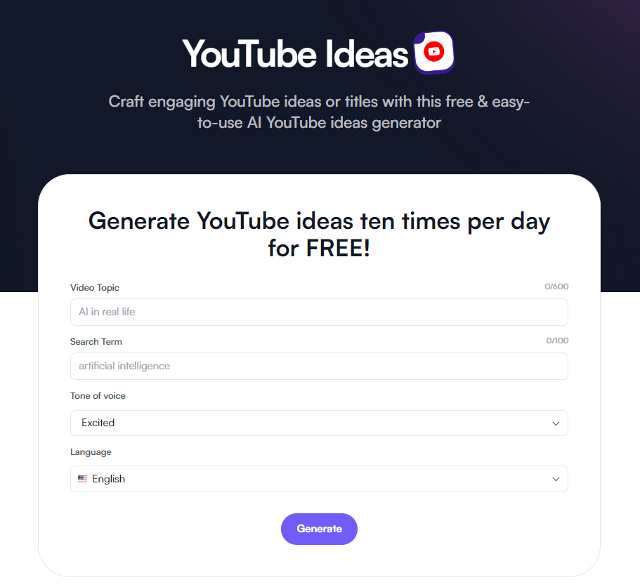

**STEP 3 - WRITE THE VIDEO SCRIPT** 🖊

With the topic and video idea in place, it's time to create the video script. And for this we’ll use our friend ChatGPT.

Here is a prompt you can use:

*Act like an expert YouTube content creator with long experience in [insert your niche] videos.*

*I want to write a YouTube video script about [topic] to [goal].*

*Write an engaging and high-converting video script.*

*Make sure you mention [concepts].*

*Don’t mention [concepts].*

*The call to action is [your call to action].*

Then, as always, you can give it more prompts to increase the quality of the output. Some prompt examples are:

*Make it shorter*

NUCLEAR AI FILES 195 dariuslukas.academy/

*Make it more engaging*

*Make it catchier*

*Make it longer*

*Rewrite the transition and make it clearer*

Once you have a good output, you do the final edits, and you have your YouTube video script.

You just have to shoot your video now (yes, you can deepfake your way out of it… it’s up to you, but if you want to connect with your audience my suggestion is to keep this part ‘human’).

**STEP 4 - WRITE A SEO-FRIENDLY TITLE AND DESCRIPTION** 🔍

Once you have a draft of your video script, it's time to write a SEO-friendly YouTube title and description.

There are very useful tools you can try for this, like , but since our aim is to cut the time required, we’ll rely on ChatGPT once again.

Keep working in the same chat you used for the video script, and use this prompt:

*Now I want to write an effective YouTube title and description for my video. Make sure they are SEO-friendly.*

Now you have your video, with title and description.

Before posting it, make sure you do it in the best time for your audience. If you don’t know how to do it, ask ChatGPT for instructions:

*Give me a step-by-step process to find when is the best time to post my new YouTube video*

**STEP 5 - EXTRACT COMMENTS TO GET IDEAS FOR THE NEXT VIDEOS** 🔄

Let’s say you repeat this process 10 times. Now you have ten videos, which means you will have a certain amount of comments.

You can use the same AI tool we used before () to create a spreadsheet with all the topics people talk about under your videos.

NUCLEAR AI FILES 196 dariuslukas.academy/

This way you have incredible data about your audience and you have free ideas for your next videos. 📈

**But wait, there’s more!**

What if you have a YouTube channel and you're struggling with low traffic and views despite posting content daily, it can be discouraging.

Low growth often leads to a lack of motivation and enthusiasm for creating videos, causing many creators to give up on YouTube early on.

Here’s how can help you turn things around.

can support you with SEO ranking, channel optimisation, data analytics, and also offers AI features such as **Thumbnail Generator** and **YouTube Title Analyzer**.

🚀**How to get started:**

1. Install .

2. Sign in with your YouTube account.

3. TubeBuddy will then connect to your YouTube channel dashboard.

Now, let’s dive into its features!

**1. SEO and Ranking** 📊

● Easily track your video rankings;

● Optimise your videos’ tags, descriptions and titles to increase visibility in search results;

● Discover and analyse keyword ideas;

NUCLEAR AI FILES 197 dariuslukas.academy/

● Organise your YouTube tags in one place with Tag Management; ● Boost your Click-Through Rate (CTR) with AI-based recommendations; ● Use Insta-Suggest to discover long-tail tags for your YouTube videos.

**2. Channel Optimisation** 🛠️

● Use the Video Scheduling feature to plan and automatically publish your videos in advance;

● Access the Video Topic Planner to keep your content ideas organised;

● Remove or hide videos in advance with Sunset Video;

● Use their Channel Valuation option to assess your channel’s actual value and identify issues like broken links or unoptimised titles;

● Check out their Demonetization Audit to prevent demonetization by YouTube; ● Gain valuable audience insights to better understand your audience;

● Backup all your videos with the Channel Backup feature;

**3. Video & Thumbnail**🎥🖼️

● Use their Auto Translator to translate your videos into over 40 languages; ● Access the Thumbnail Generator to create engaging thumbnails; ● Optimise your video thumbnails by conducting A/B tests;

● Use the Emoji Picker to add engaging emojis to your titles, tags and descriptions.

NUCLEAR AI FILES 198 dariuslukas.academy/

A key benefit is that TubeBuddy also provides tools for effective community management, allowing you to grow your audience engagement.

You can share your videos on multiple social media accounts using the Social Media Share Tracker.

They also offer a Comment Management feature. This is very useful because it helps you with formatting your comments for better audience feedback.

Additionally, you can use their Pick a Winner option which basically transforms your comments section into a lottery, boosting engagement and rewarding your viewers.

With TubeBuddy’s Data and Analytics features, you can easily identify critical sections of your videos and get access to actionable recommendations to boost your video’s visibility.

Another standout feature is that you have an option for Bulk Find, Replace, and Append so you can update your video titles and descriptions without doing all the manual work.

Their Bulk editing tools help you edit or update your cards, end screens, and descriptions in bulk.

📝**To sum up,**

TubeBuddy is a great option for optimising your videos and creating engagement on your YouTube channel.

But more than just a SEO tool, TubeBuddy offers AI features like **Suggested Shorts**, **YouTube Title Generator**, and **Thumbnail Analyzer**, which can help creators manage, grow and optimise their YouTube channel effectively.

NUCLEAR AI FILES 199 dariuslukas.academy/

A disadvantage is that it only allows one YouTube channel per subscription. Similar tools to TubeBuddy are and

💰**Let’s also consider the price…**

Their pricing plans include two options: .

NUCLEAR AI FILES 200 dariuslukas.academy/

If you're just starting your YouTube channel, consider the **Pro Plan at $3.99 per month**. With this plan, you'll have access to search optimization features and limited access to video engagement tools.

However, if you already have a bigger YouTube audience, **the Legend plan, priced at $25.20/month**, might be a better option. This plan offers unlimited access to all AI features, predictive analytics, and a competitor scorecard.

NUCLEAR AI FILES 201 dariuslukas.academy/

**2. Here are 3 AI tools that make you viral on all social media platforms!** 📈

● **AI Tool**: multiple

● **Category**: social media

management

● **What it helps you with**: go viral on all social media platforms

**● Link to website:**

---

The 3 AI tools we’re going to talk about in this section will make you viral on all social media platforms! 😎

#1. 🎩✨

This AI tool helps you create viral shorts with a single click!

Just upload your video and amazing looking captions that you can customise will be added in seconds.

But that’s not all! You can effortlessly add B-rolls, transitions, sound effects and auto-zoom.

👉**Here’s a breakdown of how to do this:**

1. Upload your video.

2. Choose the **style** of your subtitles.

Feel free to borrow themes from your favourite creators! 😎

NUCLEAR AI FILES 202 dariuslukas.academy/

3. Auto-cut silent parts.

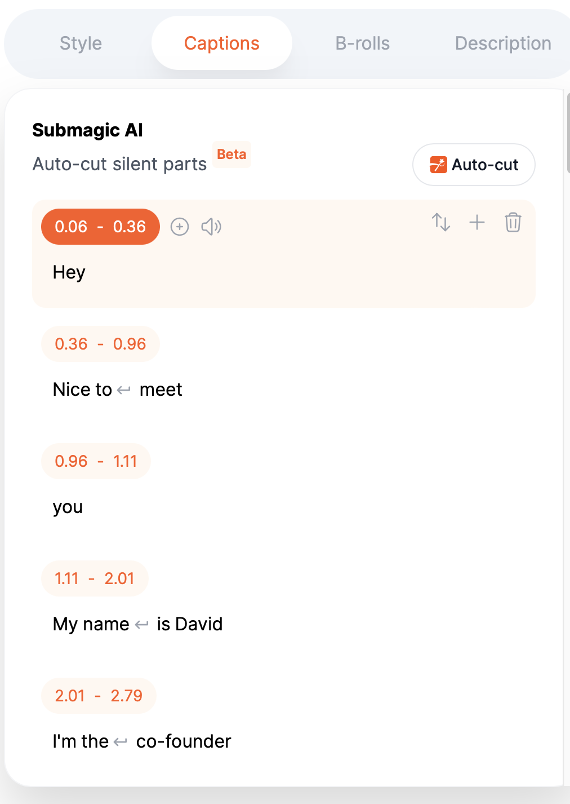

4. Add auto-zooms and B-rolls.

NUCLEAR AI FILES 203 dariuslukas.academy/

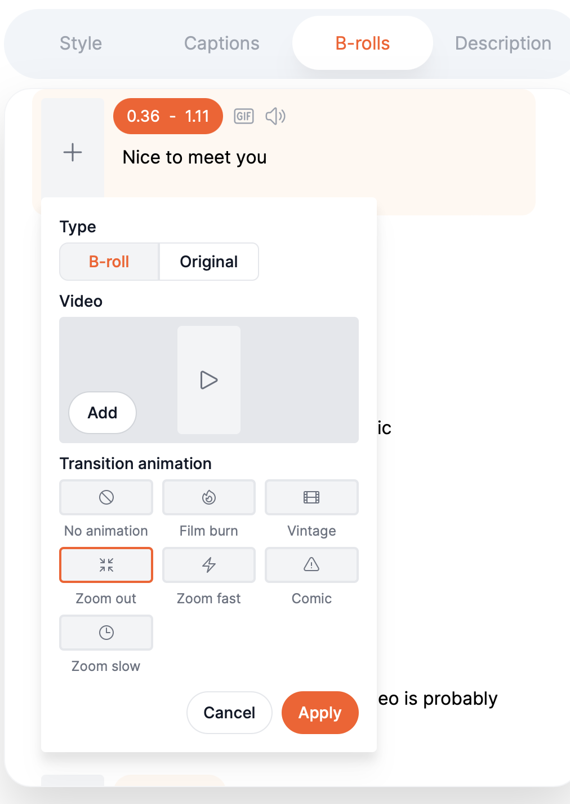

5. Use the option **Description and hashtags generated by AI.**

Doing this makes your life easier by using your transcript to create your description and hashtags.

6. Export your video!

You can now stop wasting hours editing your videos and just use to create a viral short in seconds.

NUCLEAR AI FILES 204 dariuslukas.academy/

**Now, about pricing** 💲

With a **FREE TRIAL** available, you can start using it right away! Pricing plans start at **$12/month.**

📝🧠

This AI tool can write viral tweets and threads for you!

👉 **Here’s how:**

1. Connect your X (Twitter) or LinkedIn account.

2. Use the **AI Writer** to write an engaging post.

For example, if you type “*AI and the future of technology”,* you’ll receive three options to choose from.

NUCLEAR AI FILES 205 dariuslukas.academy/

Or use their **Ghost Writer** for a series of ready-to-use posts aligned with your saved preferences.

Now you can schedule your posts!

NUCLEAR AI FILES 206 dariuslukas.academy/

At this stage, Postwise offers two pricing plans: **Basic ($37/month)** which includes access to all growth tools, 400 AI credits, 6 months of scheduling, and the ability to connect up to 5 accounts; and **Unlimited ($97/month, paid annually)** which expands on Basic by offering **unlimited AI credits, scheduling, and account connections**, making it ideal for users with higher content automation needs.

📹🚀

There are hundreds of **text-to-video** AI tools out there, but this one can generate engaging YouTube videos with just the push of a button.

👉 **Let’s create one together, shall we?**

1. Go to .

2. Give invideo the topic of the video you want to create.

**PROMPT:***Create a YouTube short about the smartest ways people are using AI to make their lives easier.*

NUCLEAR AI FILES 207 dariuslukas.academy/

You can then edit the video on the spot by telling invideo.io what you want to add to

the video or change.

For example, you can add subtitles, change the voiceover to a female, or add an

image of a robot in the video.

3. Generate video!

4. Tweak it!

NUCLEAR AI FILES 208 dariuslukas.academy/

🛠️If anything needs adjusting, you can use their **Manual Editor**.

You can start using this tool for **FREE**, but if you want to publish videos without a watermark, you should upgrade to one of their paid plans.

NUCLEAR AI FILES 209 dariuslukas.academy/

**3. Manage all social platforms with this AI tool!**

● **AI Tool**: Buffer

● **Category**: social media management

● **What it helps you with**: schedule posts across all platforms with ease

● **Link to website:**

---

Now I want to walk you through a management tool that allows you to schedule posts for multiple social media platforms, including Twitter, TikTok, Threads or YouTube.

It’s called .

This will make content management easy and efficient.

It integrates with external tools like Zapier, Pocket, and Twitter management tools.

For example, you can save articles from Pocket to your Buffer queue for scheduling and sharing on Twitter. 🥳

😎 **How to set up your Buffer account:**

1. Go to Buffer and sign up.

2. Connect your social media accounts (Twitter/Facebook/LinkedIn/Instagram). 3. Set up your posting schedule and time zone for each social media account.

**TOOLS:**

● Publishing → Plan and publish all your content from the same dashboard. ● Analytics → Analyse social media performance and create reports.

● Engagement → Navigate your comments and engage with your community. ● Start Page → Build your landing page.

● AI Assistant → Generate ideas and rewrite copy with AI. 🤖

NUCLEAR AI FILES 210 dariuslukas.academy/

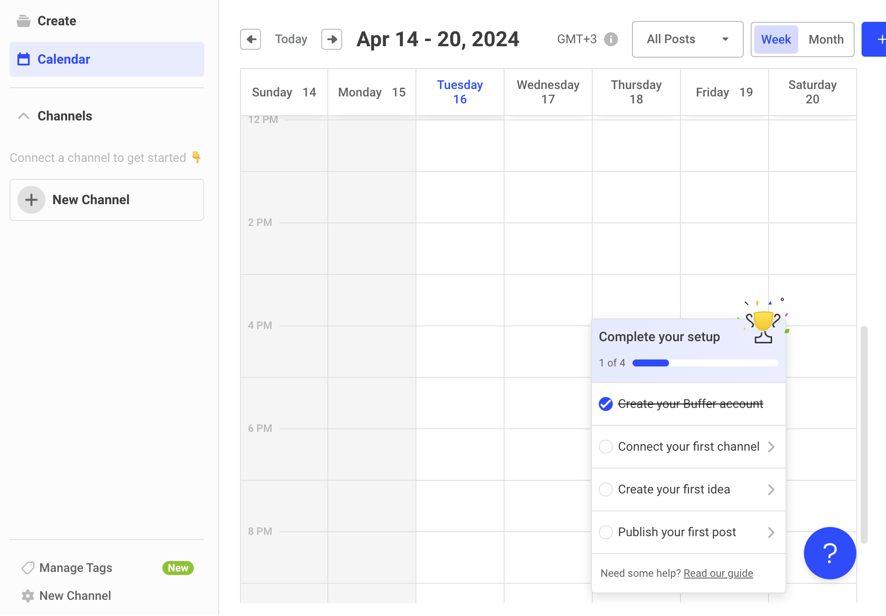

Another cool feature is that Buffer supports **team collaboration**.

Users can assign roles and permissions to team members based on their responsibilities.

Just add a name, the email address, type the name of the channel you want to provide access for, and set access level (full posting access or approval required).

Buffer’s Team plan offers unlimited users, allowing you to add as many team members as you want.

NUCLEAR AI FILES 211 dariuslukas.academy/

This platform remains a popular choice for social media scheduling, thanks to its user-friendly interface, integration capabilities, and free resources.

🤔 **However, it also has some limitations:**

Buffer’s limited analytics might not be as detailed as what other tools can offer, which could be a problem for businesses that really need a lot of data and insights.

The free plan only allows access to three channels, 10 scheduled posts per channel, and the ability to create and schedule posts in advance.

💵 **Pricing**

At this moment, Buffer offers three pricing plans: **Free (forever)** allowing up to **3 connected channels**, 10 scheduled posts per channel, 100 content ideas, AI assistant access, basic analytics, and customer support; **Essentials ($5/month per channel, billed yearly at $60)** which upgrades to **unlimited scheduled posts, unlimited ideas, advanced analytics, and an engagement inbox**; and **Team ($10/month per channel, billed yearly at $120)** which includes **everything in Essentials plus unlimited user accounts**, making it ideal for collaboration and team-based social media management.

NUCLEAR AI FILES 212 dariuslukas.academy/

If your goal is to stay consistent, organised and increase your following, Buffer is a great option.

🔄 Other social media management tools are and .

NUCLEAR AI FILES 213 dariuslukas.academy/

***CHAPTER 6***

*Cut Your Working Hours In Half With AI*

**1. Too many tasks? Use these 3 AI tools**

● **AI Tool**: multiple

● **Category**: productivity enhancement

● **What it helps you with**: save time and streamline tasks

**● Link to website:**

---

If you read The 4-hour Workweek (of course you did) you know the importance of delegating.

So, if you and your team are already drowning in tasks and you are thinking of delegating more work, here are **4 AI tools that will help you and your assistant automate more tasks**.

**1. Convert a document into a presentation**

Let’s say you need to give a presentation in 15 minutes. You wrote the script, you know exactly what to say… but you forgot to prepare the slides 😬

Don’t worry, don’t make your assistant go crazy and prepare it on the go. Instead, use the new feature just added.

If you don’t know , it’s an AI-powered app that helps users with their storytelling and communication.

How does this new feature work?

You upload the document (up to 25 pages), check the slides are correct, and you have your presentation ready.

NUCLEAR AI FILES 214 dariuslukas.academy/

**2. Streamline tasks on Excel (and spend less time on it)**

If you hate doing tasks on Excel or Google Spreadsheet (*I mean, who loves it?*), then you will install this AI tool today.

Numerous AI helps you cut the boring and repetitive tasks on Excel and Google Spreadsheet through various AI functions.

You can extract text, categorise elements, use ChatGPT in cells, teach AI to do repetitive tasks, even get complex formulas explained.

And it’s very simple!

On you can already see the app in action.

**3. Get calls transcribed and summarised for you**

Having team meetings is not only useful, but necessary for all businesses, especially the remote ones. But sometimes things get lost.

If you want to optimise communication during meetings, you should try , which started collaborating with OpenAI, and an AI tool called .

These tools take notes and summarise them all for you.

provides you with free unlimited transcriptions, it’s Bot-free, and integrates with all communication apps, like Microsoft Teams, Google Meet and even Zoom.

Whatever option you choose, you are covered!

This kind of tools are proof that artificial intelligence is a way to focus your time and energy on the right things, so you can grow faster and faster.

NUCLEAR AI FILES 215 dariuslukas.academy/

**2. Get your emails organised fast** ⚡

● **AI Tool**: Shortwave

● **Category**: Productivity and time management ● **What it helps you with**: get your email inbox

organised and easy to

manage

● **Link to website**:

---

Looking for ways to simplify inbox management through automation?

If you’re feeling overwhelmed by the constant flow of messages and frustrated with the never-ending effort to tidy up your inbox, is the solution you need.

**Here’s why you’ll love it:**

✅ It helps you prioritise your work by ensuring you never miss important emails; ✅ It allows you to easily pin emails or threads to the top of your inbox for quick access;

✅ It makes sure you reach peak productivity through its organisation and productivity features.

It’s available on iOS, Android, Mac, and Windows.

🚀**How to get started**

1. To begin, go to , and select the **“Sign in with Gmail”** option. 2. Allow access to your email, contacts and Google Calendar.

3. You’re all set!

Shortwave only works with Gmail or Google Workspace accounts and does not support any other email services.

🎁**What you get:**

NUCLEAR AI FILES 216 dariuslukas.academy/

● **AI-powered search**: analyses your entire email history for the information you need

● **Ghostwriter**: creates personalised drafts using your style

● **Translations**: provides high quality translations for both reading and writing emails

● **Schedule meetings**: suggests available time slots based on your calendar

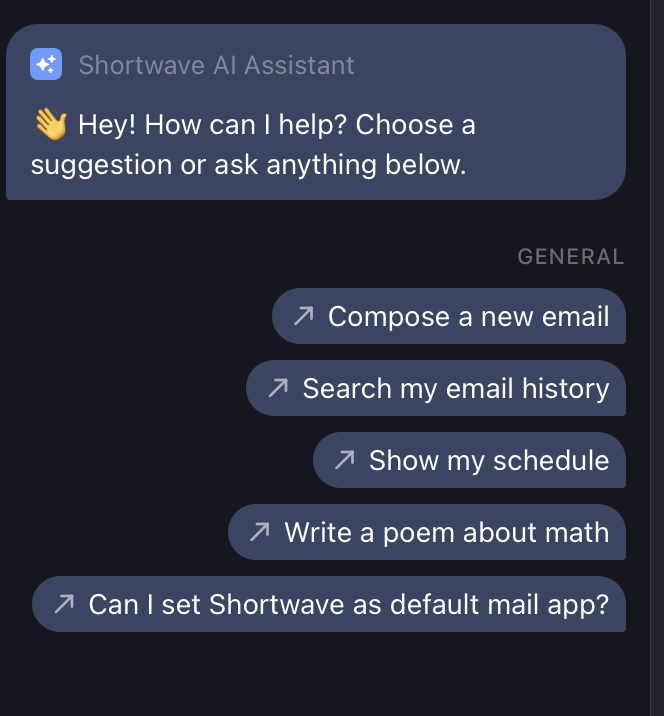

📁**OTHER ORGANISATION FEATURES**

1. Group emails into **bundles**

Bundles are groups of related threads that condense multiple emails into just one compact line in your inbox.

You can customise and configure bundles from **Settings -> Inbox**.

NUCLEAR AI FILES 217 dariuslukas.academy/

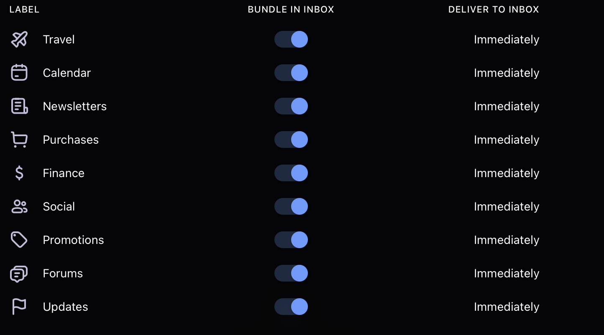

The default bundles include emails related to *Travel, Calendar, Newsletters, Purchases, Finance, Social, Promotions, Forums and Updates*.

2. **Delivery Schedule**

Schedule emails or bundles to only show up at certain times.

For example, if you prefer not to see emails related to *Travel* during your workday, you can schedule them not to appear until 5 PM on workdays.

3. **Eliminate noise**

Stop unwanted or annoying emails by blocking spam senders.

NUCLEAR AI FILES 218 dariuslukas.academy/

4. **Auto-apply labels**

Configure labels to automatically apply to specific senders.

And if you want to increase your productivity, here’s what you can do:

1. **Turn emails into to-dos** -> check off emails when you’re done.

2. **Prioritise your threads** -> organise your threads using **drag & drop** and **add** **notes**.

3. **Pin & Snooze** -> pin important threads and snooze the ones that you’d think about later.

4. **Keyboard Shortcuts** -> use shortcuts for an accelerated user experience.

📤**But wait, there’s more…**

Here are some more Shortwave features you’ll love:

● **Undo send** → this feature allows you to revoke an email shortly after sending it, giving you the chance to correct mistakes or make changes before it reaches the recipient.

NUCLEAR AI FILES 219 dariuslukas.academy/

● **Calendar integration** → accept or reject invites

● **Granular push controls** → minimise disruptions with personalised alerts ● **Do not disturb** → get push notifications when you want them

● **Light & dark modes** → switch between brighter and darker colour schemes ● **Thread links** → reference your emails from other apps with permanent links ● **Saved searches** → add your favourite senders, labels and searches to your sidebar.

● **Blocked tracking pixels** → get more privacy by detecting and removing the majority of tracking pixels from emails.

● **Multi-account support** → manage and access multiple accounts.

● **Signatures & aliases** → import signatures and send from any of your aliases. 💰**HOW MUCH DOES IT COST?**

provides a **FREE** version with essential functions, but it has limited access to older emails (with a searchable email history of up to 90 days).

If you want to access advanced features like AI-assisted search or full email search history, a subscription starts at $14 per month.

NUCLEAR AI FILES 220 dariuslukas.academy/

NUCLEAR AI FILES 221 dariuslukas.academy/

**3. The best time-saving AI tools on a budget** 💲

● **AI Tool**: multiple

● **Category**: Productivity enhancement

● **What it helps you with**: save time on everyday tasks

**● Link to website:**

---

Entrepreneurs & marketers: finding yourself with a busy schedule?

If you’re looking to streamline your workflow, but are afraid that it may cost too much, this is for you!

We’ve dug in the caves of AI to find the best AI tools for small/medium business owners that improve workflow.

We had a goal: make these tools affordable.

And these are the tools that will help you save time while not spending hundreds of dollars every month! 💲

🔇**:**improves your call quality with features like background voice cancellation and noise reduction;

💼**:** automates lead discovery and streamlines contact management; 🗓️**:** optimise your schedule with AI

Let’s begin with the first one:

**1.**

**Main features:**

🎙️ **AI Voice Clarity**

● **Background Voice Cancellation**: removes background voices, such as chatter of other people talking in the same room.

NUCLEAR AI FILES 222 dariuslukas.academy/

● **Noise Cancellation**: eliminates background noise from both ends of the call. ● **Echo Cancellation**: filters the echoing sounds in the room.

🤖 **AI Meeting Assistant**

● **Meeting Transcription**: provides automatic meeting transcription.

● **Meeting Notes**: takes meeting notes and summarises discussions. ● **Meeting Audio Recordings**: records meeting audios, which you can then share with colleagues.

🔗 integrates with all communication apps, like **Microsoft Teams, Google Meet and Zoom**.

🛠️ **Setting up is easy** - just install it and choose it as your microphone and speaker in your communication app's audio settings, and you're ready to use it.

💰 **Pricing**

As of now, Krisp offers three pricing plans: **Free ($0/month, forever)** for individuals, including unlimited transcript & audio recording, **60 minutes/day of noise**

**cancellation**, **2 AI notes & action items per day**, and a **7-day meeting history**; **Pro ($8/month)** for professionals needing **unlimited AI notes**, transcripts & summaries in 19+ languages, **video recording**, and **Krisp Co-pilot**; and **Business ($15/month)** for teams, offering everything in Pro plus **SSO/SCIM integration, SOC2 report access, admin controls, and priority support**.

NUCLEAR AI FILES 223 dariuslukas.academy/

So in this case, depending on the size of your business, you might probably use

either the free or the $8 version.

**2.**

**Clay**is an automation tool that transforms the process of discovering and evaluating individuals and businesses, saving you valuable time and resources.

As a powerful lead finder, Clay helps you discover prospects' work emails and automates Google searches to evaluate company websites, identify keywords, and compile lists.

For instance, it can detect if companies prioritise remote work or mention specific keywords on their websites.

Moreover, users can take notes on each contact, including important details such as their role, company, or contact information.

🔗**It integrates with social media profiles, contacts, calendars, and more (LinkedIn, Twitter, etc.).**

If you have many contacts and interact directly with customers or other professionals, Clay is an excellent tool to manage and organise everything for maintaining these relationships and communications efficiently.

NUCLEAR AI FILES 224 dariuslukas.academy/

💰 **Pricing**

You can start using Clay for **FREE** and access all its core features. This includes easily importing contacts from Email, Calendar, Twitter, and more. You can stay organised with search and groups, receive reminders and birthday notifications, and see unlimited updates. Plus, you can add up to 1000 contacts.

For additional features, you can explore **Clay's Pro Plan**, starting at **$10 per month**.

Clay also provides personalised plans tailored for teams and enterprises.

Most probably, you’ll end up using the free or $10 version.

**3**.

is an AI tool that generates personalised schedules based on your assigned tasks and habits.

NUCLEAR AI FILES 225 dariuslukas.academy/

Ideal for team coordination and managing multiple projects, Reclaim streamlines scheduling by syncing multiple calendars and speeding up meetings with its **Scheduling Links** feature. This leads to smoother collaborations and allows for buffer time between meetings.

Moreover, this tool is a game-changer for those struggling to balance work and personal life. By syncing with both work and personal calendars, it provides a clear overview of your schedule, enabling you to find more free time and achieve better work-life balance.

🔗 Affordable, intuitive, and designed to protect your time, it integrates with popular tools including **Slack, Asana, ClickUp, Tasks, Jira Software, Todoist, Zoom, Linear, and Raycast**.

In summary, it organises your calendar into flexible free time and protected "defended time", categorising tasks, meetings, and habits for better prioritisation.

💰 **Pricing**

Best of all, you can get started for **FREE**.

Small/medium business owners will probably get the best bang for their buck on the free or $8 version.

**4.**

NUCLEAR AI FILES 226 dariuslukas.academy/

What if you could compile all the Q&As your customers have, upload it into a PDF, and then have an AI answer any question that’s on that document?

That is what does:

📝 You upload a PDF

🤖 The AI becomes an expert in it

🕵️ You can create chats where people ask something and, if it is on the PDF, the machine will answer those inquiries in a conversational and warm manner.

*Uploading your Q&As for customer service…*

*Uploading your SOPs for new hire training…*

*Uploading long industry reports…*

Imagine how much time it would save having all the information inside those documents only one question away?

That’s the power of !

You can also start using it for free!

NUCLEAR AI FILES 227 dariuslukas.academy/

**4. Save time on daily tasks**

● **AI Tool**: multiple

● **Category**: Productivity enhancement

● **What it helps you with**: save time on everyday

tasks

**● Link to website:**

---

Let’s go through some AI tools that you can look at to outperform your competitors

and achieve your September resolutions.

I’m going to break down three September resolutions you might have and give you

an AI tool for each of those.

**1. IN CASE YOU WANT TO HIRE NEW PEOPLE**

Many companies want to expand their team after the summer.

If that’s your case you need to use .

NUCLEAR AI FILES 228 dariuslukas.academy/

Manatal is an AI recruitment tool designed to streamline the hiring process and source top talent efficiently.

Their platform is super easy to use, in fact even if you’re new to recruitment you can navigate this tool effortlessly.

One of the best things about it is the customizable pipeline. Every company has a different hiring process right? So being able to customise your recruitment pipeline is just great if you ask me.

But it doesn’t end here.

Because with Manatal you can reach a wide audience by posting job openings on over 2,500 free and premium channels. These include global, local, and specialised platforms like Indeed, LinkedIn, Monster, and more.

Plus, you also have an AI Engine that helps you by suggesting the top candidates for each job role. It automates routine tasks and scores candidates' profiles based on job requirements, making candidate screening more efficient.

Manatal goes full circle, because it helps you keep track of the onboarding process too.

NUCLEAR AI FILES 229 dariuslukas.academy/

Cool right?

**2. CASE YOU WANT TO LAUNCH NEW OFFERS**

Come on, I know you have some new offers to launch during autumn.

If you’re a launch addict like many entrepreneurs, you might find .

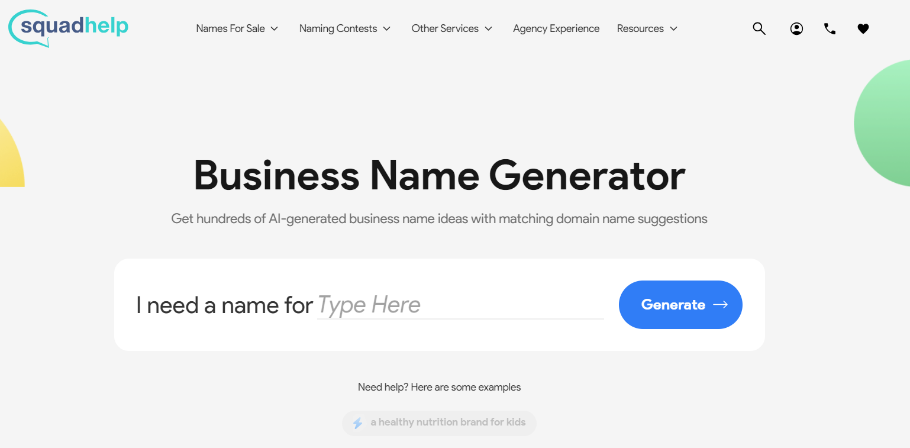

I know, I know, this tool claims to generate business names.

But with just a couple of tests you can actually see that it works perfectly with names for new products or offers too.

You just need to type in a short description of what you’re launching, and you’ll get a lot of good inspirations!

**3. IN CASE YOU WANT TO OPTIMISE YOUR WORK DAY MORE**

I know who you are.

You’re that kind of entrepreneur who tries to optimise your work day. You want to have good sleep, get some focus music, remove all friction…

NUCLEAR AI FILES 230 dariuslukas.academy/

You like biohacking because you want to be more productive, that’s why you often binge watch videos about productiveness.

Well, if this is you, you’ll love .

Timely offers a game-changing solution for business owners looking to streamline time tracking and productivity management.

First off, you get automated time tracking. Timely eliminates the need for manual time tracking methods, like timers and notes. It automatically records time spent across web and desktop apps, including documents, meetings, emails, websites, and video calls. This feature ensures accurate records with zero effort.

When you use Timely, you gain an exact daily breakdown of your activities, offering a nice snapshot of your workday. From documents to video calls, everything is

captured automatically, allowing you to focus on the needle movers of your business.

You can even integrate it into your team tasks, because it allows you to track projects in real time, monitor budgets, hours, and activities. This feature is really nice for project management, and it helps with smarter decision-making.

Timely also helps you with tracking every billable detail in your projects, and this helps you make sure no valuable work goes unnoticed.

NUCLEAR AI FILES 231 dariuslukas.academy/

Timely claims their product will reduce timesheet administration by up to 75%. You’ll have to see if it’s true for yourself, but it’s definitely an interesting tool for your

schedule.

NUCLEAR AI FILES 232 dariuslukas.academy/

**5. AI note takers: Otter vs Fireflies** 🏆

● **AI Tool**: multiple

● **Category**: note takers and transcribers

● **What it helps you with**: taking notes during calls **● Link to website:**

i/

---

Have you ever found yourself in the situation where you’re taking notes during a meeting and you keep getting distracted?

As a result you’re not fully engaging in the discussion, plus taking notes is so much harder.

Not to mention those times when you can't even attend the meeting at all. And getting up to speed is tough.

If you’re already using one of these tools for transcribing and recording calls and meetings…

Congrats!

You’re doing a great job by automating your meetings and improving your productivity.

Today we’ll compare two of the best AI tools that help you with your meeting notes: and . Hopefully this will help you decide which one is more suitable for you.

🤔**Otter and Fireflies: what sets them apart?**

**● Otter.ai**

Otter.ai is an **AI transcription tool** designed to generate transcriptions for meetings, interviews and other conversations.

**● Fireflies.ai**

NUCLEAR AI FILES 233 dariuslukas.academy/

Fireflies.ai is an **AI assistant** for meetings that records, transcribes and provides search functionalities for your voice discussions during meetings.

Now, if you’re wondering:

**What’s the difference between a transcription tool and a meeting assistant?**

**1. Transcription Tool** 📝

A meeting transcription tool, such as Otter.ai, uses AI to automatically record and transcribe spoken discussions into written text.

**Advantages:**

✅ Saves time;

✅ Allows you to concentrate on the meeting rather than note-taking; ✅ Facilitates easy recall and review of meeting discussions.

Initially, Otter.ai was designed as a voice notes app. Over time, it expanded to include features such as creating summaries of conversations, editing transcriptions, and adding notes in real-time.

**2. Meeting Assistant** 💼

A meeting assistant is doing more than just transcription; it can help you with different tasks before, during and after the meeting. Besides sending an assistant to your call for task automation, it also offers features like collaborative meeting notes, search functionality, and conversation intelligence.

**Advantages:**

✅ Saves time before and after the meetings;

✅ Generates meeting highlights, actions items, and summaries; ✅ Eliminates biases in meeting notes.

Fireflies is primarily designed as a meeting assistant for businesses and teams rather than individual users. It records, transcribes, and facilitates search functions for meetings.

NUCLEAR AI FILES 234 dariuslukas.academy/

Additionally, it integrates with various tools such as dialers, CRMs, and platforms like Slack to provide meeting assistance both before and after the meeting.

**Otter** 🆚**Fireflies**

It’s time for the final battle….

✅ Both of them do an excellent job of accurately transcribing audio from meetings into text.

✅ They are simple to get started with, offering an intuitive interface.

✅ Both platforms facilitate collaboration by allowing you to invite individuals from either within or outside your organisation.

✅ Additionally, they allow you to transcribe audio files that you upload.

**Otter:**

**Fireflies:**

✅ They both offer Chrome extensions for transcribing meetings.

However… Fireflies' extension stands out with unique features. The Fireflies Chrome extension includes **AskFred for the Web**, which summarises web pages, articles, YouTube videos, and other content.

**AskFred:**

NUCLEAR AI FILES 235 dariuslukas.academy/

**Otter Chat:**

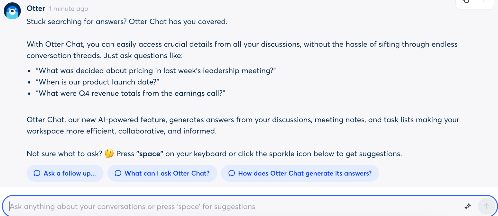

✅ They integrate with various communication and productivity tools.

NUCLEAR AI FILES 236 dariuslukas.academy/

Otter.ai integrates with platforms like Zoom, Microsoft Teams, Google Meet, and Dropbox, enabling users to sync recordings and transcripts across different applications.

**Otter:**

🆕 They have a new integration with Slack.

Fireflies integrates with tools such as Zoom, Microsoft Teams, Slack, and Google Calendar, ensuring smooth workflow integration.

**Fireflies:**

NUCLEAR AI FILES 237 dariuslukas.academy/

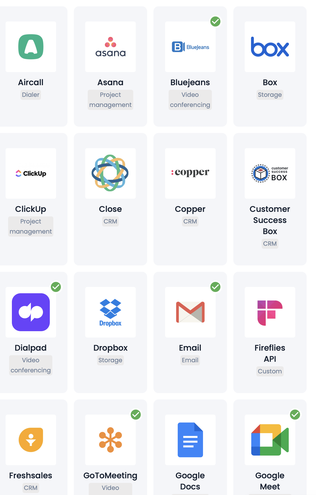

💰**Pricing**

Both and provide affordable subscription options.

They offer **FREE** plans with limited features and also provide customised pricing for enterprises.

Otter.ai’s paid plan begins at $8.33 per month, with the Business plan priced at $20 per month.

The Pro plan for Fireflies costs $10 per user per month, while its Business plan is priced at $19 per user per month.

🤔**Which one is the best for you?**

Otter and Fireflies are both great options, offering accurate transcriptions, collaboration tools and an user-friendly interface.

NUCLEAR AI FILES 238 dariuslukas.academy/

If you're an individual or a small team needing meeting transcripts, you can choose .

If you want voice-to-text transcripts with extra features like better integration and search options, go for i.

NUCLEAR AI FILES 239 dariuslukas.academy/

**6. Meetings made easy: auto notes and summaries**

● **AI Tool**: Noty.ai

● **Category**: note-takers and transcribers

● **What it helps you with**: taking notes during calls ● **Link to website**:

---

Let’s be real—how many times have you left a meeting only to forget key takeaways, miss action items, or rush to recap everything?

solves this by automatically transcribing, summarizing, and generating to-do lists in real-time, so you can focus on the conversation, not on taking notes.

And here’s something most AI transcription tools don’t provide—by the end of this report, you’ll discover how to use without committing to a subscription.

Let’s get started!

**How to Set It Up in 3 Simple Steps:**

1️⃣**Create an Account** – Sign up and grant permissions for meeting access.

2️⃣**Integrate with Your Meetings** – Sync with Google Meet or Zoom to enable real-time transcription.

3️⃣**Start Using AI-Powered Notes** – Join a meeting and get an instant summary with action items right after!

**Key Features:**

📝 Real-Time Transcription – Instantly captures accurate meeting notes.

🤖 AI-Powered Summaries – Condenses key points into clear takeaways.

✅ Automated Action Items – Highlights tasks and key decisions.

NUCLEAR AI FILES 240 dariuslukas.academy/

📤**Seamless Sharing** – Easily share summaries and notes with your team.

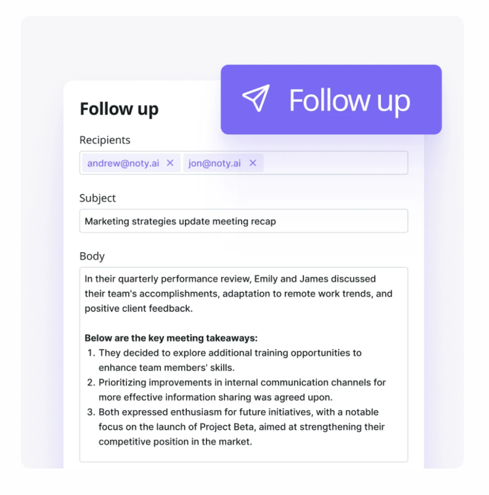

🔗**Integrations** – Connects with Zoom, Google Meet, Slack, Notion, and more. 🔍**Smart Search** – Quickly find any past conversation.

🌍**Multilingual Support** – Covers 87 languages (including arabic, filipino, farsi, georgian or vietnamese).

NUCLEAR AI FILES 241 dariuslukas.academy/

💰**Pricing**

Many AI meeting assistants come with pricey subscriptions, but Noty.ai gives you flexible options.

As of the time writing this ebook, you can choose the **Pro Plan** for **$19.99/month** (or **$10/month when billed yearly**), which includes:

✅ 100 hours of transcription

✅ AI-generated summaries

✅ A Kanban task board

✅ Export options (Docs, PDF, TXT)

✅ Priority support

Or go with the **Pay-as-You-Go** plan at just **$1 per hour**—get all the Pro features without a monthly commitment, only paying for what you use.

🎁 **Bonus:** Try it free for 7 days!

NUCLEAR AI FILES 242 dariuslukas.academy/

**7. Organise your information visually**

● **AI Tool**: Albus

● **Category**: visualiser

● **What it helps you with**: explore topics with the help of images and

diagrams

● **Link to website**:

---

Let me walk you through an interesting tool that allows you to explore any topic with AI.

It’s called - which is not to be mistaken with Albus AI (another interesting AI tool).

is an AI tool that allows you to explore a topic and explain it through text and images, organising all the information visually on a board.

NUCLEAR AI FILES 243 dariuslukas.academy/

I played with it, and I want to share with you the most interesting functionalities you can find in this beta AI platform, and how you can use them for your business.

Keep in mind, I won’t describe all the functionalities, but just the ones that are most interesting for you and your business. If you want to dig in more, you should take some time to explore it further.

**1. How to start using Albus**

As you can see in , everything starts from the topic or question that you type in the search box at the top of the board.

From there, on the left will appear a colourful menu with subtopics to explore.

What can we write in the search box?

As marketers and business owners, the best thing we can do is write about a problem you have in your company (like ‘My team is not cooperating well’), the problem your target audience has, or a topic that is the focus of our method, products or approach (like ‘women losing weight through weight training’).

This way you can solve your company’s problems, find new ideas for your content, and dig into your audience’s mind.

When you click on one of the subtopics on the left, a box will appear on the board, and you will find some deeper info about what you asked for.

NUCLEAR AI FILES 244 dariuslukas.academy/

Now let’s see the different ways you can use Albus for your business.

**2. Find new perspectives**

When you play with this tool you will find it does an amazing job giving you new perspectives and angles. And of course, this is great for your copy angles and content topics.

You have many ways to do it:

Once a subtopic has been created by AI, click on the ‘+’ that appears on the side of a box. You will have to chance to click on ‘Tell me more’ options

● Ask a question through the ‘Smart text option’. On the right menu, there is an option that allows you to get answers to your questions about that topic. So if you are working with this tool and you think of a question, you can do it easily.

NUCLEAR AI FILES 245 dariuslukas.academy/

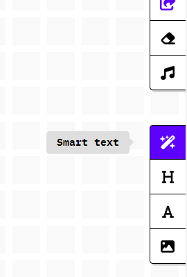

● If you see a good point covered in one of the outputs, you can copy and

paste that part in another text element, and ask the tool to expand on

that point, make it simpler or provide a new perspective. To create a text

box, you just have to click on the ‘A’ on the right menu.

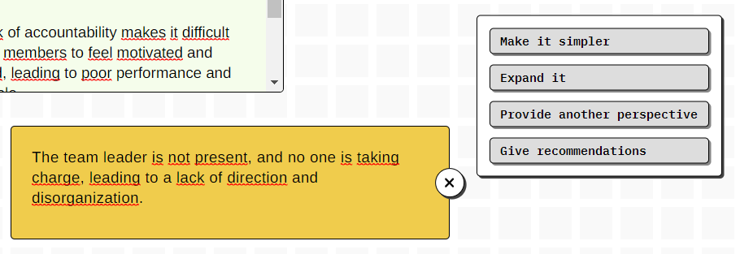

If you are looking for the solution to a problem, these functionalities allow you to find the root of that problem, while if you are looking for ideas for content and copy these new perspectives will help you open your mind.

**3. Find out the common mistakes**

Whether you are focusing on a problem or on a topic for your copy and content, this function is very useful, because you can find the most common mistakes people make about a certain topic.

NUCLEAR AI FILES 246 dariuslukas.academy/

On the left menu, you can switch from ‘explore’ to ‘teach’. Once you have done that you can click on ‘Common mistakes’. Select ‘adult education’ in the box that appears at the top.

**4. Find more about your audience**

As you can see in the picture above, this tool allows you to go deeper into the real-life benefits.

You just need to click on ‘Real-life benefits’ in the ‘teach’ menu.

But it doesn’t end here. Another trick you can use to get to know your audience and their feelings better is using the ‘Expand it’ function.

Like I showed you before, you just need to copy a sentence from a previous output, paste it into a new text box, and expand it by clicking on the ‘+’ that appears on the side.

Do it a couple of times and you might find yourself with ideas, phrases and feelings you hadn't thought of.

As you can see, this tool has a lot of potential.

NUCLEAR AI FILES 247 dariuslukas.academy/

**8. Implement AI on what you already do** 📈

● **AI Tool**: multiple

● **Category**: task

streamlining

● **What it helps you with**: get AI to work on the

things you already to

**● Link to website:**

/

---

Do you know one of the great things about AI?

It can take something we already do regularly and give you ideas to make it work better.

And I’m not just talking about marketing ideas.

In this section you will find a few ways you can use AI to help you improve what you already have and do in your business.

**1.** The first thing to mention is an AI tool called, and let me tell you, if you have a lot of phone/online conversations with your customers, you need this.

It’s based on a simple principle: conversations with customers are insanely valuable for business growth, yet very few people have the time to review them properly and get valuable insights.

That’s exactly where Flai comes in.

This tool helps businesses summarise conversations, get an overview of the most frequent topics, and find what needs to be improved in your products, so that you can have more happy customers and grow your revenue faster.

**2.** The second way AI uses what we already have to help us improve is through our most valuable asset: our teams.

is a tool that helps people in teams connect better through AI.

How? It identifies who might be isolated and needs some help connecting better, measuring employee engagement.

NUCLEAR AI FILES 248 dariuslukas.academy/

Let’s say two of your employees don't communicate much. This AI-powered tool finds the things these two people have in common, their shared interests will connect them better and make them more cohesive in their work.

And we both know that more cohesive companies grow faster and better.

Even better, Glue gives you measurable results for your budget! 📈

**3.** The third thing you can do to use AI to work with what you already have is something that would take a little more work, but in some cases could have a really high ROI.

Let’s explain this with a real-life business example.

Job van der Voort, CEO and co-founder of , trained AI for the specific needs of his company.

You see, he runs a platform for businesses of all sizes to hire and pay remote workers from anywhere. This business model involves employing people in dozens of countries. So as a business they need to be able to quickly respond to questions about the regulations in each of those locations.

That’s why they trained an AI bot with country-specific expertise and local knowledge.

Their internal ChatGPT is a total wizard at knowing each country's specific laws, and now they don't need to waste hours digging through loads of boring paperwork to find the juicy bits about a particular country's laws anymore. They just type their question into their own internal tool and within seconds, they get a straight-up accurate answer.

Now, I understand this last “trick” is harder to implement, because you will probably need to hire an AI developer. But for many companies it would still be a no brainer for the ROI it generates.

This is exactly how AI is meant to be implemented: to take the tedious tasks off our shoulders and allow us to focus on the needle movers of our businesses.

NUCLEAR AI FILES 249 dariuslukas.academy/

**9. 3 ways to get unstuck through AI**

● **AI Tool**: multiple

● **Category**: brainstorming ● **What it helps you with**: getting more ideas to

improve what you

produce

**● Link to website:**

---

As a marketer, business owner or freelancer, there is a sensation you are probably familiar with.

*That feeling of being stuck*⛓

You know when we can't come up with a fresh idea for a product, a campaign, a strategy for a launch…

Or maybe you plateaued in your growth…

Well, fear not, as AI can help you get unstuck in more ways than you may think. In this section, we will explore 4 **powerful ways AI can help you overcome obstacles and achieve your goals easier.**

**1. Coming up with a new email strategy**

Let’s say you have been testing various email strategies but nothing seems to really work.

You have tried everything the gurus said, but still no results.

How do you get unstuck? Try writing a ChatGPT prompt outlined this way:

● Objective of the email strategy

● Context

● Target Market

● Unique Value Proposition of your product or service

● Details of the product or service

NUCLEAR AI FILES 250 dariuslukas.academy/

● Short list of the guidelines ChatGPT needs to follow for this strategy - like the number of emails, if you want it to write the sequence, etc.

It will take some time to write this kind of prompt, but it’s definitely effective to overcome the plateau 📊

**2. Ask Jeff Bezos some insights about your audience**📖

As you probably already know, Amazon is a great place to find useful information about your audience's feelings and thoughts.

This is an easy and fast way to get unstuck.

So, why not have ChatGPT “take” information from Amazon and give it to you in a fraction of the time? Here’s how you do it:

● Identify the number 1 book or audiobook your avatar would read or listen to ● Ask ChatGPT to do a summary of the reviews of that book

● Ask ChatGPT to make a list of the top 10 problems that book helped overcome according to reviewers

**3. Use scientific research to find new ideas and angles**

When you’re feeling stuck during the creation process, I have found diving into scientific research data really dig myself out.

Have you ever noticed there is research on virtually anything? Yes, it’s true… and it is funny - and VERY useful for us.

But since going through all the scientific research is very time consuming, we should take advantage of an AI tool called .

This is a search engine that uses AI to extract and distil findings directly from scientific research.

With Consensus finding scientific data will be easy like a Google search.

NUCLEAR AI FILES 251 dariuslukas.academy/

**10. Find persuasive data with AI**

● **AI Tool**: multiple

● **Category**: research

● **What it helps you with**: streamline the research phase and find new

angles

**● Link to website:**

---

Do you use scientific research for your campaigns?

You read that right, we are talking about *scientific research*.

When you use this kind of data in your marketing and branding, be it on websites, landing pages, or videos, your claims are more credible and persuasive.

Because data is proof that something is true, that’s why so many companies use it.

But… finding the right research paper and extracting the data you are looking for can be pretty hard and time-consuming.

Well, not anymore with AI! There are lots of tools that you can use today to streamline this process and use the right data in your marketing 📈

So in this section I am going to break down a process you can use to leverage AI to find the scientific data you need for your next strategy.

**1. FIND THE RIGHT PIECE OF RESEARCH** 🔬

The first step is finding the right piece of research. While Google would help us really slowly with this, AI search tools can help you to get it done in a fraction of the time.

There are 3 AI tools I personally love:

NUCLEAR AI FILES 252 dariuslukas.academy/

1.

2.

NUCLEAR AI FILES 253 dariuslukas.academy/

3.

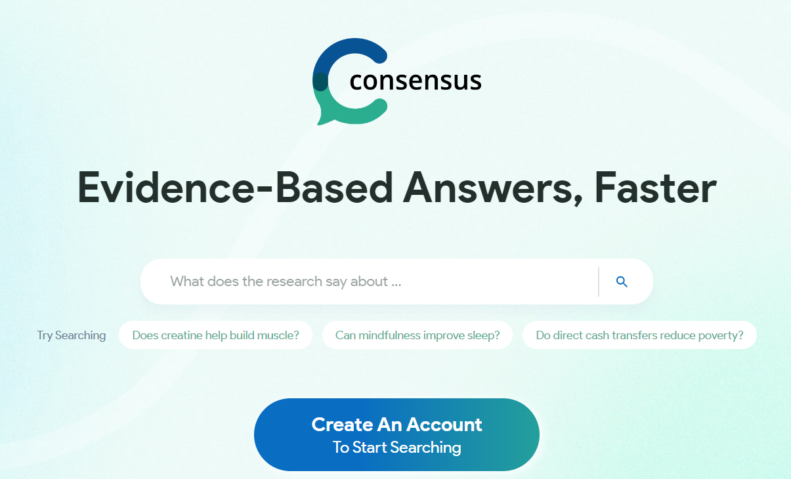

These are the tools that could *possibly* replace Google search, according to experts.

Because they scour the internet and give a condensed summary of what they find in a digestible way, without you having to open dozens of tabs looking for the right information.

Since there is a lot of research on many topics, at this stage my suggestion would be to use all these tools and get as much information as possible – you can also take a look at the references these tools provide to get more in depth with the data. Then copy and paste the best findings into a Google or Word Document.

**2. UNDERSTAND INFORMATION BETTER** 📑

Now you have in front of you a document that contains all the information you need. But the problems are:

1. you don’t know which is the best data to use

2. the language probably isn’t very simple to understand, as most research papers aren’t very good at that

NUCLEAR AI FILES 254 dariuslukas.academy/

So how do we solve this? We turn the Google Doc into a PDF, and use AI tools like or to… chat with the file, ask questions and understand the content better.

**3. CREATE YOUR MESSAGE** 🔊

The third step is to take the information you gathered from the last two steps, and use ChaGPT to use it in your copy and marketing strategy in an effective way.

Here’s a prompt you can use:

NUCLEAR AI FILES 255 dariuslukas.academy/

*Act like a branding and marketing expert, with decades of experience in the [niche].I have found this useful piece of research: [insert piece of research].*

*Write a persuasive [type of copy] using this piece of data.*

If you don’t know where to use the data you have found, here’s another prompt you can use:

*I have found a piece of research that says [piece of data].*

*I want to use this data to promote my [type of products]. Where can I use it?*

NUCLEAR AI FILES 256 dariuslukas.academy/

**11. Create your online course with AI!**

● **AI Tool**: Eurekaa

● **Category**: online courses ● **What it helps you with**: brainstorm and design online courses

● **Link to website:**

---

If you’re looking for an AI platform to help you brainstorm and design online courses, you’ll love this section. 📚

Instead of spending countless hours behind the screen doing boring course research, you can get results in just a few seconds with.💡

If you want to save time and create valuable content based on data driven insights and analytics, Eurekaa is the perfect tool to provide you with the information you need.

🌟 Here are the main features of this platform:

**1. Topic Discovery** 🌐

NUCLEAR AI FILES 257 dariuslukas.academy/

Type in a general topic and explore over **297.000 courses and 600.000 categories**. Their vast database can help you find inspiration and identify the best topics for your course.

2. **Fine-tune Your Search** 🔍

Select the topic, niche, rating, enrollment, or estimated earnings to find exactly what you’re looking for.

**3. Market Insights** 📈

Eurekaa provides detailed market insights, showing the popularity and relevance of your chosen topic. This helps you understand the demand and see how you can expand and refine your ideas to better meet market needs.

**4. Opportunity Scoring** 🎯

Wondering if your topic of interest will be a hit or miss? Their algorithm combines enrollment data, course availability, and search trend to calculate your topic’s success chances.

NUCLEAR AI FILES 258 dariuslukas.academy/

**5. AI Gap Analysis** 🤖

With their AI Gap Analysis feature, you can easily identify what's missing in existing courses and what additions could make your content more compelling. This feature helps you spot opportunities to differentiate your course and meet unmet needs.

**6. AI Lesson Architect** ✍️

Eurekaa’s AI Lesson Architect can assist you in generating various types of content, including outlines, introductions, descriptions, summaries, and chapters. If you already have some content, the Lesson Architect can automatically structure and format it, saving you even more time and effort.

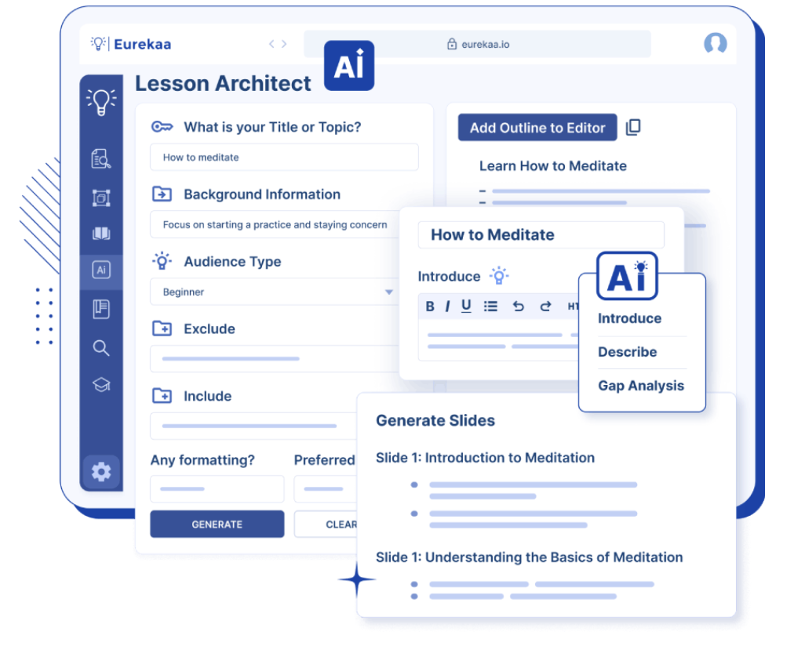

**7. AI-Assisted Idea Editor** 🧠

This feature provides you with an AI writer that assists you in developing your ideas. In the editor’s modular UI you can drag and sort key ideas easily and toggle between outline, document, and PowerPoint modes.

**8. Optimise Your Title** 🛠️

NUCLEAR AI FILES 259 dariuslukas.academy/

Make your content discoverable with their **Title Rank** feature, which provides insights into the search volume and competition for your chosen keywords.

Eurekaa offers courses in multiple languages, including English, Chinese, Dutch, German, Japanese, Portuguese, Romanian, and Russian.

💰 The platform costs **$7.99 per month (billed annually) for the Researcher subscription**, and **$12.99 per month for the Creator plan**.

Both plans include the Course Comparison Engine, Topic Viability Scoring, AI Gap Analysis, Platform Research Engine, Book Search Engine, Content Library, and Keyword Planner.

**The Creator plan** also offers additional AI features such as the **Doc Editor with AI-Assist and the AI Lesson Architect.**

They offer a **FREE** trial, so it's definitely worth trying if you're interested in creating online

courses or books.

NUCLEAR AI FILES 260 dariuslukas.academy/

**12. Sell online courses effortlessly**

● **AI Tool**: Thinkific

● **Category**: online courses ● **What it helps you with**: create and sell online

courses

● **Link to website**:

m

---

Whether you're a coach, entrepreneur, or educator, can help you build a successful online course business…

and give you the flexibility to generate passive income while working remotely. Today, we'll show you how to do that using AI!

**How to Get Started**

**1️⃣** S**ign Up & Choose a Plan** – Get started with Thinkific’s free plan or upgrade to unlock advanced features.

**2️⃣** C**reate Your Course** – Use the + **New Course** button to build your course from scratch or with a template.

💡 *Let AI help you plan your course!*

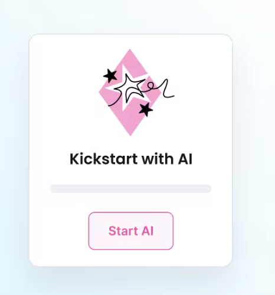

NUCLEAR AI FILES 261 dariuslukas.academy/

3️⃣ **Add Lessons & Chapters** – Organize your course with structured chapters and lessons using video, text, quizzes, and more.

4️⃣**Customize Your Course Site** – Use the website builder and let AI suggest improvements or help create landing pages.

**5️⃣** S**et Pricing & Launch** – Sell your course as a one-time purchase, subscription, or membership, and start enrolling students!

🔥 **Key Features:**

✅ **Easy Course Creation** – Upload videos, quizzes, PDFs, interactive lessons, and more with the drag-and-drop builder.

✅ **Customizable Website** – Build a fully-branded course site or landing page.

NUCLEAR AI FILES 262 dariuslukas.academy/

✅**Marketing & Sales Tools** – Offer coupons, promotions, affiliate programs, and email marketing to grow your audience.

✅**Membership & Subscription Options** – Sell courses one-time, as bundles, or as recurring memberships.

NUCLEAR AI FILES 263 dariuslukas.academy/

✅**Advanced Quizzing & Assignments** – Test students with graded quizzes, surveys, and assignments to improve learning outcomes.

✅**Student Management & Engagement** – Track progress, issue certificates, and communicate via discussion forums and direct messaging.

✅**Integrations & Automations** – Connect with Stripe, PayPal, Zoom, Notion, and email marketing platforms to enhance your workflow.

✅**Analytics & Reporting** – Get insights into course performance, revenue, and student engagement to optimize your business.

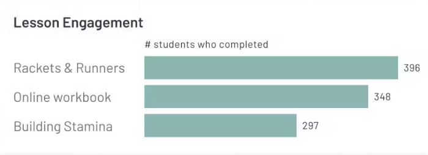

**Pros:**

✔ AI-powered platform covering everything you need: course creation, student management, sales, and more.

NUCLEAR AI FILES 264 dariuslukas.academy/

✔ Payment handling, including coupons and refunds.

**Cons:**

❌ Limited customization options for more advanced features.

❌ App integrations can be pricey.

Other alternatives to Thinkific include Teachable and Kajabi.

💰 **Pricing**

As of the time writing this report, Thinkific offers three pricing plans:

💡**Basic ($31/month)** – Unlimited courses, website builder, email automation.💡**Start ($73/month)** – Adds memberships, AI-powered landing pages, live lessons, and payment plans.

💡**Grow ($146/month)** – For scaling businesses, includes API access, bulk

enrollments, and priority support.

Each plan comes with a **14-day free trial** to explore all the features before committing!

NUCLEAR AI FILES 265 dariuslukas.academy/

**13. Get everything you need from your videos**

● **AI Tool**: transcript.lol

● **Category**: transcript

generation

● **What it helps you with**: get all the info you need about a video

● **Link to website:**

---

This tool allows you to paste the URL of 1500+ platforms, including TikTok, Instagram, LinkedIn, TED Talks, Apple Podcasts, YouTube, and more, and receive the transcript of the content.

And more than offering a transcript, you also get access to some cool AI features!

Here’s what you get with :

🔖**Relevant sections:** Easily find sections where specific topics were discussed.

💬 **Contextual Q&A:** Receive answers from the transcript, with precise references using their “Ask ChatGPT” feature.

🎙️**Speaker identification:** The AI automatically assigns labels to multiple speakers, so you know who said what.

🚀**How it works:**

1. Add the public URL of video or audio, OR upload a file.

*(The maximum duration for the FREE trial is 30 minutes)* 2. Select the output language.

3. Choose whether to make the transcript Private, Public or Unlisted.

4. Select which AI features you want to use (including Summaries, Topics, Blog Posts, LinkedIn Posts, Quizzes, and more.)

NUCLEAR AI FILES 266 dariuslukas.academy/

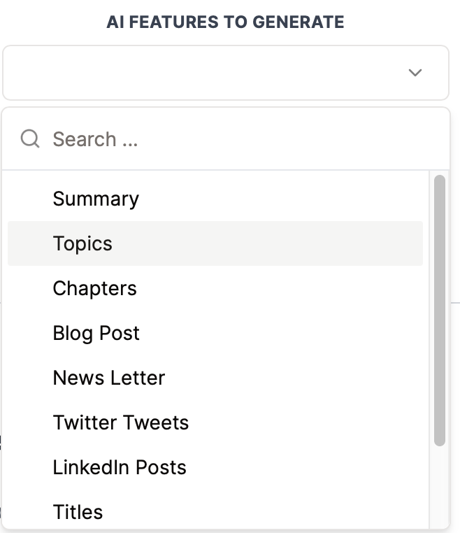

5. Transcribe!

NUCLEAR AI FILES 267 dariuslukas.academy/

🔍 I decided to test this tool using one of Darius’ YouTube videos: *“How to Effectively Learn AI in 2024 (4-Step Guide for Beginners)”*.

In just around 2 minutes, it generated an accurate transcript.

Next, I explored its AI features: I extracted the “Topics”.

And it showed me the exact topics that were discussed in the video: *“AI for Small Businesses”, “AI Tools”, “Learning AI”, “Community for AI Beginners”,* and *“AI Basics: Machine Learning, Deep Learning, LLMs”*.

NUCLEAR AI FILES 268 dariuslukas.academy/

Then, I decided to “Generate Tweets”.

And here are the tweets it generated:

*Tweet 1:* 🚀 *Are you a small business owner ready to level up with AI? Discover the 80-20 of AI tools that yield a high ROI on your time. No tech expertise required!*

*#AIforBusiness #SmallBusiness #Entrepreneur*

*Tweet 2:* 🔍 *Step 1: Identify the goal of your AI journey. What area of your business do you want to automate with AI? This step is crucial for achieving results. Learn more in this video. #AIJourney #BusinessAutomation #AIforSmallBusiness*

*Tweet 3:* 🧠 *Step 2: Understand how AI really works. From machine learning to deep learning, get clear on the basics of artificial intelligence. Watch the video to learn more. #ArtificialIntelligence #MachineLearning #DeepLearning*

*Tweet 4:* ⚙️ *Step 3: Find the right AI tool for your business. No need to become a tech expert. Discover easy-to-use AI tools that can save you time and streamline your operations. Watch the video to learn a no-code three-step process. #AITools*

*#NoCodeAI #TimeSavingTools*

🤔 I also wanted to try the feature “Generate Blog Post”, and I must say, it did a pretty good job.

Here’s some lines it generated:

*For small business owners, the thought of diving into the world of AI can be daunting. The good news is, you don't need to be a tech expert to leverage AI for your business. In this blog post, I'll guide you through a four-step process to learn AI effectively and efficiently.*

**Step 1: Define Your AI Goals**

NUCLEAR AI FILES 269 dariuslukas.academy/

*Before diving into the world of AI, it's crucial to identify the specific areas of your business that could benefit from automation and AI integration. Consider the following questions:*

*● What tasks do you want to automate with AI?*

*● Do you want to streamline content creation, copywriting, video editing, or* *other specific areas of your business?*

*Having a clear understanding of your AI goals will set the foundation for the next steps in your AI journey.*

While it did misspell some words, like the name of certain AI tools, it provides a good starting point for a future blog post.

Another AI feature is the ability to create quizzes to engage your audience. From the 9-minute video I selected, it generated a 6-question quiz.

💰 **Pricing**

At this point, **Transcript** offers three pricing plans: **Starter ($12/month)** including **300 minutes of transcription**, **2 seats**, file uploads up to **2GB**, and **100GB of storage**; **Growth ($29/month)** for professionals and growing teams, featuring **1000 minutes of transcription**, **5 seats**, file uploads up to **4GB**, and **250GB of storage**; and

NUCLEAR AI FILES 270 dariuslukas.academy/

**Business ($79/month)** for larger teams, providing **3000 minutes of transcription**, **15 seats**, file uploads up to **10GB**, and **1000GB of storage**.

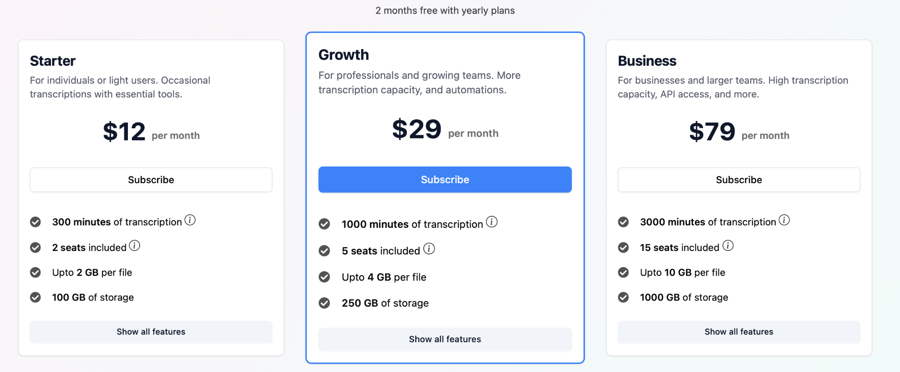

NUCLEAR AI FILES 271 dariuslukas.academy/

**14. Next-level screen recordings!**

● **AI Tool**: ScreenStudio ● **Category**: recordings

● **What it helps you with**: recording and editing your videos

● **Link to website**:

---

If you’re creating screen recordings, **you need them to look amazing**—smooth, clear, and professional.

Whether you're making tutorials, product demos, or content for social media, this tool can take your recordings to the next level!

is a macOS tool that makes it easy to record, edit, and enhance your videos.

Let’s dive in and show you how simple it is!

**How to Create Stunning Screen Recordings (in 5 Simple Steps)** 1️⃣**Download and Install**:

Visit Screen Studio's website and download the application for macOS.

2️⃣**Launch the Application**:

Open the app, explore the interface, and get ready to record.

3️⃣**Configure Recording Settings**:

● **Select Recording Area**: Choose whether to capture the entire screen or a specific window.

● **Audio Sources**: Opt to record system audio, microphone input, or both.

NUCLEAR AI FILES 272 dariuslukas.academy/

4️⃣**Start Recording**:

Just click **"Record,"** and Screen Studio enhances your video in real-time with features like:

● **AI-Driven Zoom and Focus**: Automatically identifies areas of interest and zooms in to highlight key actions.

● **Smooth Cursor Animation**: Transforms rapid cursor movements into natural, fluid glides.

● **Noise Reduction**: Filters out background noise for clear audio.

5️⃣**Edit and Export**:

● **Trim, Cut, & Enhance**: Trim unnecessary parts, generate subtitles, and enhance overall clarity.

● **Customizable Styles**: Adjust backgrounds, spacing, and visual effects for a polished, branded finish.

● **Export Options**: Choose from presets optimized for social media, web, or high-res editing.

NUCLEAR AI FILES 273 dariuslukas.academy/

💰 **Pricing**

💳**Subscription Plan** – **$9/month**

✔️ Lifetime updates

✔️ Shareable links

✔️ Use on up to 3 personal macOS devices

✔️ Upcoming AI tools & team collaboration

🏆**One-Time Purchase** – **$229**

✔️ Own it forever + 1 year of updates & shareable links✔️ Optional renewal for $109/year for continued updates

NUCLEAR AI FILES 274 dariuslukas.academy/

🤩 Coming soon to **Screen Studio**: AI features that make your recordings sound as amazing as they look!

🔥**AI Voice Generation** (powered by Speechify) – Add **natural-sounding voiceovers** in seconds.

🎧**AI Audio Enhancement** (powered by Adobe Podcast Enhance) – Automatically **boosts clarity and removes noise**.

Unlike Loom (which focuses on quick screen sharing), Screen Studio is designed for creators who want their recordings to look professional and polished—without spending hours editing.

If you want to make stunning, studio-quality screen recordings effortlessly, this is the tool for you.

NUCLEAR AI FILES 275 dariuslukas.academy/

**15. AI customer support that feels human!**

● **AI Tool**: PlayAI

● **Category**: customer

support

● **What it helps you with**: creating realistic

AI-powered conversations ● **Link to website**:

---

In this section, we’re talking about , a platform that’s changing how businesses use voice AI to chat with customers.

If you’ve ever wanted to create super-realistic, AI-powered conversations, this tool is for you.

Whether you’re building a virtual assistant or an automated customer support agent, helps you make conversations that really connect with users.

🔥**How to get started**

1️⃣**Sign Up** – Go to Play AI’s website and create an account.

2️⃣**Build Your AI Agent** – Follow the simple steps to create your custom AI voice assistant.

3️⃣**Deploy & Scale** – Add your AI agent to your website, app, or business tool and start chatting with customers right away.

Let’s dive in and take a closer look!

When you create an account and log in to Play AI, you’ll have **four main options** to explore.

NUCLEAR AI FILES 276 dariuslukas.academy/

🗣️ **1. VOICE AGENTS** – Create conversational AI voice agents for customer support, sales, virtual characters, and more.

Here’s what you’ll need to configure:

● **Name** – Give your AI a unique name to personalize its identity.

● **Voice & Speed** – Select from a range of AI-generated voices and adjust the speech speed to sound just right. You can also **create a custom voice** if needed.

● **Avatar** – Upload an image to visually represent your AI.

● **Advanced Settings** – Customize deeper aspects of your agent’s functionality:

NUCLEAR AI FILES 277 dariuslukas.academy/

🚀**Behavior** – Set conversation style and response tone.

🚀**Knowledge** – Train your AI on specific information or datasets.

🚀**Actions** – Assign tasks or automate responses based on triggers.

Once you’ve fine-tuned these settings, just hit **"Create"**.

🔊 **2. PLAYNOTE** – Generate **AI-powered podcasts** from **PDFs, images, or text transcripts**, making it easy to convert content into engaging audio.

**How It Works**

✅ **Upload a File** – Select a document, image, or text file to process. Supported formats include PDFs, EPUBs, JPEGs, DOCX, MP4s, MP3s, and more (up to **50MB**). ✅ **AI Voice Generation** – The system converts your text into a **natural, human-like voice**, making it perfect for **podcasts, audiobooks, or automated narration**. ✅ **Download & Share** – Once the AI has generated the audio, you can download the file and use it however you like.

NUCLEAR AI FILES 278 dariuslukas.academy/

🎙️ **3. PLAYGROUND** – Experiment with **real-time text-to-speech AI** and fine-tune speech output for your projects.

**How It Works**

✅ **Enter Your Text** – Type or paste any text into the input box.

✅ **Select Language & Voice** – Choose from a variety of AI-generated voices and set the language.

✅ **Pick a Speech Model** – Select an AI model to define how the speech sounds.

✅ **Customize Voice Settings** – Adjust **speed** and **temperature** to refine how the voice sounds—making it faster, slower, or more expressive.

✅ **Generate Speech** – Click **"Generate Speech"** to hear the AI bring your text to life!

NUCLEAR AI FILES 279 dariuslukas.academy/

🎧 **4. API** – Integrate Play AI’s voices into your own applications.

💰 **Pricing**

As of the time of writing this AI Report, Play AI offers the following plans:

● **Free ($0/month)** – 30 min speech credits, 1 voice clone, 3 private playnotes.

● **Starter ($9/month)** – 50 min credits, 10 voice clones, unlimited playnotes. ● **Creator ($49/month)** – 300 min credits, 50 voice clones, 1 pro clone.

● **Pro ($99/month)** – **Most popular**: 700 min credits, 500 voice clones, 3 pro clones.

● **Scale ($299/month)** – 2,500 min credits, 1,000 voice clones, 5 pro clones. ● **Business ($999/month)** – 11,000 min credits, 2,000 voice clones, 10 pro clones.

NUCLEAR AI FILES 280 dariuslukas.academy/

Would you use AI-powered voice agents for your business?

NUCLEAR AI FILES 281 dariuslukas.academy/

***215 Amazing AI Tools***

| **No** | **Name** | **Function** | **URL** |
| --- | --- | --- | --- |
| 1 | ChatGPT | Conversational AI for natural language

understanding and generation |  |
| 2 | Claude | AI for natural language understanding and

generation | https://www.anthropic.com or https://claude.ai |
| 3 | Gemini | Conversational AI and chatbots |  |
| 4 | Perplexity | AI for question-answering and content generation |  |
| 5 | Microsoft Azure AI services | AI tools for various applications |  |
| 6 | Canva | Design tool with AI

features for graphics and marketing |  |
| 7 | Midjourney | AI-powered image

generation and artistic creation |  |
| 8 | NightCafe Studio | AI art and photo editing platform |  |
| 9 | Tome | AI-powered content

creation and writing tool |  |
| 10 | ClipsAI | AI for creating video clips and editing |  |

NUCLEAR AI FILES 282 dariuslukas.academy/

| 11 | 2short | AI tool for creating short videos and content |  |
| --- | --- | --- | --- |
| 12 | Munch | AI tool for video content creation and editing |  |
| 13 | Pictory | AI video editing and creation platform |  |
| 14 | Veed.io | AI video editing and creation tool |  |
| 15 | Runway | AI tools for creative media and video editing |  |
| 16 | Descript | AI for podcast and video editing, transcription |  |
| 17 | OpusClip | AI video clip creation and editing tool |  |
| 18 | Lumen5 | AI video creation and editing platform |  |
| 19 | ElevenLabs | AI for voice generation and text-to-speech |  |
| 20 | Simplified | AI-powered design, content creation, and marketing tool | m |
| 21 | D-ID | AI for creating animated avatars and video

deepfakes |  |
| 22 | HeyGen | AI video generation and content creation tool |  |

NUCLEAR AI FILES 283 dariuslukas.academy/

| 23 | Galileo.ai | AI for data analysis and visualization |  |
| --- | --- | --- | --- |
| 24 | Durable.ai | AI-powered business and project management tool |  |
| 25 | UChat | AI chatbot platform for
social media engagement |  |
| 26 | Hypotenuse | AI for content creation and writing |  |
| 27 | HyperWrite | AI writing assistant and content generation tool |  |
| 28 | NaturalReaders | AI text-to-speech and voice generation tool |  |
| 29 | Rytr | AI writing and content generation tool |  |
| 30 | Capri | AI chatbot platform for automating customer interactions |  |
| 31 | Readshark | AI content summarization and reading tool |  |
| 32 | LearnSmarter.ai | AI learning and

educational content tool |  |
| 33 | ExportComments | AI tool for exporting and managing comments |  |
| 34 | WriteSonic | AI writing and content creation tool |  |

NUCLEAR AI FILES 284 dariuslukas.academy/

| 35 | TubeBuddy | AI tool for YouTube channel management and
optimization |  |
| --- | --- | --- | --- |
| 36 | Buffer | AI for social media management and scheduling |  |
| 37 | Numerous.ai | AI data analysis and visualization tool |  |
| 38 | Zoom | AI-powered video

conferencing and

communication tool |  |
| 39 | Shortwave | AI for email management and productivity |  |
| 40 | Krisp | AI noise cancellation and audio enhancement |  |
| 41 | Reclaim | AI for scheduling and time management |  |
| 42 | AskyourPDF | AI tool for extracting and querying information from PDFs |  |
| 43 | Timely | AI time tracking and productivity tool |  |
| 44 | Otter | AI transcription and note-taking tool |  |
| 45 | Fireflies | AI meeting transcription and note-taking |  |
| 46 | Voiceflow | AI chatbot platform for designing conversational experiences |  |

NUCLEAR AI FILES 285 dariuslukas.academy/

| 47 | Flair.ai | AI for sentiment analysis and content evaluation |  |
| --- | --- | --- | --- |
| 48 | WebWave | AI Website Builder |  |
| 49 | Scite.ai | AI tool for citation analysis and research insights |  |
| 50 | Consensus | AI for automated

decision-making and consensus building |  |
| 51 | Lalal | AI Audio Tool |  |
| 52 | Eurekaa | AI tool for business insights and data analysis |  |
| 53 | Transcript | AI tool for transcription and note-taking |  |
| 54 | Aiva | AI for composing music and creating soundtracks |  |
| 55 | Jasper | AI content creation and writing assistant |  |
| 56 | Copy.ai | AI tool for generating marketing copy and content |  |
| 57 | PimEyes | AI-powered facial

recognition and image search |  |
| 58 | Fotor | AI photo editing and design tool |  |

NUCLEAR AI FILES 286 dariuslukas.academy/

| 59 | Photopea | AI photo editing and design tool |  |
| --- | --- | --- | --- |
| 60 | Pixlr | AI photo editing and design tool |  |
| 61 | Prisma | AI photo art and filters tool |  |
| 62 | Luminar | AI photo editing and enhancement tool |  |
| 63 | Resemble | AI voice cloning and generation platform |  |
| 64 | Voicemod | Real-time voice changer and soundboard |  |
| 65 | Sembly | AI-powered meeting

transcription and analysis tool |  |
| 66 | SpeechText.AI | Speech recognition and transcription service |  |
| 67 | AudioNotes | AI tool for converting voice notes into text |  |
| 68 | AudioPen | Converts voice recordings into written text |  |
| 69 | Podium | AI-powered podcast

creation and editing tool |  |
| 70 | SpeakAI | AI for voice recognition |  |
| 71 | Supertranslate | AI translation tool for live speech |  |

NUCLEAR AI FILES 287 dariuslukas.academy/

| 72 | Tunity | App that streams TV audio to your device |  |
| --- | --- | --- | --- |
| 73 | Adept | AI assistant for workplace productivity |  |
| 74 | Elicit | AI research assistant for literature reviews |  |
| 75 | Bertha | AI writing assistant and content generator |  |
| 76 | Mutiny | AI-powered website personalization and optimization |  |
| 77 | Frase | AI-powered content

research and writing tool |  |
| 78 | AlphaWatch | AI tool for market research and analysis |  |
| 79 | Flick | AI social media

management and analytics |  |
| 80 | AdCreative | AI tool for generating ad creatives |  |
| 81 | GravityWrite | AI-powered content generation tool |  |
| 82 | AI Poem Generator | AI tool for generating poetry |  |
| 83 | Shopia | AI content creation and copywriting tool |  |
| 84 | Fine Talk | AI chatbot platform for businesses |  |

NUCLEAR AI FILES 288 dariuslukas.academy/

| 85 | Rosebud | AI for creating personalized avatars and art |  |
| --- | --- | --- | --- |
| 86 | Artbreeder | AI art creation and blending tool |  |
| 87 | Picso | AI-powered photo
enhancement and editing tool |  |
| 88 | Hotpot | AI art and design tools |  |
| 89 | Mage | AI-powered creative

content generation tool |  |
| 90 | DeepImage | AI image enhancement and upscaling tool |  |
| 91 | PhotoEditor | AI photo editing tool |  |
| 92 | Unboring.ai | AI tool for generating creative content |  |
| 93 | Krea | AI art generation and inspiration tool |  |
| 94 | CutoutPro | AI background removal tool |  |
| 95 | ELI5 | AI tool that explains

complex topics in simple terms |  |
| 96 | Quizgecko | AI quiz creation tool |  |
| 97 | LiveReactingAI | AI tool for creating live video reactions |  |
| 98 | MindSmith | AI tool for knowledge management and

brainstorming |  |

NUCLEAR AI FILES 289 dariuslukas.academy/

| 99 | TalkPal | AI language learning and translation tool |  |
| --- | --- | --- | --- |
| 100 | Monic.ai | AI-powered virtual assistant |  |
| 101 | Univerbal | AI tool for language learning and practice |  |
| 102 | Otis AI | AI powered marketing and advertising tool |  |
| 103 | Warmer | AI tool for

personalized email marketing |  |
| 104 | Lavender | AI email assistant for sales and marketing |  |
| 105 | Zeliq | AI-powered

customer feedback analysis tool |  |
| 106 | Signum | AI for analyzing and enhancing customer communication |  |
| 107 | Persana AI | AI tool for

personalized

marketing and sales |  |
| 108 | OutPlay | AI-powered sales engagement

platform |  |
| 109 | InWorld | AI for creating

interactive virtual characters |  |
| 110 | Ludo | AI-powered game design and development tool |  |
| 111 | Fabrie | AI design and

prototyping tool |  |

NUCLEAR AI FILES 290 dariuslukas.academy/

| 112 | Colormind | AI color scheme generator |  |
| --- | --- | --- | --- |
| 113 | Color Pop | AI-powered color palette generator |  |
| 114 | PromptHunt | AI tool for

generating creative prompts |  |
| 115 | PatternedAI | AI tool for generating unique patterns and designs |  |
| 116 | You | AI chatbot platform for productivity |  |
| 117 | Superinterface | AI chatbot platform for user experience optimization and

interface

automation |  |
| 118 | PaintsChainer | AI colorization and digital art tool |  |
| 119 | Deep Dream Generator | AI art generation and style transfer tool |  |
| 120 | Lunacy | AI design and vector graphics tool |  |
| 121 | Snappa | AI design tool for

marketing and social media |  |
| 122 | Visme | AI design tool for presentations and marketing |  |
| 123 | CreateVista | AI design tool for social media and ads |  |
| 124 | DesignBold | AI design tool for

marketing and branding |  |

NUCLEAR AI FILES 291 dariuslukas.academy/

| 125 | RelayThat | AI design tool for

marketing and ads |  |
| --- | --- | --- | --- |
| 126 | PosterMyWall | AI design tool for posters and flyers |  |
| 127 | BeFunky | AI photo editing and design tool |  |
| 128 | Scribe | AI documentation and process creation tool |  |
| 129 | InVideo | AI video creation and editing platform |  |
| 130 | Jotform | AI form builder and data collection tool |  |
| 131 | Sprout Social | AI social media

management and analytics |  |
| 132 | SocialBee | AI social media scheduling and automation |  |
| 133 | Camtasia | AI video recording and editing tool |  |
| 134 | FilmoraGo | AI video editing app for mobile devices | / |
| 135 | KineMaster | AI video editing app with advanced features |  |
| 136 | Animoto | AI video creation and editing tool |  |
| 137 | Designhill | AI graphic design tools and resources |  |

NUCLEAR AI FILES 292 dariuslukas.academy/

| 138 | LogoMaker | AI logo design tool for businesses |  |
| --- | --- | --- | --- |
| 139 | Hatchful | AI logo design tool |  |
| 140 | Looka | AI logo and brand design tool |  |
| 141 | Zyro | AI website and logo design tool |  |
| 142 | Tailor Brands | AI branding and logo design tool |  |
| 143 | Brandmark | AI logo and brand identity creation |  |
| 144 | Toggl Plan | AI project planning and team management tool |  |
| 145 | Serene | AI task management and productivity tool |  |
| 146 | Todoist | AI task management and to-do list app |  |
| 147 | Asana | AI project management and collaboration tool |  |
| 148 | Trello | AI project management and task organization tool |  |
| 149 | ClickUp | AI project management and productivity tool |  |

NUCLEAR AI FILES 293 dariuslukas.academy/

| 150 | Monday.com | AI project management and team collaboration tool |  |
| --- | --- | --- | --- |
| 151 | Wrike | AI project management and collaboration tool |  |
| 152 | Airtable | AI project management and collaboration tool |  |
| 153 | Zoho Projects | AI project management and collaboration tool |  |
| 154 | ClickTime | AI time tracking and
project management tool |  |
| 155 | Taskade | AI task management and collaboration tool |  |
| 156 | Notion | AI productivity and project management tool |  |
| 157 | Evernote | AI note-taking and organization tool |  |
| 158 | OneNote | AI note-taking and

information organization tool |  |
| 159 | Bear | AI writing and note-taking app |  |
| 160 | Craft | AI document and note-taking tool |  |
| 161 | Quillbot | AI writing and

paraphrasing tool |  |
| 162 | Grammarly | AI writing assistant and grammar checker |  |

NUCLEAR AI FILES 294 dariuslukas.academy/

| 163 | ProWritingAid | AI writing enhancement and editing tool |  |
| --- | --- | --- | --- |
| 164 | Hemingway Editor | AI writing and readability improvement tool |  |
| 165 | DeepL | AI translation tool |  |
| 166 | Otter.ai | AI meeting transcription and note-taking tool |  |
| 167 | People.ai | AI-powered sales

productivity platform |  |
| 168 | Kapwing | AI video editing and
content creation platform |  |
| 169 | Synthesia | AI video generation platform |  |
| 170 | Elai.io | AI video creation platform |  |
| 171 | Pictory | AI video creation from text |  |
| 172 | Fliki | AI text-to-video and text-to-speech tool |  |
| 173 | Designs.ai | AI-powered design tool |  |
| 174 | Remove.bg | AI background removal tool |  |
| 175 | Let's Enhance | AI image upscaling and enhancement tool |  |
| 176 | Topaz Labs | AI photo and video enhancement tools |  |
| 177 | Akkio | AI-powered conversational platform for data-driven insights |  |

NUCLEAR AI FILES 295 dariuslukas.academy/

| 178 | Imagen | Google's text-to-image diffusion model |  |
| --- | --- | --- | --- |
| 179 | Artbreeder | AI art creation and mixing tool |  |
| 180 | Jasper Art | AI art generation tool |  |
| 181 | StarryAI | AI art generation app |  |
| 182 | Wombo Dream | AI art generation app |  |
| 183 | Hotpot.ai | AI art and design tools |  |
| 184 | Fotor GoArt | AI art style transfer tool |  |
| 185 | Playground AI | AI image generation and editing platform |  |
| 186 | Leonardo.Ai | AI image generation platform |  |
| 187 | Namelix | AI business name generator |  |
| 188 | Copysmith | AI content generation platform |  |
| 189 | Peppertype.ai | AI content generation tool |  |
| 190 | Anyword | AI copywriting tool |  |
| 191 | Wordtune | AI writing enhancement tool |  |
| 192 | Frase | AI content research and SEO tool |  |

NUCLEAR AI FILES 296 dariuslukas.academy/

| 193 | INK | AI writing and SEO platform |  |
| --- | --- | --- | --- |
| 194 | Surfer SEO | AI-powered SEO tool |  |
| 195 | MarketMuse | AI content planning and optimization tool |  |
| 196 | Pepper Content | AI content creation platform |  |
| 197 | Zapier | AI-powered workflow automation tool |  |
| 198 | IFTTT | AI-powered task

automation platform |  |
| 199 | Make | AI-powered automation platform |  |
| 200 | Tray.io | AI-powered workflow automation platform |  |
| 201 | n8n | AI-powered workflow automation tool |  |
| 202 | Neural | AI Image generator |  |
| 203 | Workato | AI-powered integration and automation platform |  |
| 204 | Pabbly Connect | AI-powered workflow automation tool |  |
| 205 | Axiom.ai | AI-powered browser automation tool |  |

NUCLEAR AI FILES 297 dariuslukas.academy/

| 206 | Parabola | AI tool for automating repetitive tasks and

workflows |  |
| --- | --- | --- | --- |
| 207 | Mailchimp | AI-powered email
marketing and automation platform |  |
| 208 | DoodleMaker | AI-powered doodle video creation software |  |
| 209 | Animoto | AI video creation and editing tool |  |
| 210 | DeepAI | Chatbot and Image Generator |  |
| 211 | Visme | AI design tool for

presentations and videos |  |
| 212 | Filmora | AI-powered video editing software | m |
| 213 | Promo.com | AI video creation and marketing platform |  |
| 214 | Biteable | AI video creation platform for marketing |  |
| 215 | Animaker | AI animation and video creation platform |  |

NUCLEAR AI FILES 298 dariuslukas.academy/